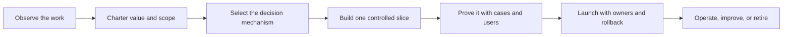

# The FDE Guide

> **Value engineering and production architecture for FDEs, applied AI engineers, product teams, and operations leaders**


An independent, open-source field guide for FDEs and internal applied-AI teams moving a customer or internal workflow from discovery to a measurable, operated outcome.

[](https://github.com/davidahmann/fde-guide/actions/workflows/validate.yml)
[](https://github.com/davidahmann/fde-guide/releases/latest)
[](LICENSE)

[Choose your starting point](#who-this-is-for) · [Follow the lifecycle](#from-idea-to-production) · [Start from a business flow](#start-from-a-business-flow) · [Inspect the examples](#learn-from-the-reference-systems) · [Use with a coding agent](#optional-use-it-with-a-coding-agent)

## Who this is for

Start with the decision your role owns. You do not need to adopt the whole repository at once.

| You are responsible for | The question to answer first | Start here |
| --- | --- | --- |
| Business value, product, or use-case selection | Is this workflow worth changing, and how will an accepted outcome be measured? | [12 Factors of AI Value Engineering](library/14-twelve-factors-ai-value-engineering.md), then [Discovery and Value](playbooks/01-discovery-and-value.md) |
| FDE or applied-AI delivery | How do we move one real workflow from observation through adoption and accountable operation? | [FDE playbooks](playbooks/README.md) and [FDE discovery pack](templates/fde-discovery-pack.md) |
| AI engineering or software architecture | Which decisions belong in rules, optimization, ML, retrieval, a foundation model, an agent, or human review? | [Software Architecture and Intelligence Selection](library/12-software-architecture-and-intelligence-selection.md), [blueprint selector](blueprints/README.md), and [reference solutions](solutions/README.md) |
| Platform, security, release, or reliability | Can this exact release act safely, fail predictably, and be operated within its value and risk limits? | [Release gates](operations/release-gates.md), [control catalog](controls/control-catalog.json), and [operations](operations/README.md) |
| Technical review or enablement | What does a complete delivery packet look like in practice? | [Shipment-risk walkthrough](examples/shipment-risk-triage/README.md) and [invoice-exception reference](examples/invoice-exception/README.md) |

## What this guide helps you deliver

- A qualified workflow with a named owner, baseline, accepted outcome, verifier, adoption path, and risk ceiling.
- A full-cost value case and a deliberate software architecture—not a model looking for a problem.
- The smallest adequate mix of deterministic code, optimization, ML, retrieval, foundation models, bounded agents, and human review.
- A tested release packet with explicit authority, failure behavior, rollout limits, rollback, and source-of-truth evidence.
- A service that an operating team can observe, support, improve, constrain, and retire.

## The core idea: engineer value before autonomy

**From a real workflow to a measurable, operated outcome.**

A useful demo can call a model and a few tools. A production AI-enabled system must also know who is allowed to act, which information is current, how to handle failure, how to prove that work finished, how much it costs, and how operators can stop or recover it.

In this guide, a **production agent** is a bounded workflow in which a foundation model makes some decisions, software controls tools and state, and people remain accountable for the outcome. An agent is one component option—not the default answer for every decision.

This repository provides the design sequence, reusable contracts, tests, and operating checks around that system. It does not require a specific model, cloud, or agent framework. It is not a drop-in runtime, a certification, or a substitute for your organization's security and risk review.

Work in this order: **outcome → workflow → decision → system → controlled action → accepted result → measured value**. Start with the user's operational decision and the economics of an accepted result. Only then choose the software architecture and the smallest adequate intelligence mechanism.

> **Tokens are an input. Autonomy is a design choice. Accepted outcomes are the product.**

The [12 Factors of AI Value Engineering](library/14-twelve-factors-ai-value-engineering.md) turn that principle into an operating framework: observe real work, own and verify the outcome, bound eligibility and authority, engineer adoption, select the smallest sufficient intelligence, price the whole service, prove it on representative work, and expand or retire from evidence. Apply it through the detailed [value-engineering](library/11-value-engineering-and-frugal-architecture.md) and [intelligence-selection](library/12-software-architecture-and-intelligence-selection.md) guides.

## From idea to production

The repository follows one delivery path. Each stage produces an artifact that the next stage can inspect or test.



| Stage | Plain-language question | Main artifact |
| --- | --- | --- |
| Observe | How does the work actually happen, including exceptions and workarounds? | [Field-observation log](templates/field-observation-log.md) and [FDE discovery pack](templates/fde-discovery-pack.md) |
| Charter | What narrow decision is worth improving, how will value be measured, and who owns the result? | [Workflow charter](templates/workflow-charter.json) and [value case](templates/value-case.md) |
| Plan adoption | How will users test, adopt, support, change, and eventually own the workflow? | [Delivery and adoption plan](templates/delivery-and-adoption-plan.md) and draft [customer handoff](templates/customer-enablement-handoff.md) |
| Select intelligence | Which decision steps belong in rules, optimization, ML, retrieval, a foundation model, an agent, or human review? | [Intelligence-selection record](templates/intelligence-selection-record.md) and [architecture guide](library/12-software-architecture-and-intelligence-selection.md) |
| Model the domain | What objects, actions, rules, and sources of truth matter? | [Domain model template](templates/operational-ontology.json) |
| Map dependencies | Which software and operational relationships need active navigation or material-change review? | [System-map manifest](templates/system-map-manifest.json) and [change-impact assessment](templates/change-impact-assessment.json), only where their maintenance cost is justified |
| Design | Where do deterministic software, optimization, ML, foundation models, tools, and people make decisions? | [Agent-system template](templates/agent-system.json) and [architecture decision record](templates/architecture-decision-record.md) |
| Bind behavior | Which exact model route, prompt, harness, context policy, guardrails, and runtime work together? | [Behavior-bundle template](templates/behavior-bundle.json) |
| Bind capabilities | What may each exact capability build read or change, for whom, and under what policy? | [Tool contract](templates/tool-contract.json), [capability manifest](templates/capability-manifest.json), and [capability supply-chain guide](operations/capability-supply-chain.md) |
| Threat model | How could data, tools, identity, or evaluation be abused? | [Threat-model template](templates/threat-model.json) |
| Prove | Does it succeed, fail safely, and help users on representative work? | [Evaluation cases](templates/evaluation-case.json) and [evaluation report](templates/evaluation-report.json) |
| Launch | What compatible release and bounded autonomy are justified, who supports them, and what reverses them? | [Solution-release manifest](templates/solution-release.json), [release gates](operations/release-gates.md), and [customer handoff](templates/customer-enablement-handoff.md) |
| Operate | Is it valuable, adopted, reliable, safe, affordable, and supportable? | [Production service review](templates/production-service-review.md), [SLO scorecard](operations/slo-scorecard.md), and [incident runbook](operations/incident-runbook.md) |
| Improve or retire | Which field evidence justifies a change, expansion, constraint, or verified shutdown? | [Field-learning register](templates/field-learning-register.md), [change management](operations/change-management.md), and [controlled improvement](blueprints/controlled-improvement-agent.md) |

Draft the threat model before the evaluation suite, then refine both together as failure paths become concrete. If the workflow has no measurable outcome or trustworthy verifier, stay in discovery. A more capable model does not repair an undefined task.

## Start from a business flow

After approving the workflow and value case, choose the recurring operating loop that best matches the work. The [operational solution portfolio](solutions/README.md) connects that business flow to optional industry profiles, horizontal platform foundations, and executable teaching evidence.

| Business flow | Start here when | Smallest useful result |
| --- | --- | --- |
| [Exception to resolution](solutions/business-flows/exception-to-resolution.md) | A transaction, request, or record cannot continue normally | One exception reaches verified resolution, recovery, or owned escalation |
| [Signal to investigation](solutions/business-flows/signal-to-investigation.md) | A signal needs attributable evidence and an authorized disposition | One persistent case with bounded evidence, review, and obligations |
| [Risk to prioritized action](solutions/business-flows/risk-to-prioritized-action.md) | Limited human capacity must focus on the most consequential work | One eligible item is scored or optimized, policy-routed, reviewed, and measured |
| [Request to activation](solutions/business-flows/request-to-activation.md) | A user, customer, service, or resource must become safely usable | One request reaches an independently accepted first outcome or safe rejection |

Then apply an industry profile where it adds real domain constraints: [healthcare access coordination](solutions/verticals/healthcare-access-coordination.md), [financial-services investigation](solutions/verticals/financial-services-investigation.md), or [industrial operations response](solutions/verticals/industrial-operations-response.md). Finally, select the horizontal foundation for identity and tenancy, integrations, sensitive evidence, or deployment and operations.

These are design accelerators, not deployable products or compliance evidence. They make the business decision, domain model, action boundary, operating measures, and customer-specific work visible. The executable teaching systems below prove only their named local invariants.

## Learn from the reference systems

The [invoice-exception example](examples/invoice-exception/README.md) shows the controlled-write method on a small financial workflow:

1. Read an invoice and the current policy.
2. Propose a resolution without giving the model authority to commit it.
3. Validate the proposal and stage it for approval.
4. Bind approval to the exact proposal.
5. Recheck permission and the current policy at commit time.
6. Make duplicate retries safe.
7. Verify the result in the ledger before reporting completion.

It includes machine-readable design files, a behavior bundle, tool and capability contracts, a threat model, executable policy, behavioral tests, adversarial evaluation cases, and a review-only release manifest. It is an in-memory teaching reference, not a deployable production service. Use the [checkout validation](#validate-a-checkout) to run it.

The [shipment-risk triage walkthrough](examples/shipment-risk-triage/README.md) is the complementary end-to-end FDE reference. It follows an illustrative customer workflow through discovery, value measurement, intelligence selection, system design, adoption, handoff, and operation. Its compact executable core combines an ML risk score, deterministic routing, optional foundation-model explanation, and human dispatch review—without autonomous shipment intervention.

## Choose the smallest system shape

| Blueprint | Use it when | Typical result |
| --- | --- | --- |
| [Bounded retrieval](blueprints/bounded-retrieval-agent.md) | The path to evidence varies, but the agent only reads and cites information | An evidence-backed answer or escalation |
| [Transactional write](blueprints/transactional-write-agent.md) | The workflow may change a real system and needs policy, approval, duplicate safety, and result verification | A verified write receipt or safe rollback/escalation |
| [Event-driven investigation](blueprints/event-driven-investigation-agent.md) | Work begins from an event, may pause, and must survive restarts | A durable case record with evidence and a terminal state |
| [Multi-agent coordinator](blueprints/multi-agent-coordinator.md) | Specialists genuinely require different tools, permissions, context, or parallel execution | Scoped worker results merged and verified by a parent workflow |
| [Enterprise agent platform](blueprints/enterprise-agent-platform.md) | Several governed workflows need shared domain, capability, identity, evaluation, release, and operating services | A reusable control plane with customer-specific solution layers |
| [Governed data analysis](blueprints/data-analysis-agent.md) | Iterative analysis depends on metric semantics, query/code execution, source revisions, and claim-level review | An evidence-linked notebook, report, or decision artifact |
| [Controlled improvement](blueprints/controlled-improvement-agent.md) | Production signals should become isolated change candidates without giving the agent merge or deployment authority | A replay-tested candidate, independent decision, canary, or rollback |
| [Hybrid intelligence system](blueprints/hybrid-intelligence-system.md) | One workflow needs deliberate rules, optimization, ML, retrieval, foundation-model, and human-review routing | A bounded decision system with route-specific evidence, fallback, and cost controls |

Start with a deterministic workflow when the steps and branches are already known. Use optimization for constrained allocation, classical ML for measured predictions, retrieval for governed evidence, and human review for weakly verifiable or high-stakes judgment. Add an agent only where bounded multi-step judgment is useful. Add multiple agents only when a real permission, context, ownership, or latency boundary justifies the coordination cost.

## Production rules in plain language

- A model may propose an action; trusted software must authorize and execute it.
- Keep the acting principal unambiguous: bind interactive work to the current user with agent attribution, and give unattended work its own narrow workload identity.
- Keep credentials behind a trusted tool boundary and restrict where runtime traffic can go.
- Admit tools, MCP servers, skills, CLIs, and code packages by verified publisher, pinned build, digest, authority, assurance, and lifecycle—not by name alone.
- Treat retrieved documents, user input, tool results, and memory as data—not instructions with higher authority.
- A retry of the same business operation must not create a second real-world change.
- After a consequential change, check the system of record before claiming success.
- Limit steps, time, retries, parallel work, and cost; every run needs an explicit stop reason.
- Treat cost as a non-functional requirement: measure full cost per accepted outcome and prefer the smallest mechanism that satisfies the outcome and risk ceiling.
- Keep evaluation data and pass signals outside the agent's control.
- Capture enough evidence to explain, pause, recover, and improve the workflow.
- Pass work between agents or context windows through a typed, expiring, authority-reducing handoff—not a free-form summary.

The machine-readable [control catalog](controls/control-catalog.json) contains the repository's engineering baseline, with each requirement mapped to release gates. The [evaluation-report](schemas/evaluation-report.schema.json) and [solution-release](schemas/solution-release.schema.json) contracts make the tested claim and compatible release bundle explicit. This is project guidance, not an external compliance standard.

## Repository map

| Path | What it answers |
| --- | --- |
| [`playbooks/`](playbooks/README.md) | How an FDE or internal delivery team moves from workflow discovery and value to delivery, adoption, handoff, and post-production improvement |
| [`library/`](library/00-start-here.md) | Why the design choices matter, what tends to fail, and how to work through a design |
| [`blueprints/`](blueprints/README.md) | Which reference architecture fits the workflow |
| [`solutions/`](solutions/README.md) | How business-flow patterns, industry profiles, and horizontal foundations compose into a starter operational solution |
| [`templates/`](templates/README.md) | Which starter artifacts to adapt and complete for a new system |
| [`controls/`](controls/control-catalog.json) | Which production requirements and release gates apply |
| [`schemas/`](schemas/README.md) | What valid machine-readable artifacts look like |
| [`patterns/`](patterns/pattern-catalog.json) | Which implementation patterns and anti-patterns are cataloged |
| [`examples/`](examples/invoice-exception/README.md) | How the artifacts and controls work together in executable code |
| [`operations/`](operations/README.md) | How to release, observe, recover, change, and measure the system |
| [`research/`](research/README.md) | Which dated sources support changing implementation guidance |
| [`docs/maintainers/`](docs/maintainers/repository-maintenance.md) | How maintainers keep controls, evidence, contracts, navigation, and releases coherent |
| [`catalog.json`](catalog.json) | Which governed artifacts have stable IDs, types, paths, and tags |
| [`.agents/skills/`](.agents/skills/) | Which optional, focused workflow a compatible coding agent can follow for the current delivery job |
| [`scripts/`](scripts/validate-repository.mjs) and [`tests/`](tests/schema-contracts.test.mjs) | How repository structure, contracts, and examples are verified |

The [production AI-systems mind map](library/08-agent-systems-mind-map.md) shows how customer value, architecture, intelligence selection, context, control, evidence, adoption, and operations depend on one another. The [FDE and applied AI engineering synthesis](library/10-fde-and-production-agent-synthesis.md) explains how field delivery and internal product/platform engineering share one lifecycle without transferring customer-specific context.

## Evidence and scope

The guide combines practice-informed patterns with technical sources. The foundational [source index](library/05-source-index.md) distinguishes supplied summaries, supplied full text, and directly reviewed references. The dated research ledger covers implementation sources reviewed from 2026-02-07 through 2026-08-07, plus explicitly revalidated foundations, and records caveats alongside portable findings. A separate [practitioner-video index](research/2026-08-07--ai-engineer-production-agent-video-index.md) records exact talks, chapters, corroboration, and claim limits.

Vendor scale and performance figures remain attributed. Experimental findings remain labeled. Platform behavior changes, so apply the same controls to your own environment and verify claims against current primary documentation before deployment.

## Optional: use it with a coding agent

The guide is complete as documentation; the skills are an optional way to make its workflows easier to invoke from Codex, Claude Code, Cursor, and other compatible agents. Install the ten-skill workflow pack with the open [`skills` CLI](https://github.com/vercel-labs/skills):

```bash
npx skills add davidahmann/fde-guide
```

The installer detects compatible agents and lets you choose project or global scope. Review the CLI and skill source before installation, and pin the repository release or commit you have reviewed for production use. To use the guide without installing anything, clone or open the repository and give your agent [`AGENTS.md`](AGENTS.md).

Then start with a concrete job:

```text
Use $qualify-ai-workflow to assess this candidate workflow: [describe it].
```

<details>
<summary>See all ten workflow skills</summary>

| Job | Skill | You should leave with |
| --- | --- | --- |
| Qualify the work | [`$qualify-ai-workflow`](.agents/skills/qualify-ai-workflow/SKILL.md) | Observed workflow, owner, baseline, accepted outcome, verifier, risk ceiling, and go/defer/reject decision |
| Prove the economics | [`$engineer-ai-value`](.agents/skills/engineer-ai-value/SKILL.md) | Adoption-adjusted value case, full cost, guardrails, cost ceiling, and measurement plan |
| Select the intelligence | [`$select-ai-mechanism`](.agents/skills/select-ai-mechanism/SKILL.md) | Smallest sufficient mechanism for each decision, with fallback and retirement rationale |
| Design the system | [`$design-production-ai-system`](.agents/skills/design-production-ai-system/SKILL.md) | Coherent architecture and the smallest applicable design packet |
| Build release evidence | [`$build-ai-evaluation`](.agents/skills/build-ai-evaluation/SKILL.md) | Representative cases, isolated evaluation, slice-level results, limitations, and decision |
| Secure reads and actions | [`$secure-ai-action-boundary`](.agents/skills/secure-ai-action-boundary/SKILL.md) | Typed boundaries, authority matrix, capability provenance, denials, and recovery tests |
| Decide production readiness | [`$review-ai-production-readiness`](.agents/skills/review-ai-production-readiness/SKILL.md) | Release decision, control gaps, owners, rollout limits, and rollback triggers |
| Operate the service | [`$operate-ai-service`](.agents/skills/operate-ai-service/SKILL.md) | Service scorecard, incidents and changes, value and cost trend, and next decision |
| Transfer ownership | [`$transfer-ai-service`](.agents/skills/transfer-ai-service/SKILL.md) | Exercised operating capability, support model, blockers, and exit decision |
| Reuse field learning | [`$productize-field-learning`](.agents/skills/productize-field-learning/SKILL.md) | Sanitized learning record, productization boundary, validation, owner, and release path |

</details>

Each skill progressively loads only the playbook, controls, templates, and examples needed for its job. The skills are instruction-only: they do not grant tools, credentials, permissions, approval, or evidence. The [control catalog](controls/control-catalog.json), schemas, target-system policy, and human authority remain controlling. Before admitting a skill into a production workflow, apply the provenance, authority, lifecycle, and disable controls in `TOL-006`.

[`AGENTS.md`](AGENTS.md) is the repository-wide working contract; [`catalog.json`](catalog.json) is the governed-artifact registry; [`llms.txt`](llms.txt) is the compact navigation index.

A useful fallback when no single skill fits is:

```text
Follow AGENTS.md. Help me design a production AI-enabled system for [workflow].
Start by observing and chartering the current work: actor, decision,
inputs, action, owner, baseline, accepted outcome, verifier, adoption path,
and risk ceiling. Compare deterministic, optimization, ML, retrieval,
foundation-model, agent, and human options. Recommend the smallest matching
blueprint. Produce only the artifacts justified by the workflow, citing
repository control IDs. Do not begin implementation while a consequential
discovery question is unresolved.
```

For an implementation or review task, state the target workflow, allowed authority, systems in scope, evidence available, and expected deliverable. The skill or agent map can then route through the repository without loading every document.

## Validate a checkout

Requires Node.js 22 or later.

Review repository code before running it. For an untrusted contribution, use CI or a disposable environment with no credentials or sensitive data; `npm test` executes repository-controlled code.

```bash
npm ci --ignore-scripts
npm test
git diff --check
```

The suite checks repository links and anchors, JSON contracts, policy denials, authorization boundaries, duplicate-safe writes, adversarial scenarios, traces, and postcondition verification in the reference environment.

## Contribute

Start with [CONTRIBUTING.md](CONTRIBUTING.md). Use [GitHub Discussions](https://github.com/davidahmann/fde-guide/discussions) for design questions, [Issues](https://github.com/davidahmann/fde-guide/issues) for reproducible defects or evidence corrections, and the private vulnerability channel in [SECURITY.md](SECURITY.md) for security reports.

Maintained by [David Ahmann](https://github.com/davidahmann) ([LinkedIn](https://www.linkedin.com/in/dahmann/)), a cloud, data, and AI platform leader with Field CTO experience. This is an independent project; no current or former employer endorsement is implied.

Licensed under [Apache-2.0](LICENSE). Citation metadata is in [`CITATION.cff`](CITATION.cff).
