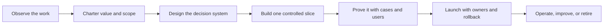

# Production Agent Engineering: An FDE Field Guide

An independent, open-source forward-deployed engineering (FDE) guide for moving AI-agent workflows from discovery to controlled production use.

[](https://github.com/davidahmann/production-agent-engineering/actions/workflows/validate.yml)
[](LICENSE)

Use this repository to:

- Find operational work where an agent can create measurable value—and reject weak use cases early.
- Turn field observations into a clear workflow, solution design, delivery plan, and controlled production service.
- Give customer teams the evidence, skills, ownership, and operating routines to maintain the result.

Leading an engagement? Begin with the [FDE playbooks](playbooks/README.md). Designing one system? Use [Start Here](library/00-start-here.md). Building with a coding agent? Give it [`AGENTS.md`](AGENTS.md) as its working map.

## What problem this guide solves

A useful demo can call a model and a few tools. A production system must also know who is allowed to act, which information is current, how to handle failure, how to prove that work finished, and how operators can stop or recover it.

In this guide, a **production agent** is a bounded workflow in which a model makes some decisions, software controls tools and state, and people remain accountable for the outcome.

This repository provides the design sequence, reusable contracts, tests, and operating checks around that workflow. It does not require a specific model or agent framework. It is not a drop-in runtime, a certification, or a substitute for your organization's security and risk review.

## Find your path

| If you need to… | Start with | You should leave with… |
| --- | --- | --- |
| Lead an FDE engagement | [FDE playbooks](playbooks/README.md) | A path from field discovery and value to customer-owned production operation |
| Decide what to build | [Discovery and Value](playbooks/01-discovery-and-value.md) and [Start Here](library/00-start-here.md) | An observed workflow, owner, baseline, measurable outcome, verifier, and go/no-go decision |
| Design a production system | [Production Implementation Playbook](library/07-production-implementation-playbook.md) | A domain model, architecture, behavior bundle, tool and capability contracts, evaluation cases, and threat model |
| Choose an architecture | [Blueprint selector](blueprints/README.md) | The smallest system shape that fits the workflow and its risks |
| Deliver and transfer a solution | [Solution Design and Delivery](playbooks/02-solution-and-delivery.md) | A tested vertical slice, adoption evidence, release plan, and customer-owned handoff |
| Review an existing agent | [Production, Evaluation, and Governance](library/04-production-evaluation-and-governance.md) and [release gates](operations/release-gates.md) | A list of control gaps, required tests, and a release decision |
| Build or repair evaluations | [Evaluation Corpus and Review Loops](library/09-evaluation-corpus-and-review-loops.md) | Repeatable success, failure, and adversarial scenarios |
| Operate or improve an agent | [Operate and Scale](playbooks/03-operate-and-scale.md) | A service cadence covering outcomes, adoption, reliability, safety, cost, change, and retirement |
| Debug a production failure | [Telemetry contract](operations/telemetry-contract.md) and [incident runbook](operations/incident-runbook.md) | Evidence for diagnosis, containment, recovery, and a regression case |
| Learn from working code | [Invoice-exception reference](examples/invoice-exception/README.md) | A tested example of approval, authorization, retry safety, and result verification |
| Understand why guidance exists | [Source index](library/05-source-index.md) and [dated research ledger](research/README.md) | The evidence, caveats, and review date behind a recommendation |

## From idea to production

The repository follows one delivery path. Each stage produces an artifact that the next stage can inspect or test.



| Stage | Plain-language question | Main artifact |
| --- | --- | --- |
| Observe | How does the work actually happen, including exceptions and workarounds? | [Field-observation log](templates/field-observation-log.md) and [FDE discovery pack](templates/fde-discovery-pack.md) |
| Charter | What narrow decision is worth improving, how will value be measured, and who owns the result? | [Workflow charter](templates/workflow-charter.json) and [value case](templates/value-case.md) |
| Plan adoption | How will users test, adopt, support, change, and eventually own the workflow? | [Delivery and adoption plan](templates/delivery-and-adoption-plan.md) and draft [customer handoff](templates/customer-enablement-handoff.md) |
| Model the domain | What objects, actions, rules, and sources of truth matter? | [Domain model template](templates/operational-ontology.json) |
| Design | Where do models, deterministic code, and people make decisions? | [Agent-system template](templates/agent-system.json) |
| Bind behavior | Which exact model route, prompt, harness, context policy, guardrails, and runtime work together? | [Behavior-bundle template](templates/behavior-bundle.json) |
| Bound capabilities | What may each exact capability build read or change, for whom, and under what policy? | [Tool contract](templates/tool-contract.json), [capability manifest](templates/capability-manifest.json), and [capability supply-chain guide](operations/capability-supply-chain.md) |
| Threat model | How could data, tools, identity, or evaluation be abused? | [Threat-model template](templates/threat-model.json) |
| Prove | Does it succeed, fail safely, and help users on representative work? | [Evaluation cases](templates/evaluation-case.json) and [evaluation report](templates/evaluation-report.json) |
| Launch | What compatible release and bounded autonomy are justified, who supports them, and what reverses them? | [Solution-release manifest](templates/solution-release.json), [release gates](operations/release-gates.md), and [customer handoff](templates/customer-enablement-handoff.md) |
| Operate | Is it valuable, adopted, reliable, safe, affordable, and supportable? | [Production service review](templates/production-service-review.md), [SLO scorecard](operations/slo-scorecard.md), and [incident runbook](operations/incident-runbook.md) |
| Improve or retire | Which field evidence justifies a change, expansion, constraint, or verified shutdown? | [Field-learning register](templates/field-learning-register.md), [change management](operations/change-management.md), and [controlled improvement](blueprints/controlled-improvement-agent.md) |

Draft the threat model before the evaluation suite, then refine both together as failure paths become concrete. If the workflow has no measurable outcome or trustworthy verifier, stay in discovery. A more capable model does not repair an undefined task.

## Learn from the reference system

The [invoice-exception example](examples/invoice-exception/README.md) shows the controlled-write method on a small financial workflow:

1. Read an invoice and the current policy.
2. Propose a resolution without giving the model authority to commit it.
3. Validate the proposal and stage it for approval.
4. Bind approval to the exact proposal.
5. Recheck permission and the current policy at commit time.
6. Make duplicate retries safe.
7. Verify the result in the ledger before reporting completion.

It includes machine-readable design files, a behavior bundle, tool and capability contracts, a threat model, executable policy, behavioral tests, adversarial evaluation cases, and a review-only release manifest. It is an in-memory teaching reference, not a deployable production service. Use the [checkout validation](#validate-a-checkout) to run it.

## Choose the smallest system shape

| Blueprint | Use it when | Typical result |
| --- | --- | --- |
| [Bounded retrieval](blueprints/bounded-retrieval-agent.md) | The path to evidence varies, but the agent only reads and cites information | An evidence-backed answer or escalation |
| [Transactional write](blueprints/transactional-write-agent.md) | The workflow may change a real system and needs policy, approval, duplicate safety, and result verification | A verified write receipt or safe rollback/escalation |
| [Event-driven investigation](blueprints/event-driven-investigation-agent.md) | Work begins from an event, may pause, and must survive restarts | A durable case record with evidence and a terminal state |
| [Multi-agent coordinator](blueprints/multi-agent-coordinator.md) | Specialists genuinely require different tools, permissions, context, or parallel execution | Scoped worker results merged and verified by a parent workflow |
| [Enterprise agent platform](blueprints/enterprise-agent-platform.md) | Several governed workflows need shared domain, capability, identity, evaluation, release, and operating services | A reusable control plane with customer-specific solution layers |
| [Governed data analysis](blueprints/data-analysis-agent.md) | Iterative analysis depends on metric semantics, query/code execution, source revisions, and claim-level review | An evidence-linked notebook, report, or decision artifact |
| [Controlled improvement](blueprints/controlled-improvement-agent.md) | Production signals should become isolated change candidates without giving the agent merge or deployment authority | A replay-tested candidate, independent decision, canary, or rollback |

Start with a deterministic workflow when the steps and branches are already known. Add an agent only where bounded judgment is useful. Add multiple agents only when a real permission, context, ownership, or latency boundary justifies the coordination cost.

## Production rules in plain language

- A model may propose an action; trusted software must authorize and execute it.
- Keep the acting principal unambiguous: bind interactive work to the current user with agent attribution, and give unattended work its own narrow workload identity.
- Keep credentials behind a trusted tool boundary and restrict where runtime traffic can go.
- Admit tools, MCP servers, skills, CLIs, and code packages by verified publisher, pinned build, digest, authority, assurance, and lifecycle—not by name alone.
- Treat retrieved documents, user input, tool results, and memory as data—not instructions with higher authority.
- A retry of the same business operation must not create a second real-world change.
- After a consequential change, check the system of record before claiming success.
- Limit steps, time, retries, parallel work, and cost; every run needs an explicit stop reason.
- Keep evaluation data and pass signals outside the agent's control.
- Capture enough evidence to explain, pause, recover, and improve the workflow.
- Pass work between agents or context windows through a typed, expiring, authority-reducing handoff—not a free-form summary.

The machine-readable [control catalog](controls/control-catalog.json) contains the repository's engineering baseline, with each requirement mapped to release gates. The [evaluation-report](schemas/evaluation-report.schema.json) and [solution-release](schemas/solution-release.schema.json) contracts make the tested claim and compatible release bundle explicit. This is project guidance, not an external compliance standard.

## Repository map

| Path | What it answers |
| --- | --- |
| [`playbooks/`](playbooks/README.md) | How an FDE team moves from customer discovery and value to delivery, adoption, handoff, and post-production improvement |
| [`library/`](library/00-start-here.md) | Why the design choices matter, what tends to fail, and how to work through a design |
| [`blueprints/`](blueprints/README.md) | Which reference architecture fits the workflow |
| [`templates/`](templates/README.md) | Which starter artifacts to adapt and complete for a new system |
| [`controls/`](controls/control-catalog.json) | Which production requirements and release gates apply |
| [`schemas/`](schemas/README.md) | What valid machine-readable artifacts look like |
| [`patterns/`](patterns/pattern-catalog.json) | Which implementation patterns and anti-patterns are cataloged |
| [`examples/`](examples/invoice-exception/README.md) | How the artifacts and controls work together in executable code |
| [`operations/`](operations/README.md) | How to release, observe, recover, change, and measure the system |
| [`research/`](research/README.md) | Which dated sources support changing implementation guidance |
| [`docs/maintainers/`](docs/maintainers/repository-maintenance.md) | How maintainers keep controls, evidence, contracts, navigation, and releases coherent |
| [`catalog.json`](catalog.json) | Which governed artifacts have stable IDs, types, paths, and tags |
| [`scripts/`](scripts/validate-repository.mjs) and [`tests/`](tests/schema-contracts.test.mjs) | How repository structure, contracts, and examples are verified |

The [agent-systems mind map](library/08-agent-systems-mind-map.md) shows how customer value, domain context, tools, identity, verification, adoption, and operations depend on one another. The [FDE and production-agent synthesis](library/10-fde-and-production-agent-synthesis.md) records the portable lessons behind the lifecycle.

## Evidence and scope

The guide combines practice-informed patterns with technical sources. The foundational [source index](library/05-source-index.md) distinguishes supplied summaries, supplied full text, and directly reviewed references. The dated research ledger covers sources reviewed from 2026-02-07 through 2026-08-07 and records caveats alongside portable findings. A separate [practitioner-video index](research/2026-08-07--ai-engineer-production-agent-video-index.md) records exact talks, chapters, corroboration, and claim limits.

Vendor scale and performance figures remain attributed. Experimental findings remain labeled. Platform behavior changes, so apply the same controls to your own environment and verify claims against current primary documentation before deployment.

## Validate a checkout

Requires Node.js 22 or later.

Review repository code before running it. For an untrusted contribution, use CI or a disposable environment with no credentials or sensitive data; `npm test` executes repository-controlled code.

```bash
npm ci --ignore-scripts
npm test
git diff --check
```

The suite checks repository links and anchors, JSON contracts, policy denials, authorization boundaries, duplicate-safe writes, adversarial scenarios, traces, and postcondition verification in the reference environment.

## Use this repository with a coding agent

[`AGENTS.md`](AGENTS.md) tells coding agents what is authoritative, how the folders relate, which files to read for each task, and what must pass before a change is complete. [`catalog.json`](catalog.json) is the governed-artifact registry; [`llms.txt`](llms.txt) is the compact navigation index.

A useful starting prompt is:

```text
Follow AGENTS.md. Help me design a production agent for [workflow].
Start by observing and chartering the current work: actor, decision,
inputs, action, owner, baseline, accepted outcome, verifier, adoption path,
and risk ceiling. Recommend the smallest matching blueprint. Then produce
the required design artifacts, threat model, evaluation cases, release
plan, and operating handoff, citing repository control IDs. Do not begin
implementation while a consequential discovery question is unresolved.
```

For an implementation or review task, state the target workflow, allowed autonomy, systems in scope, and expected deliverable. The agent can then route itself through the repository instead of loading every document.

## Contribute

Start with [CONTRIBUTING.md](CONTRIBUTING.md). Use [GitHub Discussions](https://github.com/davidahmann/production-agent-engineering/discussions) for design questions, [Issues](https://github.com/davidahmann/production-agent-engineering/issues) for reproducible defects or evidence corrections, and the private vulnerability channel in [SECURITY.md](SECURITY.md) for security reports.

Maintained by [David Ahmann](https://github.com/davidahmann) ([LinkedIn](https://www.linkedin.com/in/dahmann/)), a cloud, data, and AI platform leader with Field CTO experience. This is an independent project; no current or former employer endorsement is implied.

Licensed under [Apache-2.0](LICENSE). Citation metadata is in [`CITATION.cff`](CITATION.cff).
