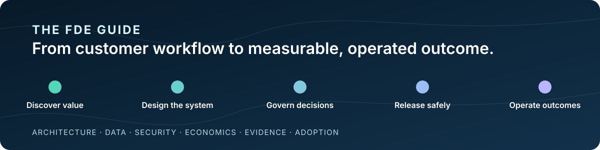
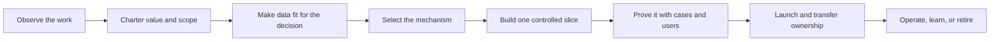

# The FDE Guide

> **Value engineering and production architecture for FDEs, applied-AI engineers, product teams, and operators**



An independent, open-source guide and engineering kit for forward deployed engineers (FDEs), internal applied-AI teams, and operators turning a real workflow into a measurable, operated AI-enabled service.

[](https://github.com/davidahmann/fde-guide/actions/workflows/validate.yml)
[](https://github.com/davidahmann/fde-guide/releases/latest)
[](LICENSE)

[Read on the web](https://davidahmann.github.io/fde-guide/) · [Read the concise Guide](guide/README.md) · [Use the value scorecard](guide/ai-value-engineering-scorecard.md) · [Establish data readiness](library/16-data-readiness-and-context-contracts.md) · [Build FDE capability](guide/capability-roadmap.md) · [Use the Handbook](playbooks/README.md) · [Run the code](#see-it-working) · [Browse solutions](solutions/README.md) · [Use with an agent](#optional-use-it-with-a-coding-agent)

## Choose your depth

This is one method at three levels. Start with only the depth your job requires.

| Layer | Use it when | Start here |
| --- | --- | --- |
| **The Guide** | You want the mental model, core principles, complete FDE delivery loop, or a practical path for building capability | [Read the concise Guide](guide/README.md) or follow the [FDE and AI engineer capability roadmap](guide/capability-roadmap.md) |
| **The Handbook** | You are qualifying, designing, delivering, transferring, or operating a real workflow | [Follow the lifecycle playbooks](playbooks/README.md) and [human-readable library](library/00-start-here.md) |
| **The Engineering Kit** | You need implementation artifacts, architecture, machine-readable contracts, release controls, executable examples, or tests | [Inspect the kit](#what-is-in-the-engineering-kit), [controlled-write system](examples/invoice-exception/README.md), and [hybrid system](examples/shipment-risk-triage/README.md) |

The Guide explains the method. The Handbook supports judgment. The Engineering Kit makes claims, authority, behavior, and changes inspectable and testable. They are not separate frameworks.

New to the role or assessing a team? The [capability roadmap](guide/capability-roadmap.md) compares adjacent responsibilities, organizes the work into eight capability domains, and provides four evidence-backed practice missions, a five-part starter pack, and a concise glossary. It is a learning route over this method—not a certification or separate framework.

## The core idea: engineer value before autonomy

**Start with the work and the accepted outcome—not with a model or agent topology.**

A production AI-enabled system must do more than produce a plausible answer. It must know who may act, which information is current, how failure is contained, how completion is verified, what the full service costs, and who can operate or stop it.

An agent is one component option. For each consequential decision, compare deterministic software, optimization, classical ML, retrieval, a foundation-model call, a bounded agent workflow, and human review. Select the smallest sufficient mechanism and preserve its evidence, authority, cost, fallback, and retirement path.

> **Tokens are an input. Autonomy is a design choice. Accepted outcomes are the product.**

The [12 Factors of AI Value Engineering](library/14-twelve-factors-ai-value-engineering.md) turn that principle into explicit value, verifier, adoption, authority, cost, proof, and lifecycle gates. Use the one-page [AI Value Engineering Scorecard](guide/ai-value-engineering-scorecard.md) to assess one workflow without reading the full operating manual.

## See it working

This repository is not only documentation. It contains JavaScript runtimes, policies, evaluation runners, typed JSON contracts, capability manifests, threat models, release evidence, and regression tests.

| Executable system | What it demonstrates | Inspect the implementation |
| --- | --- | --- |
| [Invoice-exception resolution](examples/invoice-exception/README.md) | A model proposes; trusted software authorizes, stages, commits, deduplicates, and verifies a reversible ledger effect | [runtime](examples/invoice-exception/reference-loop.mjs), [authorization policy](examples/invoice-exception/authorization-policy.mjs), [tool contracts](examples/invoice-exception/tools/), [adversarial cases](examples/invoice-exception/evals/), and [tests](examples/invoice-exception/reference-loop.test.mjs) |
| [Shipment-risk triage](examples/shipment-risk-triage/README.md) | Classical ML scoring, deterministic routing, optional model explanation, and human review in one bounded workflow | [runtime](examples/shipment-risk-triage/shipment-risk-triage.mjs), [selection record](examples/shipment-risk-triage/intelligence-selection.md), [evaluation cases](examples/shipment-risk-triage/evals/), and [tests](examples/shipment-risk-triage/shipment-risk-triage.test.mjs) |

Run the executable evidence with Node.js 22 or later:

```bash
npm ci --ignore-scripts
npm run test:reference
npm run test:evals
npm run test:hybrid
```

The examples are in-memory teaching systems, not deployable products. Their tests prove only the declared local behavior. The full repository gate also validates links, schemas, controls, release integrity, security contracts, telemetry, and solution coverage.

## Who this is for

| You own | Start with | You should leave with |
| --- | --- | --- |
| Learning, hiring, or capability development | [FDE and AI engineer capability roadmap](guide/capability-roadmap.md) → one practice mission | Role boundaries, capability gaps, starter artifacts, and inspectable evidence without a stack-first curriculum |
| Business value or use-case selection | [Concise Guide](guide/README.md) → [Discovery and Value](playbooks/01-discovery-and-value.md) | Bounded workflow, baseline, accepted outcome, verifier, value case, guardrails, and decision |
| Data, context, or knowledge readiness | [Data readiness and context contracts](library/16-data-readiness-and-context-contracts.md) → [assessment](templates/data-readiness-assessment.md) | Decision-bound source inventory, quality thresholds, preparation lineage, output ownership, remediation economics, and operating contract |
| FDE or internal applied-AI delivery | [Handbook](playbooks/README.md) → current lifecycle stage | Evidence-backed path from observation through adoption, handoff, operation, and field learning |
| AI engineering or software architecture | [Intelligence selection](library/12-software-architecture-and-intelligence-selection.md) → [blueprints](blueprints/README.md) | Smallest sufficient mechanism, coherent system boundary, contracts, failure behavior, and test plan |
| Platform, security, release, or reliability | [Security and action boundaries](library/15-production-ai-security-and-action-boundaries.md) → [controls](controls/control-catalog.json) → [release gates](operations/release-gates.md) → [operations](operations/README.md) | Explicit authority, compatible release, telemetry, recovery, change, and retirement evidence |
| Technical enablement or review | [Worked systems](#see-it-working) → [templates](templates/README.md) | A concrete view of the code, design packet, evaluation, and operating evidence |

## From idea to production

The entire repository follows one delivery loop.



| Stage | Question | Working artifact |
| --- | --- | --- |
| Observe | How does the work really happen, including exceptions and recovery? | [Observation log](templates/field-observation-log.md) and [discovery pack](templates/fde-discovery-pack.md) |
| Charter | Is the workflow worth changing, and how will an outcome be accepted? | [Workflow charter](templates/workflow-charter.json), [value case](templates/value-case.md), and [AI Value Engineering Scorecard](guide/ai-value-engineering-scorecard.md) |
| Prepare data | Are the operational, context, evaluation, and feedback sources fit for this decision and affordable to operate? | [Data-readiness assessment](templates/data-readiness-assessment.md) and [data-context manifest](templates/data-context-manifest.json) |
| Select | Which steps belong in software, optimization, ML, retrieval, a model, an agent, or human review? | [Intelligence-selection record](templates/intelligence-selection-record.md) |
| Build | What is the smallest end-to-end slice that exercises the real boundaries and work surface? | [Delivery plan](templates/delivery-and-adoption-plan.md), [domain model](templates/operational-ontology.json), and applicable [blueprint](blueprints/README.md) |
| Prove | Does it work safely, economically, and usefully on representative cases? | [Evaluation cases](templates/evaluation-case.json), user evidence, failure tests, and applicable release record |
| Launch | Can the exact release be contained, recovered, supported, and rolled back? | [Production service readiness](templates/production-service-readiness.md), [release gates](operations/release-gates.md), [customer handoff](templates/customer-enablement-handoff.md), and model/agent [solution release](templates/solution-release.json) where applicable |
| Operate | Should the service continue, improve, expand, constrain, pause, or retire? | [Service review](templates/production-service-review.md), [operations](operations/README.md), and [field-learning register](templates/field-learning-register.md) |

If the workflow has no measurable outcome, credible verifier, accountable owner, accessible context, adoption path, or tolerable risk boundary, stay in discovery. A more capable model will not repair an undefined task.

## What is in the Engineering Kit

| Path | What it provides |
| --- | --- |
| [`examples/`](examples/invoice-exception/README.md) | Executable reference runtimes, policies, worlds, evaluation runners, threats, release evidence, and regression tests |
| [`solutions/`](solutions/README.md) | Business-flow patterns, industry profiles, and horizontal accelerators—design starting points, not deployable products |
| [`blueprints/`](blueprints/README.md) | Reference architectures with components, trust boundaries, state, failures, telemetry, and release tests |
| [`templates/`](templates/README.md) | Discovery, value, data readiness, architecture, domain, evaluation, release, adoption, handoff, and service-review artifacts |
| [`controls/`](controls/control-catalog.json) | Machine-readable production requirements and release-gate mappings normative within this guide |
| [`schemas/`](schemas/README.md) | JSON Schema 2020-12 contracts for governed data, design, evaluation, capability, handoff, telemetry, and release records |
| [`patterns/`](patterns/pattern-catalog.json) | Evidence-linked implementation patterns and anti-patterns |
| [`operations/`](operations/README.md) | Release, data quality and drift, telemetry, SLO, incident, behavior-monitoring, change, recovery, and retirement guidance |
| [`research/`](research/README.md) | Dated sources, portable findings, attribution, and caveats behind changing recommendations |
| [`scripts/`](scripts/validate-repository.mjs) and [`tests/`](tests/) | Repository validation, semantic invariants, security regressions, release-integrity checks, and executable examples |

The current machine-readable evaluation-report and solution-release profiles bind model and agent releases. Deterministic, optimization, or classical-ML-only systems retain equivalent ordinary software architecture, test, provenance, deployment, rollback, and operating evidence; do not create placeholder agent artifacts.

## Start from a business flow

After the workflow and value case are approved, the [operational solution portfolio](solutions/README.md) can accelerate design without replacing target-specific discovery or evidence.

| Business flow | Smallest useful result |
| --- | --- |
| [Exception to resolution](solutions/business-flows/exception-to-resolution.md) | One exception reaches verified resolution, recovery, or owned escalation |
| [Signal to investigation](solutions/business-flows/signal-to-investigation.md) | One persistent case contains attributable evidence, bounded review, and owned obligations |
| [Risk to prioritized action](solutions/business-flows/risk-to-prioritized-action.md) | One eligible item is scored or optimized, policy-routed, reviewed, and measured |
| [Request to activation](solutions/business-flows/request-to-activation.md) | One request reaches an independently accepted first outcome or safe rejection |

Apply an industry profile only when it adds real domain constraints: [healthcare access coordination](solutions/verticals/healthcare-access-coordination.md), [financial-services investigation](solutions/verticals/financial-services-investigation.md), or [industrial operations response](solutions/verticals/industrial-operations-response.md). Then select only the required horizontal foundation for identity, integrations, sensitive evidence, or deployment and operations.

These artifacts are design hypotheses. They are not customer observations, compliance evidence, authorization policy, or release evidence.

## Optional: use it with a coding agent

The guide is complete as documentation. The optional task skills make ten focused jobs easier to invoke from Codex, Claude Code, Cursor, and other compatible agents:

```bash
npx skills add davidahmann/fde-guide
```

Review the CLI and skill source before installation, and pin the repository release or commit you reviewed for production use. To use the repository without installing anything, clone it and give your agent [`AGENTS.md`](AGENTS.md).

```text
Use $qualify-ai-workflow to assess this candidate workflow: [describe it].
```

<details>
<summary>See all ten optional workflow skills</summary>

| Job | Skill |
| --- | --- |
| Qualify a workflow | [`$qualify-ai-workflow`](.agents/skills/qualify-ai-workflow/SKILL.md) |
| Engineer the value case | [`$engineer-ai-value`](.agents/skills/engineer-ai-value/SKILL.md) |
| Select the mechanism | [`$select-ai-mechanism`](.agents/skills/select-ai-mechanism/SKILL.md) |
| Design the system | [`$design-production-ai-system`](.agents/skills/design-production-ai-system/SKILL.md) |
| Build evaluations | [`$build-ai-evaluation`](.agents/skills/build-ai-evaluation/SKILL.md) |
| Secure action boundaries | [`$secure-ai-action-boundary`](.agents/skills/secure-ai-action-boundary/SKILL.md) |
| Review production readiness | [`$review-ai-production-readiness`](.agents/skills/review-ai-production-readiness/SKILL.md) |
| Operate a service or portfolio | [`$operate-ai-service`](.agents/skills/operate-ai-service/SKILL.md) |
| Transfer ownership | [`$transfer-ai-service`](.agents/skills/transfer-ai-service/SKILL.md) |
| Productize field learning | [`$productize-field-learning`](.agents/skills/productize-field-learning/SKILL.md) |

</details>

Skills are instruction-only routes over the same governed artifacts. They grant no tools, credentials, permissions, approval, or evidence. Target-system policy, human authority, exact capability admission, schemas, and controls remain controlling.

## Scope and evidence

The repository does not require a specific model, cloud, or agent framework. It is not a drop-in runtime, certification, or substitute for the target organization's review. The control catalog is engineering policy normative within this guide, not an external compliance standard.

Practice-informed guidance is separated from dated research, controls, executable evidence, and vendor or speaker claims. Metrics remain attributed; experimental findings remain labeled. Verify changing platform behavior against current primary documentation before deployment.

[`AGENTS.md`](AGENTS.md) is the repository working contract, [`catalog.json`](catalog.json) is the governed-artifact registry, and [`llms.txt`](llms.txt) is the compact machine-navigation index.

## Validate a checkout

Review repository code before running it. For an untrusted contribution, use CI or a disposable environment without credentials or sensitive data.

```bash
npm ci --ignore-scripts
npm test
git diff --check
```

## Contribute

Start with [CONTRIBUTING.md](CONTRIBUTING.md). Use [Discussions](https://github.com/davidahmann/fde-guide/discussions) for design questions, the focused [field-signal form](https://github.com/davidahmann/fde-guide/issues/new?template=field-signal.yml) to suggest an anonymized lesson or learning resource, [Issues](https://github.com/davidahmann/fde-guide/issues) for reproducible defects or evidence corrections, and the private channel in [SECURITY.md](SECURITY.md) for vulnerabilities.

Maintained by [David Ahmann](https://github.com/davidahmann) ([LinkedIn](https://www.linkedin.com/in/dahmann/)), a cloud, data, and AI platform leader with Field CTO experience. This is an independent project; no current or former employer endorsement is implied.

Licensed under [Apache-2.0](LICENSE). Citation metadata is in [`CITATION.cff`](CITATION.cff).
