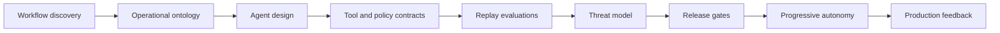

# Production Agent Engineering: An FDE Field Guide

An open-source field guide for designing, evaluating, securing, deploying, and operating production AI agents.

[](https://github.com/davidahmann/production-agent-engineering/actions/workflows/validate.yml)
[](LICENSE)

This repository is a vendor-neutral engineering kit: machine-readable controls, JSON Schemas, architecture blueprints, replay evaluations, operational runbooks, and a tested transactional reference system. It is built from forward-deployed engineering (FDE) patterns, implementation field notes, and dated technical sources.

It is not an agent framework or a model leaderboard. Changing platform guidance lives in the dated [research ledger](research/README.md); vendor metrics remain attributed.

## Start here

| Goal | Entry point |
| --- | --- |
| Select a workflow | [FDE discovery pack](templates/fde-discovery-pack.md) |
| Establish production requirements | [Control catalog](controls/control-catalog.json) |
| Choose a system shape | [Architecture blueprints](blueprints/README.md) |
| Define runtime contracts | [Schemas](schemas/), [templates](templates/) |
| Build replay evaluations | [Evaluation guide](library/09-evaluation-corpus-and-review-loops.md) |
| Review a release | [Release gates](operations/release-gates.md) |
| Inspect executable behavior | [Invoice-exception reference](examples/invoice-exception/README.md) |
| Trace guidance to evidence | [Source index](library/05-source-index.md), [current research](research/2026-02-07--2026-08-07-production-agent-source-ledger.md) |

## Delivery path



## Choose an architecture

| Blueprint | Use when | External effect |
| --- | --- | --- |
| [Bounded retrieval](blueprints/bounded-retrieval-agent.md) | Evidence can be gathered and cited without mutation | None |
| [Transactional write](blueprints/transactional-write-agent.md) | A business operation needs policy, approval, idempotency, and readback | Staged or reversible write |
| [Event-driven investigation](blueprints/event-driven-investigation-agent.md) | Work must survive restarts and react to changing evidence | Case updates only |
| [Multi-agent coordinator](blueprints/multi-agent-coordinator.md) | Independent specialists can run with scoped authority and explicit join semantics | Per-worker scoped |

## Production invariants

- Model output never authorizes an action or proves completion.
- Effect boundaries recheck caller identity, tenant, scope, policy revision, and approval freshness when approval is required.
- External effects use a service-enforced idempotency key tied to the business operation and source-of-truth readback.
- Retrieved content, telemetry, and tool output remain untrusted input.
- Evaluation infrastructure is isolated from the agent being scored.
- Success is measured per accepted outcome, including retries, latency, tools, and human review.

The requirements and release tests in the [control catalog](controls/control-catalog.json) are normative within this guide. They are engineering policy for this project, not an external compliance standard.

## Repository map

```text
.
├── blueprints/    # reference architecture, state, trust, and failure designs
├── controls/      # machine-readable production requirements and gates
├── examples/      # schema-valid, executable vertical reference system
├── library/       # engineering decisions, patterns, and anti-patterns
├── operations/    # release, telemetry, SLO, and incident specifications
├── patterns/      # machine-readable pattern and anti-pattern catalog
├── research/      # dated evidence and source-quality ledger
├── schemas/       # JSON Schema 2020-12 system and runtime contracts
├── scripts/       # repository and artifact validation
└── templates/     # copy-ready discovery, design, policy, and eval artifacts
```

Machine index: [`catalog.json`](catalog.json). Agent instructions: [`AGENTS.md`](AGENTS.md). Compact agent index: [`llms.txt`](llms.txt).

## Validate

Requires Node.js 22 or later.

```bash
npm ci
npm test
git diff --check
```

The suite validates schemas, embedded tool contracts, control and evidence references, links and anchors, negative policy cases, adversarial replay worlds, trace conformance, idempotency, authorization, and postcondition readback.

## Contribute

Start with [CONTRIBUTING.md](CONTRIBUTING.md). Use [GitHub Discussions](https://github.com/davidahmann/production-agent-engineering/discussions) for design questions, [Issues](https://github.com/davidahmann/production-agent-engineering/issues) for reproducible defects or evidence corrections, and the private vulnerability channel defined in [SECURITY.md](SECURITY.md) for security reports.

Maintained by [David Ahmann](https://github.com/davidahmann) ([LinkedIn](https://www.linkedin.com/in/dahmann/)), a cloud, data, and AI platform leader with Field CTO experience. This is an independent project; no current or former employer endorsement is implied.

Licensed under [Apache-2.0](LICENSE). Citation metadata is in [`CITATION.cff`](CITATION.cff).
