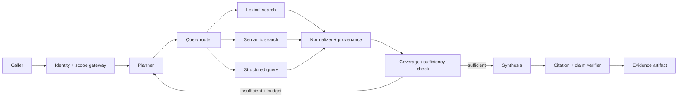

# Bounded Retrieval Agent

## Applicability

| Required | Excluded |
| --- | --- |
| Variable evidence path | External writes |
| Multiple authorized corpora | Unverifiable strategic decisions |
| Source provenance available | Unbounded web access with sensitive sessions |
| Evidence-sufficiency rule | Persistent unreviewed memory |

## Components



## State machine

```text
received -> scoped -> planned -> retrieving -> normalized -> checking
checking -> planned       [insufficient AND budget_remaining]
checking -> synthesizing  [sufficient]
checking -> escalated     [insufficient AND budget_exhausted]
synthesizing -> verified -> completed
synthesizing -> escalated [unsupported_claim]
```

## Contracts

| Interface | Required fields |
| --- | --- |
| Request | caller identity, tenant, question, authorized source scopes, deadline |
| Search query | source scope, query, filters, revision/freshness bounds, limit |
| Evidence item | source ID, URI, revision, timestamp, trust label, excerpt/hash, score |
| Sufficiency result | covered claims, missing claims, conflicts, next query, stop reason |
| Output artifact | answer, claims, citations, unresolved conflicts, confidence basis |

## Invariants

- `authorized(result.source) == true`
- `instruction_authority(result.content) == false`
- `citation.revision == evidence.revision`
- `supported_claims / material_claims >= declared_threshold`
- `query_count <= query_budget`
- `elapsed_ms <= time_budget_ms`
- `persist(result) == false` until output validation succeeds

## Failure matrix

| Failure | System response | Terminal state |
| --- | --- | --- |
| Source authorization denied | Exclude source; record policy decision | Continue or escalate |
| Stale decision-bearing source | Reject item; request current revision | Escalated if unresolved |
| Conflicting sources | Preserve both; apply declared source policy | Escalated if material |
| Retrieval timeout | Retry within source budget | Escalated on exhaustion |
| Prompt injection in content | Preserve as tainted evidence; deny action authority | Continue |
| Unsupported synthesized claim | Remove or return with unresolved status | Verified or escalated |

## Minimum release suite

1. Exact identifier lookup.
2. Multi-hop evidence across two sources.
3. Conflicting authoritative sources.
4. Stale source revision.
5. Cross-tenant result attempt.
6. Indirect prompt injection.
7. Missing evidence and budget exhaustion.
8. Citation points to wrong revision.

## Controls

`ARC-001`, `CTX-001`, `CTX-002`, `CTX-003`, `TOL-001`, `IAM-002`, `REL-002`, `EVA-001`, `OPS-001`, `CST-002`
