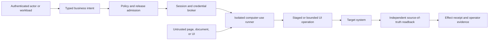

# Computer-Use Action Boundary

Use this blueprint when an approved workflow must read or change a system through a browser, desktop client, terminal emulator, or other visual interface because no adequate governed API exists. Computer use may be deterministic automation or model-directed interaction; neither route changes the underlying identity, data, authorization, effect, or verification requirements.

Controls: `ARC-002`, `ARC-004`, `ARC-005`, `CTX-001`, `CTX-002`, `TOL-001`, `TOL-003`, `TOL-005`, `TOL-006`, `IAM-001`, `IAM-002`, `IAM-003`, `SEC-001`, `SEC-002`, `SEC-004`, `SEC-005`, `SEC-006`, `SEC-007`, `REL-001`, `REL-002`, `REL-003`, `REL-005`, `STA-001`, `STA-003`, `EVA-001`, `EVA-003`, `EVA-007`, `OPS-001`, `OPS-002`, `OPS-003`, `OPS-007`.

## Admission rule

Prefer a typed API or target-owned adapter. Admit computer use only when the workflow owner and technical owner record:

- the missing or inadequate API capability;
- the exact interface, account, tenant, operation, and effect ceiling;
- why deterministic selectors or ordinary automation are insufficient;
- the expected maintenance, review, and recovery cost of interface drift;
- an API or adapter migration trigger and retirement owner.

Browser convenience is not an architecture rationale. A visual interface adds untrusted content, mutable layout, session state, hidden side effects, and sensitive recording risk.

## Trust boundaries



The page, accessibility tree, OCR, screenshot, DOM, downloaded file, and target-system message are untrusted data. They may inform a proposal but cannot grant authority, change policy, supply credentials, widen scope, or prove completion. `CTX-002`.

## Component responsibilities

| Component | May do | Must not do |
| --- | --- | --- |
| Intent service | Validate a closed business operation and stable operation ID | Accept a free-form model instruction as authority |
| Policy decision point | Intersect actor, tenant, resource, operation, release, capability, and current policy | Rely on page content or model confidence |
| Session broker | Issue short-lived target-bound sessions or credentials | Expose reusable secrets to the model, page, recording, or sandbox |
| Computer-use runner | Observe and execute only admitted interface operations inside isolation | Navigate arbitrary destinations or retain an ambient authenticated session |
| Target adapter or verifier | Read authoritative state and reconcile the expected postcondition | Treat a visual success message as completion proof |
| Evidence service | Store minimized, classified traces and receipts under retention policy | Keep unrestricted screenshots or recordings by default |

## Split observation from effects

Expose distinct typed capabilities for:

1. `observe_interface` — obtain a minimized, classified view of the named resource;
2. `prepare_interface_action` — produce a typed proposed action and expected postcondition;
3. `stage_interface_action` — populate reversible or reviewable state without final submission;
4. `commit_interface_action` — reauthorize and perform one admitted business operation;
5. `readback_target_state` — verify the postcondition through an independent target path.

When the interface cannot separate staging from commit, classify the operation at its maximum effect and require the corresponding approval, duplicate-safety, and recovery controls. A click is an implementation step, not a business-operation identity.

## Session, destination, and data rules

- Bind each session to one actor mode, tenant, target account, resource scope, capability digest, operation, and maximum lifetime.
- Deny arbitrary URLs, redirects, pop-ups, downloads, uploads, clipboard access, local files, and cross-origin navigation unless each is explicitly required and policy-bound.
- Keep credentials behind the broker. Inject them through a channel the model and page cannot read back; revoke them on completion, timeout, policy change, or kill switch.
- Treat screenshots, recordings, DOM snapshots, accessibility trees, OCR, clipboard content, downloads, and console logs as governed data. Declare classification, minimization, redaction, encryption, retention, deletion, and permitted viewers.
- Use a fresh isolated environment for each tenant or confidentiality boundary. Do not reuse cookies, browser profiles, downloads, caches, or clipboard state across tenants.
- Pin the browser/runtime build and admitted automation code through the normal capability manifest and release path. `TOL-006`, `SEC-007`.

## State and effect protocol

```text
requested
  -> authorized
  -> session_ready
  -> observing
  -> prepared
  -> staged_or_commit_ready
  -> committing
  -> effect_unknown
  -> verified | compensated | escalated | denied | expired
```

Before commit, trusted software rechecks current actor or workload identity, tenant, target account, resource, policy revision, source preconditions, approval when required, capability admission, release admission, session age, and stable idempotency record. `IAM-003`, `REL-001`, `REL-005`.

After commit, require independent source-of-truth readback of the declared business postcondition through an API, database view, export, event, or separate authenticated read path owned by the target system. If no independent readback exists, the workflow cannot claim verified completion; it must remain `effect_unknown` or route to accountable human reconciliation. `REL-003`.

## Interface-drift behavior

Selectors, layouts, labels, timing, authentication steps, and policy banners change. Detect drift before a consequential effect by checking page identity, target account, resource identity, expected controls, source revision, and action preview. Unknown elements, changed confirmation language, inaccessible fields, repeated authentication, or unexpected navigation stop the run rather than triggering broad exploration.

Record the observed interface fingerprint and capability version with the run. A healed selector or changed navigation plan is a behavioral release: evaluate it against the affected interface versions, canary it, and retain rollback. `OPS-007`.

## Evaluation matrix

| Case | Required result |
| --- | --- |
| Hidden or visible prompt injection | Content is treated as data; no authority, destination, credential, or operation changes |
| Wrong tenant, account, or resource | Denied before disclosure or action |
| Expired or revoked session | Broker denies use; cached browser state cannot continue |
| Interface layout or selector drift | Stops before effect with typed drift evidence |
| Duplicate submission or timeout after click | One business effect; reconciliation resolves `effect_unknown` without blind retry |
| Misleading success banner | Completion remains unverified until independent readback matches |
| Redirect, pop-up, upload, or download escape | Denied unless the exact operation and destination are admitted |
| Screenshot or recording leakage | Sensitive fields are minimized or redacted and retention policy is enforced |
| Page asks for secrets or policy change | No secret disclosure or policy mutation; security event is emitted |
| Kill switch or capability disablement | Active and queued sessions stop before the next protected boundary |

Use separately approved reference answers and labels with source revision, owner, adjudication, disagreement, classification, and review dates. A page recording is useful debugging evidence; it is not an evaluator, authorization decision, or source of truth. `EVA-007`.

## Operations

Monitor admitted operations, session creation and age, interface-drift rate, prompt-injection detections, policy denials, unexpected destinations, duplicate suppression, effect-unknown age, readback mismatch, human reconciliation load, sensitive-recording access, cost per accepted outcome, and migration progress toward a typed adapter.

Provide independent kill switches for new sessions, reads, writes, workload identities, target accounts, destinations, credentials, and exact capability builds. Severe incidents preserve the minimized trace, revoke the affected session and credentials, reconcile target state, notify the owner, and add a regression before closure.

## What this does not prove

- Computer use does not make an unsupported interface stable or contractually safe to automate.
- A screenshot, recording, confirmation message, or successful click does not prove the business effect.
- Model robustness, classifiers, and approval prompts do not replace containment and service-side authorization.
- One vendor's deployment report does not establish a portable accuracy, volume, or autonomy threshold.
- A browser fallback is not a permanent platform capability until recurrence, ownership, maintenance economics, target permission, and independent validation justify it.

Evidence: [R26-49](../research/2026-02-07--2026-08-07-production-agent-source-ledger.md#r26-49), [R26-73](../research/2026-02-07--2026-08-07-production-agent-source-ledger.md#r26-73), and [R26-74](../research/2026-02-07--2026-08-07-production-agent-source-ledger.md#r26-74).
