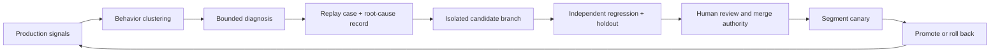

# Controlled Improvement Agent

## Purpose

Turn production signals into reviewable change candidates without allowing the agent to change the systems that judge, approve, or deploy its work.



## Authority separation

| Plane | Agent may | Agent MUST NOT |
| --- | --- | --- |
| Evidence | Read redacted traces, metrics, incidents, and user corrections | Read credentials, hidden evaluation answers, or unrestricted customer payloads |
| Diagnosis | Cluster behavior and propose a causal failure record | Label correlation as root cause without replay evidence |
| Change | Write to an isolated branch or candidate artifact store | Modify production, protected branches, policies, registries, or release approvals |
| Evaluation | Request approved suites and consume signed results | Edit tests, graders, fixtures, thresholds, reference answers, or pass signals |
| Delivery | Prepare diff, migration, canary, rollback, and review packet | Approve, merge, deploy, expand autonomy, or suppress alerts |

Use distinct workload identities for evidence read, candidate write, evaluator execution, and deployment. No principal may span candidate author and release decision authority.

## Diagnostic record

```text
diagnostic_id
signal_window + affected release/route/segment
first_divergent_step
violated_invariant
failure_class
owning_layer
causal_evidence
counterevidence
world/policy/data/component revisions
replay_case_ids
customer and security impact
confidence + unresolved alternatives
owner + severity + due date
```

Failure classes: `context`, `retrieval`, `data_quality`, `model_behavior`, `tool_contract`, `authorization`, `state`, `effect_unknown`, `postcondition`, `evaluation`, `runtime`, `capacity`, `cost`, `human_interface`, `adoption`, `unknown`.

## Candidate change packet

- Before/after digests for model route, prompt, context policy, tool, guardrail, evaluator, runtime, and schema.
- Affected workflows, segments, identities, data classes, effect classes, and external dependencies.
- Diagnostic and replay-case links.
- Threat-model delta and new negative tests.
- Compatibility and migration plan.
- Independent evaluation report, including unchanged holdout and contamination attestation.
- Canary population, duration, success/rollback criteria, and accountable owner.
- Rollback artifact and last-known-good digest.
- Required reviewers and segregation-of-duties check.

## State machine

```text
signal_detected
  -> cluster_confirmed
  -> diagnosis_replayed
  -> candidate_created
  -> independent_eval_requested
independent_eval_requested -> eval_failed [terminal]
independent_eval_requested -> eval_passed -> review_rejected [terminal]
eval_passed -> review_approved -> canary_started
canary_started -> rolled_back [terminal]
canary_started -> canary_passed -> promoted -> monitored [terminal]
```

Every terminal path emits a reason. No failed, rejected, or rolled-back path reaches promotion; a new attempt starts a new candidate with a new digest and evaluation record. An evaluation failure cannot be converted into a pass by changing the threshold inside the same change packet.

## Release tests

- Candidate identity cannot write evaluator, CI, policy, approval, protected branch, registry, or deployment resources.
- A production incident produces a replay case before closure (EVA-004).
- The first divergent step and violated invariant reproduce in the frozen world.
- Candidate passes the incident case, unchanged regression suite, isolated holdout, safety slices, and resource budgets.
- Evaluator and decision principals differ from the candidate author.
- Changed model/prompt/tool/context/guardrail routes are evaluated independently (OPS-007).
- Canary can be stopped by kill switch, automatically rolls back on declared criteria, and verifies the restored digest.
- Promotion cannot occur from an agent-authored natural-language success claim.

Evidence leads: R26-17, R26-20, R26-25, R26-46, R26-51, R26-55.

## Controls

`EVA-002`, `EVA-004`, `EVA-006`, `IAM-001`, `IAM-002`, `OPS-001`, `OPS-002`, `OPS-003`, `OPS-005`, `OPS-007`, `REL-003`, `SEC-004`
