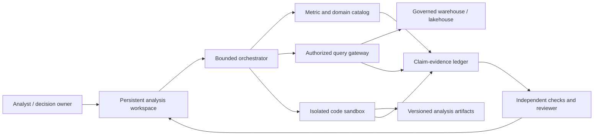

# Governed Data Analysis Agent

## Use when

- The work is iterative: inspect, query, reconcile, explain, and revise.
- Correctness depends on metric semantics, snapshot time, joins, filters, or messy source data.
- Reviewers need a persistent notebook, claims table, or report rather than a chat transcript.

Do not use this pattern when a deterministic dashboard, saved query, or fixed rule answers the bounded question.

## System boundary



Trust boundaries:

1. The model proposes plans, queries, code, and claims; it does not grant data access or certify results.
2. The query gateway enforces user/workload identity, tenant, row/column policy, approved sources, query shape, scan/cardinality/cost limits, and snapshot semantics.
3. Code runs without ambient credentials in an ephemeral sandbox. Dataset access occurs through bounded handles.
4. The claim-evidence ledger records source revision, query/code digest, time scope, metric definition, transformations, checks, and uncertainty.
5. Release graders, reference answers, policy, and production promotion remain outside the agent write boundary.

## Required contracts

### Analysis request

| Field | Requirement |
| --- | --- |
| Decision | The business decision the analysis must support |
| Population | Eligible entities and explicit denominator |
| Metrics | Catalog IDs, owners, versions, units, aggregation, and guardrails |
| Time | Event time, processing time, timezone, snapshot/as-of rule |
| Segments | Permitted dimensions and minimum cohort sizes |
| Authority | Caller, tenant, row/column policy, purpose, expiry |
| Budgets | Turns, queries, rows, bytes, scan cost, sandbox time, tokens, total cost |
| Deliverable | Notebook, table, chart, memo, or review packet |
| Acceptance | Deterministic checks plus named domain-review rubric |

### Query plan

The model submits a typed logical plan. A deterministic compiler and policy layer MUST:

- resolve metrics and joins from the governed semantic layer;
- reject unknown tables, columns, functions, destinations, and dynamic identifiers;
- enforce row, column, tenant, purpose, and time-snapshot policy below the model;
- estimate scan volume, output cardinality, latency, and cost before execution;
- parameterize values and reject multi-statement, DDL, DML, external functions, and unrestricted export;
- return query digest, policy decision, source revisions, row count, truncation state, and cost.

### Claim-evidence record

```text
claim_id
claim_text_hash
metric_definition_id + version
population + segment + time_window
source/query/code/artifact digests
world and policy revisions
deterministic checks
reconciliation results
uncertainty and limitations
review state + reviewer
supersedes / invalidated_by
```

Free-form explanation is presentation. The record above is the review and audit unit.

## State machine

```text
received
  -> scoped
  -> semantics_resolved
  -> plan_authorized
  -> data_profiled
  -> analysis_executed
  -> claims_reconciled
  -> artifact_rendered
  -> independently_checked
  -> accepted | revision_requested | escalated | failed
```

Each state transition persists input/output digests and a terminal reason. Iteration returns to a named prior state; it does not silently overwrite accepted evidence.

## Verification matrix

| Layer | Deterministic checks | Judgment checks |
| --- | --- | --- |
| Semantics | Metric/version exists; unit and aggregation match | Metric is appropriate for the decision |
| Data | Schema, freshness, nulls, duplicates, join cardinality, denominator | Missingness and bias materially affect interpretation |
| Query/code | AST policy, execution, resource limits, reproducible digest | Method is proportionate and assumptions are defensible |
| Result | Reconciliation, totals, invariants, sensitivity bounds | Conclusions follow from the evidence |
| Artifact | Claims link to evidence; labels/time/source present | Narrative and visual hierarchy support review |
| Safety | No unauthorized row/column/export/tool action | Sensitive disclosure is minimized for the audience |

Same-agent critique MAY find defects; it MUST NOT be presented as independent verification.

## Evaluation program

Required slices:

- no tool call, wrong tool, and invalid query-parameter selection;
- ambiguous metric, competing definitions, and missing denominator;
- stale snapshot, late-arriving data, policy drift, and schema drift;
- join explosion, duplicate rows, null-heavy cohorts, Simpson's paradox, and tiny segments;
- unsupported causal claim, cherry-picked window, and uncertainty crossing the release threshold;
- prompt injection in source text, notebook cells, labels, metadata, and prior artifacts;
- row/column/tenant escape, oversized result, expensive query, export attempt, and credential request;
- multi-session memory aging, corrected source data, invalidated conclusions, and evolving workspace state.

Run the same workload over repeated trials and a multi-day simulated workspace. Record accepted outcome, reviewer corrections, claim-level precision, prohibited disclosure, query cost, cycle time, and cost per accepted analysis—not only execution success.

## Failure behavior

| Failure | Terminal or recovery behavior |
| --- | --- |
| Metric ambiguity | Pause and present the competing governed definitions |
| Missing/stale source | Stop the affected claim; do not substitute an unapproved source |
| Query denied | Preserve policy reason; revise within existing authority or escalate |
| Resource budget | Return partial evidence and explicit unresolved work; no hidden sampling |
| Reconciliation mismatch | Invalidate dependent claims and return to analysis execution |
| Policy/source revision changes | Invalidate approval and rerun affected plans and checks |
| Artifact render failure | Preserve verified claims; retry presentation only |
| Reviewer rejection | Version a new candidate; preserve prior evidence and decision |

## Release tests

- ARC-002: model output cannot bypass semantic, query, policy, or promotion enforcement.
- CTX-001/CTX-002: every decision source is revisioned and untrusted content has no instruction authority.
- TOL-005/SEC-006: reads declare exposure and remain identity, tenant, account, destination, and budget bound.
- EVA-001/EVA-003/EVA-006: release evidence covers semantics, data, trajectory, artifacts, safety, budgets, uncertainty, and high-risk slices.
- HUM-001/HUM-002: the reviewer can inspect, correct, reject, pause, and resume a persistent evidence-linked artifact.
- OPS-006/OPS-007: production monitoring detects data, policy, model, tool, and behavior drift per versioned route.

Evidence leads: R26-16, R26-23, R26-40, R26-47, R26-51, R26-52, R26-53.
