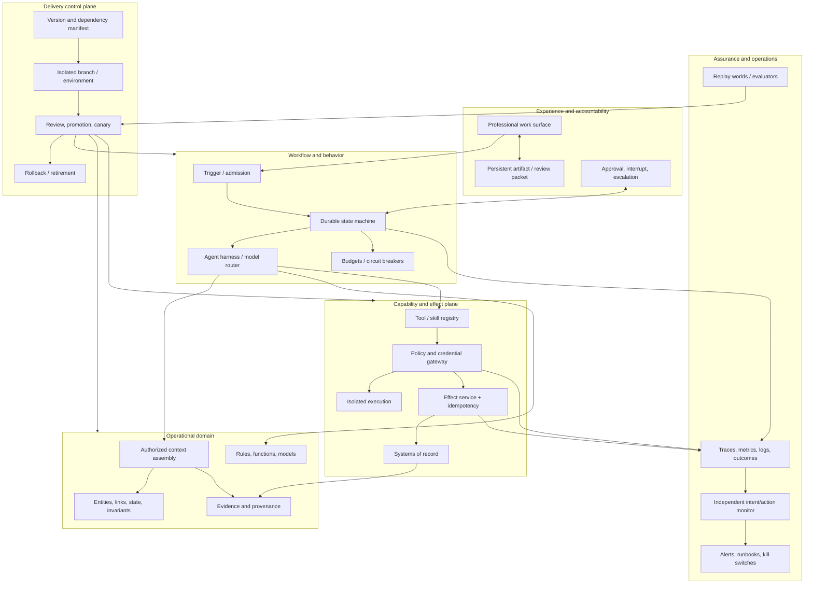

# Enterprise Agent Platform Blueprint

Use this blueprint when several production-agent workflows need shared identity, context, tool, evaluation, delivery, and operating capabilities. Do not build a platform before one bounded workflow proves which capabilities are actually reusable.

## Design goals

- Preserve direct traceability from customer outcome to runtime effect.
- Keep models replaceable and deny them authority over identity, policy, state, evaluation, and completion.
- Represent the operational domain as entities, state, logic, actions, security, evidence, and feedback.
- Make each workflow independently releasable, containable, observable, and retirable.
- Separate reusable platform capability from customer-specific data, policy, and workflow configuration.

Controls: `ARC-001`, `ARC-002`, `ARC-004`, `DEL-001`, `DEL-002`, `OPS-006`, `OPS-007`.

## Logical architecture



## Component contracts

| Component | Responsibility | Must not own |
| --- | --- | --- |
| Professional surface | Present state, evidence, uncertainty, alternatives, and permitted actions | Authorization or hidden completion logic |
| Admission | Validate trigger, tenant, actor, segment, rate, and workflow version | Free-form model interpretation of authority |
| Durable workflow | Persist transitions, timers, retries, approvals, cancellation, and terminal state | Hidden state in a conversation session |
| Harness/router | Assemble bounded context, invoke model, validate structured output, route tools | Secrets, final authorization, or business completion proof |
| Operational domain | Define identities, relationships, lifecycle, rules, actions, and invariants | Source-specific leakage into every consumer |
| Context assembly | Retrieve authorized high-signal evidence with provenance and freshness | Instruction authority from retrieved content |
| Tool registry | Publish owned, typed, versioned, task-shaped capabilities and lifecycle | Blanket organizational tool exposure |
| Policy/credential gateway | Intersect actor, agent, tenant, resource, purpose, tool, policy, and approval | Model-visible credentials or prompt-only enforcement |
| Effect service | Enforce stable operation identity, current-state preconditions, idempotency, receipt, and readback | Trust in caller-supplied completion claims |
| Sandbox | Bound code, filesystem, process, compute, time, and capability-aware egress | Shared production credentials or unrestricted network |
| Evaluation service | Run isolated fixtures, trials, graders, negative controls, and reports | Agent-writable labels, pass signals, or merge authority |
| Observability | Record privacy-minimized versions, state, policy, tools, effects, outcomes, and cost | Hidden reasoning or unrestricted payload capture |
| Intent/action monitor | Compare declared intent with observable action payloads and escalate or contain | Authorization decisions or agent rationalization as trusted evidence |
| Delivery control plane | Version the compatible solution, isolate changes, promote, canary, rollback, and retire | Treat merge or deployment request as proof of health |

## Trust boundaries

1. **User and external input → admission:** validate shape, identity, tenant, purpose, and eligibility.
2. **Retrieved/tool content → model context:** retain provenance and taint; content cannot redefine authority.
3. **Model output → workflow:** accept only closed schemas; reject unknown state transitions and instructions.
4. **Workflow → tool gateway:** re-evaluate current actor, scope, policy, approval, budget, and resource revision.
5. **Sandbox → network/service:** enforce operation-aware egress and brokered short-lived credentials.
6. **Proposal → external effect:** use stable business-operation identity, current-state precondition, idempotency, and source-of-truth readback.
7. **Runtime → evaluation:** sanitize production evidence; deny the candidate access to hidden tests, labels, graders, other trials, and pass signals.
8. **Candidate change → production:** require independent review, compatible manifest, canary, health and outcome soak, and rollback.
9. **FDE/platform → customer environment:** keep customer data and policy inside the customer boundary; export only approved reusable patterns.

## Runtime actor modes

| Mode | Identity | Authority |
| --- | --- | --- |
| `interactive_delegated` | Short-lived user-bound session with explicit agent attribution | Intersection of current user, agent, tool, resource, tenant, policy, and approval |
| `unattended_workload` | Dedicated non-human workload identity | Predefined segment and capability policy; no user impersonation |
| `mixed` | Explicit user-bound and unattended phases with separate attribution | The narrower current phase authority; no authority inheritance across the mode change |

Delegated workers and effect services are identity roles, not actor-mode enum values:

| Role | Identity | Authority |
| --- | --- | --- |
| Worker or subagent | Child identity or delegation token linked to parent run | Downscoped task, tools, context, budget, and expiry |
| Effect service | Target-service identity behind trusted gateway | Only validated, authorized, duplicate-safe operations |

Controls: `IAM-001`, `IAM-002`, `IAM-003`.

## Solution release manifest

Each candidate records digests or immutable versions for:

- Workflow charter and accepted-outcome contract
- Domain model, source schema, retrieval/index, and policy
- Agent system, model routes, prompts, context rules, and guardrails
- Tool contracts, implementations, registry entries, credentials, and egress policy
- State schema, migrations, runtime, sandbox, and dependencies
- User surface, review packet, training, and support procedure
- Threat model, evaluation cases, graders, world fixtures, and claim manifest
- Telemetry contract, alerts, runbooks, SLOs, and rollback

Control: `DEL-001`.

## State transitions

```text
candidate
  -> chartered
  -> designed
  -> sandbox_verified
  -> shadow_verified
  -> canary
  -> bounded_production
  -> expanded | constrained | paused | retired

any active state
  -> incident_contained
  -> reconciled
  -> remediated
  -> prior_verified_state | retired
```

The workflow runtime maintains its own domain state machine. The delivery state machine cannot be changed by model output or runtime success text.

## Failure behavior

| Failure | Required behavior |
| --- | --- |
| Missing/stale source or policy | Stop affected decision path; preserve evidence; retry only under freshness policy |
| Tool contract or authorization denial | Do not transform denial into another capability; escalate with typed reason |
| Timeout before effect | Retry within budget using stable operation ID |
| Timeout after possible effect | Enter effect-unknown state, read back source of truth, then complete or reconcile |
| Approval expired or policy changed | Revalidate proposal; require fresh approval when obligations changed |
| Duplicate delivery | Return prior receipt; create no second business effect |
| Context/handoff loss | Fail closed if objective, authority, provenance, verified state, or unresolved work is incomplete |
| Evaluator contamination | Invalidate report, quarantine suite, rotate hidden data, block promotion |
| Monitor outage | Follow declared degraded mode; never convert monitor absence into authorization |
| Dependency/model regression | Stop rollout, route to verified prior configuration, preserve affected-run manifest |
| Customer ownership gap | Hold expansion; restore paired operating mode or constrain service |

## Telemetry

In addition to the [telemetry contract](../operations/telemetry-contract.md), record:

- Workflow charter, solution release, and user-surface versions
- Eligible segment and accepted-outcome verifier revision
- Actor mode and user-plus-agent attribution
- Context/handoff schema version and provenance completeness
- Evaluation claim, trial, environment, and report revision
- Adoption, override, abandonment, reviewer wait, and support event
- Dependency lifecycle and current deprecation risk
- Customer service owner and operating-maturity state

Control: `OPS-006`.

## Release tests

- Deterministic/single-call/coded-workflow baseline comparison
- Requirement-to-component trace completeness
- Cross-resource compatibility and migration rehearsal
- User-delegated and unattended identity separation
- Cross-tenant, stale-policy, revoked-scope, and approval-expiry denial
- Sensitive read, result-size, redirect, credential-provenance, and package-proxy egress cases
- Duplicate, reordered, cancelled, partial, and timeout-after-effect delivery
- Context-reset and worker handoff preserving objective, authority, provenance, and open work
- Evaluation answer-key, cross-trial, contamination, and agent-mutation denial
- Per-model and per-route behavior regression
- Alert-route, kill-switch, rollback, reconciliation, and retirement game days
- Operator review, interruption, support, and customer-led release exercises
- Accepted-outcome, adoption, cost, and value thresholds by segment

## Scaling rule

Reuse the control plane, schemas, patterns, and operating methods. Keep each workflow's customer data, domain policy, permissions, value contract, and release evidence isolated. Add a shared capability only after at least one workflow proves the interface and another can reuse it without inheriting the first workflow's private assumptions.

Evidence: [R26-42](../research/2026-02-07--2026-08-07-production-agent-source-ledger.md#r26-42), [R26-44](../research/2026-02-07--2026-08-07-production-agent-source-ledger.md#r26-44), [R26-46](../research/2026-02-07--2026-08-07-production-agent-source-ledger.md#r26-46), [R26-48](../research/2026-02-07--2026-08-07-production-agent-source-ledger.md#r26-48), and [R26-49](../research/2026-02-07--2026-08-07-production-agent-source-ledger.md#r26-49).
