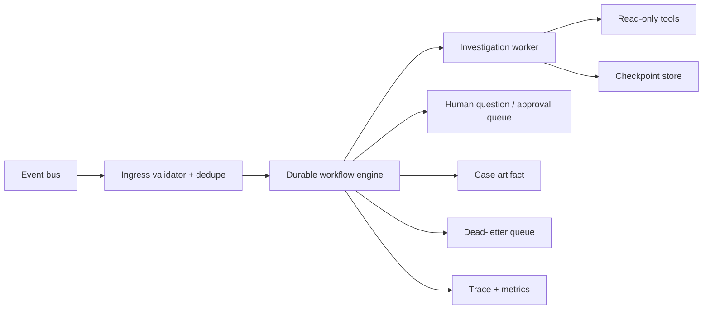

# Event-Driven Investigation Agent

## Components



## Event envelope

```json
{
  "event_id": "uuid",
  "event_type": "alert.created",
  "event_version": "1.0.0",
  "tenant_id": "tenant-a",
  "object_id": "alert-123",
  "occurred_at": "2026-08-07T17:00:00Z",
  "source_revision": "42",
  "traceparent": "00-...",
  "dedupe_key": "tenant-a:alert-123:42"
}
```

## State machine

```text
received -> validated -> leased -> investigating -> checkpointed
checkpointed -> investigating [more_evidence]
checkpointed -> waiting_human [question_or_approval]
waiting_human -> investigating [resume_event]
investigating -> completed [verifier_pass]
investigating -> escalated [budget_or_evidence_failure]
any active state -> cancelled [cancellation_event]
retry_exhausted -> dead_lettered
```

## Durability contract

| Concern | Requirement |
| --- | --- |
| Delivery | At-least-once accepted; effects idempotent |
| Lease | Owner, expiry, heartbeat, fencing token |
| Checkpoint | State version, evidence hashes, budgets, next action |
| Replay | Reducer is deterministic; side effects identified by receipt |
| Migration | State schema version and migration function |
| Cancellation | Propagates to active tool calls and delegated workers |
| Dead letter | Original event, failure class, attempts, owner, replay gate |
| Retention | Per-field classification, TTL, legal/audit requirements |

## Invariants

- One active lease per workflow instance.
- Stale fencing tokens cannot commit checkpoints or effects.
- Reducer replay never re-executes completed external effects.
- Retry classification is deterministic and versioned.
- Cancellation stops new actions and records partial work.
- Resume restores budgets, authorization, and source freshness checks.

## Failure matrix

| Failure | Response |
| --- | --- |
| Duplicate event | Return existing workflow ID and receipt |
| Worker crash | Lease expiry; resume from checkpoint |
| Tool timeout | Retry by class and budget |
| Provider outage | Pause workflow; degrade or reroute by policy |
| Invalid checkpoint | Quarantine; restore prior verified state |
| Version incompatibility | Block resume; migrate or escalate |
| Human timeout | Expire approval; escalate or close safely |

## Minimum release suite

1. Duplicate event delivery.
2. Worker crash after tool result and before checkpoint.
3. Timeout before and after a side effect.
4. Cancellation during tool execution.
5. Checkpoint schema migration.
6. Expired lease and stale fencing token.
7. Human pause and resume after authorization change.
8. Dead-letter replay after defect correction.

## Controls

`REL-001`, `REL-002`, `REL-003`, `REL-004`, `STA-001`, `STA-003`, `OPS-001`, `OPS-003`, `OPS-005`, `CST-002`
