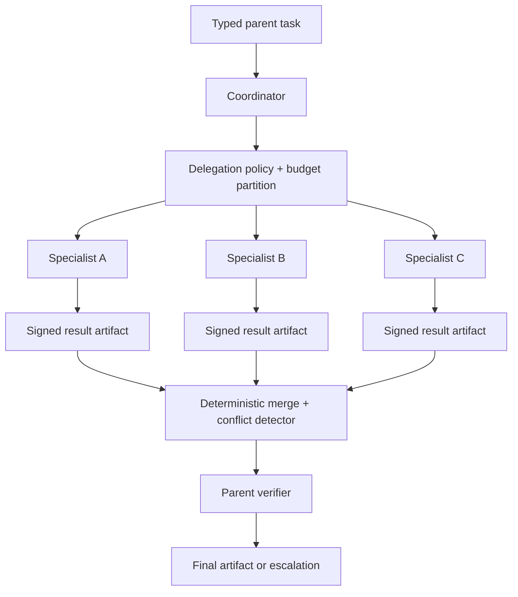

# Multi-Agent Coordinator

## Admission criteria

At least one MUST be true:

- Workers require non-overlapping restricted data or tools.
- Workers require substantially different context that degrades combined performance.
- Independent work can reduce wall time within a declared capacity budget.
- Organizational ownership requires separate accountable services.

## Components



## Delegation envelope

```json
{
  "parent_run_id": "run-123",
  "task_id": "sanctions-review",
  "worker_role": "sanctions-specialist",
  "objective": "return evidence-backed sanctions status",
  "allowed_sources": ["sanctions-index"],
  "allowed_tools": ["search-sanctions"],
  "caller_authority_digest": "sha256:...",
  "budget": { "steps": 6, "time_ms": 20000, "cost_usd": 0.08 },
  "result_schema": "sanctions-result@1.0.0",
  "deadline": "2026-08-07T17:00:20Z"
}
```

## Coordination protocol

| Concern | Contract |
| --- | --- |
| Fan-out | Static maximum and per-role capacity |
| Identity | Worker identity + attenuated initiating-caller authority |
| Budget | Parent budget partition; child cannot borrow implicitly |
| Cancellation | Parent cancellation propagates to all children |
| Result | Typed artifact, evidence, versions, cost, terminal reason |
| Merge | Deterministic precedence and conflict detection |
| Partial failure | Required versus optional worker roles |
| Retry | Stable task ID and idempotent worker result |
| Environment | Comparable tool/source/model revisions for confirmation |

## Invariants

- `child_authority ⊆ parent_authority ∩ worker_role_authority`
- `sum(child_budget) <= parent_delegation_budget`
- `active_workers <= fanout_limit`
- Child output cannot directly mutate parent durable state.
- Coordinator cannot reinterpret a policy denial as success.
- Merge preserves provenance and unresolved conflicts.
- Parent completion requires parent-level verification.

## Failure matrix

| Failure | Response |
| --- | --- |
| Required worker denied | Parent escalates; no substitution with broader worker |
| Optional worker timeout | Mark missing evidence; continue if verifier permits |
| Contradictory results | Preserve evidence; run conflict rule or human review |
| Parent cancelled | Cancel children; reject late results |
| Worker exceeds budget | Terminate child; return partial artifact |
| Duplicate child task | Return existing signed result |
| Environment mismatch | Reject confirmation; rerun in comparable environment |

## Minimum release suite

1. Authority attenuation on every worker.
2. Fan-out cap under recursive delegation attempt.
3. Parent cancellation with active workers.
4. Required worker failure.
5. Optional worker timeout.
6. Contradictory specialist conclusions.
7. Duplicate child task and result replay.
8. Budget partition and aggregate cost ceiling.

## Controls

`ARC-003`, `IAM-001`, `IAM-002`, `REL-001`, `REL-002`, `REL-004`, `STA-001`, `EVA-001`, `OPS-001`, `CST-001`, `CST-002`
