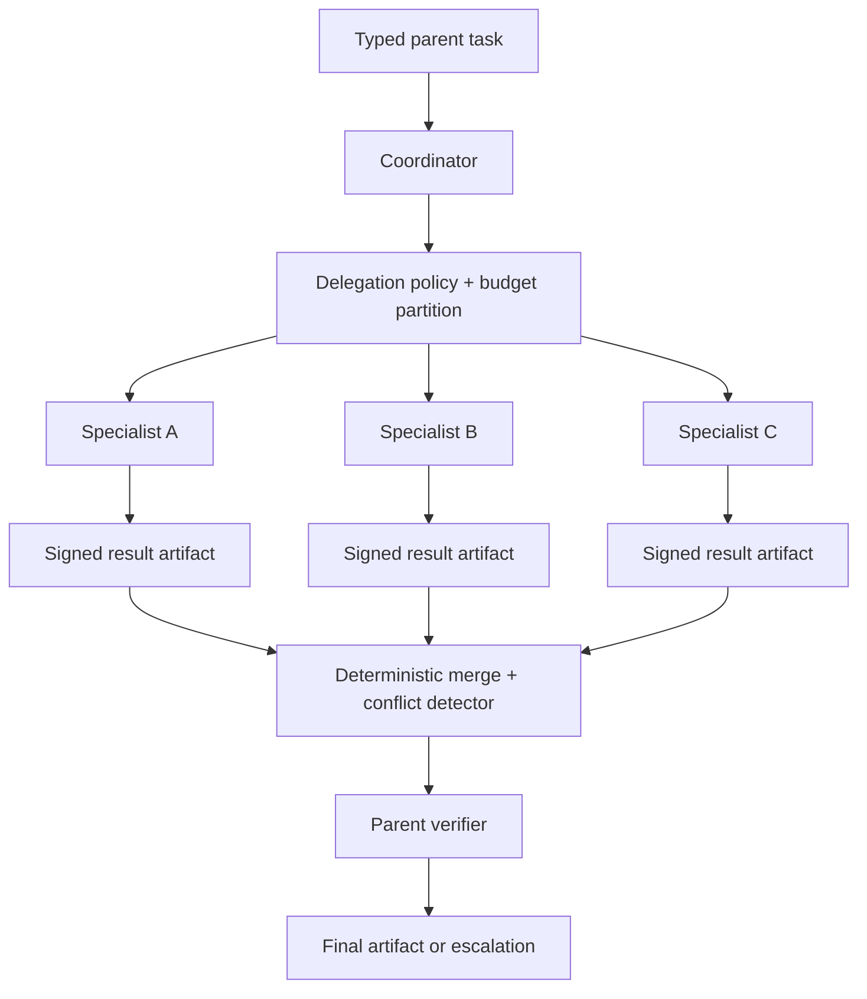

# Multi-Agent Coordinator

## Admission criteria

At least one MUST be true:

- Workers require non-overlapping restricted data or tools.
- Workers require substantially different context that degrades combined performance.
- Independent work can reduce wall time within a declared capacity budget.
- Organizational ownership requires separate accountable services.

Before admission, run the same representative suite through a serial single-agent or deterministic baseline. Record task success, safety, latency, cost, review load, and failure isolation. Parallel or specialist decomposition is accepted only when the measured benefit exceeds coordination cost and introduces no unresolved authority or merge ambiguity (`ARC-004`).

## Components

## Delegation envelope

Every worker, agent, and context-reset delegation MUST validate against the canonical [handoff-envelope schema](../schemas/handoff-envelope.schema.json) (`CTX-005`). Start from the [handoff-envelope template](../templates/handoff-envelope.json) rather than inventing a coordinator-specific packet.

The envelope binds:

- Producer and recipient with immutable principal/workload identity, system, role, run, and actor mode; objective and acceptance conditions
- Verified state, evidence provenance, unresolved work, and untrusted payload references
- Parent-authority lookup ID and current state revision; tenant, initiating-caller ceiling, delegated actions and scopes, effect ceiling, policy revision, and delegation depth
- Exact parent handoff ID and envelope digest for nested delegation
- Remaining steps, tool calls, time, tokens, and cost
- Issuer, attestation, content digest, nonce, parent handoff digest, expiry, and single-use replay policy
- Explicit terminal reason

The recipient's versioned system and tool contracts enforce role-specific result validation and source allowlists. The envelope carries the applicable objective, verified state, provenance, and attenuated authority; free-form text remains untrusted data. The returned worker result uses the same envelope so the parent can verify authority, provenance, budget, and terminal state before merge.

At consumption, trusted code MUST resolve the current parent grant or consumed parent handoff from an authoritative store, recompute the parent-authority digest from that state, and verify the producer and exact nested lineage. It MUST also authenticate the current recipient and exactly match its immutable principal, system, role, run, and actor mode to the envelope before admitting work. After attestation verification, one durable atomic compare-and-swap transaction MUST claim both `handoff_id` and nonce and reserve the requested child allocation against the current parent and recipient revisions (`CTX-005`, `IAM-002`, `IAM-003`, `REL-002`, `REL-004`). Missing parent state, current recipient, verifier, or atomic claim service fails closed. A schema-valid envelope is only a proposal until these consume-time checks pass.

The atomic claim is the execution admission record. A concurrent or post-restart retry of the same envelope receives `already_claimed` and must not execute again; reuse of either replay key with different content is a conflict. An unknown claim outcome remains blocked until the durable ledger is reconciled—never “rolled back” from process memory.

## Coordination protocol

| Concern | Contract |
| --- | --- |
| Fan-out | Static maximum and per-role capacity |
| Identity | Authenticated current recipient + exact principal/system/role/run/actor binding + attenuated initiating-caller authority |
| Budget | Durable atomic replay-claim and compare-and-reserve against current parent and recipient revisions; aggregate sibling allocation cannot exceed the parent ceiling |
| Cancellation | Parent cancellation propagates to all children |
| Result | Typed artifact, evidence, versions, cost, terminal reason |
| Context handoff | Typed, provenance-preserving packet with allowed fields, trust labels, freshness, and consumer |
| Merge | Deterministic precedence and conflict detection |
| Partial failure | Required versus optional worker roles |
| Retry | Durable single-use handoff ID and nonce; `already_claimed` never re-admits execution; stable task ID and idempotent worker result |
| Environment | Comparable tool/source/model revisions for confirmation |
| Validation | Parent verifier receives the evidence required to check results and, for independent review, does not inherit unnecessary worker reasoning or hidden answer context |

## Invariants

- `child_authority ⊆ parent_authority ∩ worker_role_authority`
- `sum(child_budget) <= parent_delegation_budget`
- The budget inequality is enforced over all sibling reservations, not independently per envelope.
- `active_workers <= fanout_limit`
- A nested handoff names the exact authoritative parent handoff ID and digest, and its producer is that parent's recipient.
- The envelope recipient exactly matches an authenticated, active current principal before the durable claim transaction.
- Child output cannot directly mutate parent durable state.
- Coordinator cannot reinterpret a policy denial as success.
- Merge preserves provenance and unresolved conflicts.
- Parent completion requires parent-level verification.
- Free-form conversation history is not a worker handoff contract.

## Failure matrix

| Failure | Response |
| --- | --- |
| Required worker denied | Parent escalates; no substitution with broader worker |
| Optional worker timeout | Mark missing evidence; continue if verifier permits |
| Contradictory results | Preserve evidence; run conflict rule or human review |
| Parent cancelled | Cancel children; reject late results |
| Worker exceeds budget | Terminate child; return partial artifact |
| Duplicate child task | Return existing signed result |
| Reused handoff ID or nonce | Reject before reservation or worker admission |
| Parent missing, stale, revoked, or wrong lineage | Reject; do not fall back to envelope-declared authority |
| Recipient missing, unauthenticated, inactive, or mismatched | Reject before replay claim or budget reservation |
| Atomic claim unavailable, ambiguous, or budget-exhausted | Reject; reconcile durable state before retry; do not start the child |
| Environment mismatch | Reject confirmation; rerun in comparable environment |

## Minimum release suite

1. Authority attenuation on every worker.
2. Fan-out cap under recursive delegation attempt.
3. Parent cancellation with active workers.
4. Required worker failure.
5. Optional worker timeout.
6. Contradictory specialist conclusions.
7. Duplicate child task, reused handoff ID, reused nonce, and result replay.
8. One atomic replay-claim and sibling-budget reservation with an aggregate parent ceiling.
9. Invented parent, stale parent revision, and nested parent ID/digest mismatch.
10. Wrong, inactive, or unauthenticated current recipient is rejected before claim.
11. Successful root and nested consumption through authoritative parent and recipient resolution.
12. Concurrent and post-restart replay returns `already_claimed` without second admission.
13. Unavailable verifier or atomic claim service fails closed.
14. Serial baseline comparison and admission decision.
15. Malformed, over-scoped, stale, and tainted context-handoff rejection.

## Controls

`ARC-003`, `ARC-004`, `CTX-005`, `IAM-001`, `IAM-002`, `IAM-003`, `REL-001`, `REL-002`, `REL-004`, `STA-001`, `EVA-001`, `OPS-001`, `CST-001`, `CST-002`
