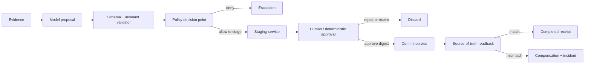

# Transactional Write Agent

## Components



## Effect protocol

```text
proposal_digest = hash(canonical(proposal + source_revisions + policy_revision))
idempotency_key = hash(tenant_id + business_object_id + operation + source_revision)

propose -> validate -> authorize -> stage -> approve(proposal_digest)
        -> reauthorize -> commit(idempotency_key) -> readback -> receipt
```

## Trust boundaries

| Boundary | Enforcement |
| --- | --- |
| Caller → agent | Authentication, tenant, purpose, request schema |
| Agent → tool gateway | Workload identity + caller-authority intersection |
| Model → action | Typed intent only; no direct credential or API access |
| Stage → approval | Immutable proposal digest, reviewer role, expiry |
| Approval → commit | Reauthorization, digest match, idempotency |
| Commit → completion | Independent source-of-truth readback |

## State machine

```text
received -> evidence_loaded -> proposed -> validated -> authorized -> staged
staged -> approved -> reauthorized -> committed -> readback_verified -> completed
staged -> rejected
staged -> expired
any pre-commit state -> escalated
committed -> compensation_required [readback_mismatch]
```

## Invariants

- Model output cannot transition `authorized`, `approved`, `committed`, or `completed`.
- Approval binds exact proposal, source revisions, policy revision, tenant, and expiry.
- Commit service enforces idempotency independently of agent memory.
- Caller authorization is re-evaluated immediately before commit.
- Completion requires source-of-truth readback.
- Compensation is preapproved, typed, separately authorized, and observable.
- Secrets remain behind the tool gateway.

## Failure matrix

| Failure | Response | Effect ceiling |
| --- | --- | --- |
| Validation failure | Reject proposal; attach field errors | None |
| Policy denial | Record decision; escalate | None |
| Approval rejection/expiry | Discard staged proposal | Staged only |
| Commit timeout | Retry with same idempotency key; read back first | One effect |
| Authorization changed | Deny commit; invalidate approval | Staged only |
| Readback mismatch | Freeze writes; compensate; incident | Bounded |
| Duplicate event | Return existing operation receipt | One effect |

## Minimum release suite

1. Approved proposal commits exactly once.
2. Unauthorized caller cannot stage or commit.
3. Cross-tenant object is denied.
4. Approval digest mismatch is denied.
5. Expired approval is denied.
6. Commit timeout followed by retry produces one effect.
7. Policy revision changes between stage and commit.
8. Readback mismatch invokes compensation and incident flow.
9. Prompt-injected evidence cannot bypass policy.
10. Cost or step budget stops before commit.

## Controls

`ARC-002`, `TOL-003`, `IAM-001`, `IAM-002`, `IAM-003`, `SEC-001`, `SEC-002`, `REL-001`, `REL-003`, `STA-002`, `EVA-003`, `HUM-001`, `OPS-002`
