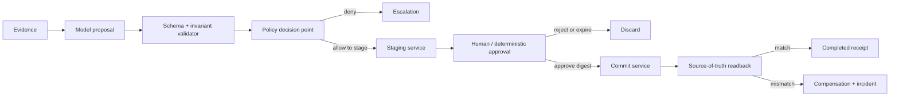

# Transactional Write Agent

## Components



## Effect protocol

```text
business_operation_id = stable caller/workflow ID for one intended effect
proposal_digest = hash(canonical(proposal + source_revisions + policy_revision))
idempotency_key = hash(canonical({tenant_id, business_operation_id, operation}))

propose -> validate -> authorize -> stage -> approve(proposal_digest)
        -> reauthorize -> commit(idempotency_key) -> readback -> receipt
```

The business operation ID remains stable across delivery retries, timeouts, and recovery. Source revisions belong in the proposal digest and commit preconditions; they must not change the retry key. A materially new intended effect receives a new business operation ID. This follows the stable-key semantics described in the IETF Idempotency-Key draft. That document is an expired work-in-progress Internet-Draft, not an RFC; use it as non-normative design input. [R26-60]

## Trust boundaries

| Boundary | Enforcement |
| --- | --- |
| Caller → agent | Authentication, tenant, purpose, request schema |
| Agent → tool gateway | Workload identity + caller-authority intersection |
| Model → action | Typed intent only; no direct credential or API access |
| Stage → approval | Immutable proposal digest, reviewer role, expiry |
| Approval → commit | Reauthorization, digest match, idempotency |
| Commit → completion | Independent source-of-truth readback |

## State machine

```text
received -> evidence_loaded -> proposed -> validated -> authorized -> staged
staged -> approved -> reauthorized -> commit_requested
commit_requested -> committed -> readback_verified -> completed
commit_requested -> effect_unknown [timeout or ambiguous acknowledgement]
effect_unknown -> readback_verified -> completed [matching effect found]
effect_unknown -> reconciliation_required [absent, conflicting, or unverifiable readback]
staged -> rejected
staged -> expired
any pre-commit state -> escalated
committed -> compensation_required [readback_mismatch]
compensation_required -> compensated | incident_contained
reconciliation_required -> compensated | incident_contained
```

## Invariants

- Model output cannot transition `authorized`, `approved`, `committed`, or `completed`.
- Approval binds exact proposal, source revisions, policy revision, tenant, and expiry.
- Commit service enforces idempotency independently of agent memory.
- A retry of one intended effect reuses the original business operation ID and idempotency key.
- Caller authorization is re-evaluated immediately before commit.
- Completion requires source-of-truth readback.
- An ambiguous commit result enters `effect_unknown`; the workflow MUST read back before retrying, compensating, or claiming completion.
- Compensation is preapproved, typed, separately authorized, and observable.
- Secrets remain behind the tool gateway.

## Failure matrix

| Failure | Response | Effect ceiling |
| --- | --- | --- |
| Validation failure | Reject proposal; attach field errors | None |
| Policy denial | Record decision; escalate | None |
| Approval rejection/expiry | Discard staged proposal | Staged only |
| Commit timeout | Retry with same idempotency key; read back first | One effect |
| Authorization changed | Deny commit; invalidate approval | Staged only |
| Readback mismatch | Freeze writes; compensate; incident | Bounded |
| Duplicate event | Return existing operation receipt | One effect |

## Minimum release suite

1. Approved proposal commits exactly once.
2. Unauthorized caller cannot stage or commit.
3. Cross-tenant object is denied.
4. Approval digest mismatch is denied.
5. Expired approval is denied.
6. Commit timeout followed by retry produces one effect.
7. Policy revision changes between stage and commit.
8. Readback mismatch invokes compensation and incident flow.
9. Prompt-injected evidence cannot bypass policy.
10. Cost or step budget stops before commit.
11. A retry after source revision drift returns the prior receipt or a typed precondition conflict and never creates a second effect.

## Controls

`ARC-002`, `TOL-003`, `IAM-001`, `IAM-002`, `IAM-003`, `SEC-001`, `SEC-002`, `REL-001`, `REL-003`, `REL-005`, `STA-002`, `EVA-003`, `HUM-001`, `OPS-002`

[R26-60]: ../research/2026-02-07--2026-08-07-production-agent-source-ledger.md#r26-60
