# Invoice Exception Reference System

## Objective

```text
invoice exception event
  -> gather ledger/vendor/policy evidence
  -> propose resolution
  -> validate invariants
  -> authorize and stage
  -> approve exact proposal digest
  -> reauthorize and commit idempotently
  -> reconcile any effect-unknown timeout
  -> read back ledger state
  -> completed receipt | compensation + incident
```

## Architecture

```mermaid
flowchart LR
    E["Exception event"] --> W["Durable workflow"]
    W --> R["Read tools"]
    R --> O["Invoice ontology"]
    O --> M["Resolution proposal"]
    M --> V["Schema + invariant validation"]
    V --> P["Policy decision point"]
    P --> S["Stage resolution"]
    S --> A["AP approver"]
    A --> C["Commit resolution"]
    C --> B["Ledger readback"]
    B --> Q["Effect receipt"]
```



## Artifact map

| Artifact | Path |
| --- | --- |
| Workflow charter | [`workflow-charter.json`](workflow-charter.json) |
| Agent design | [`agent-system.json`](agent-system.json) |
| Ontology | [`ontology.json`](ontology.json) |
| Behavior bundle | [`behavior-bundle.json`](behavior-bundle.json) |
| Read-invoice tool | [`tools/read-invoice.json`](tools/read-invoice.json) |
| Retrieve-policy tool | [`tools/retrieve-policy.json`](tools/retrieve-policy.json) |
| Stage-resolution tool | [`tools/stage-resolution.json`](tools/stage-resolution.json) |
| Commit-resolution tool | [`tools/commit-resolution.json`](tools/commit-resolution.json) |
| Readback tool | [`tools/readback-invoice-effect.json`](tools/readback-invoice-effect.json) |
| Candidate capability manifests | [`capabilities/`](capabilities/) |
| Authorized-flow eval | [`evals/authorized-commit.json`](evals/authorized-commit.json) |
| Unauthorized-flow eval | [`evals/unauthorized-write.json`](evals/unauthorized-write.json) |
| Retry/idempotency eval | [`evals/duplicate-retry.json`](evals/duplicate-retry.json) |
| Revision-drift retry eval | [`evals/revision-drift-retry.json`](evals/revision-drift-retry.json) |
| Injection eval | [`evals/prompt-injection.json`](evals/prompt-injection.json) |
| Threat model | [`threat-model.json`](threat-model.json) |
| Authorization policy | [`authorization-policy.mjs`](authorization-policy.mjs) |
| Executable loop | [`reference-loop.mjs`](reference-loop.mjs) |
| Behavioral tests | [`reference-loop.test.mjs`](reference-loop.test.mjs) |
| Replay world fixture | [`invoice-world-fixture.mjs`](invoice-world-fixture.mjs) |
| Executable eval runner | [`run-evals.mjs`](run-evals.mjs) |
| Independent grader | [`evaluation-grader.mjs`](evaluation-grader.mjs) |
| Measured evaluation output | [`evaluation-output.json`](evaluation-output.json) |
| Evaluation report | [`evaluation-report.json`](evaluation-report.json) |
| Review-only solution release | [`solution-release.json`](solution-release.json) |
| Trace-event contract | [`../../schemas/trace-event.schema.json`](../../schemas/trace-event.schema.json) |
| Effect-receipt contract | [`../../schemas/effect-receipt.schema.json`](../../schemas/effect-receipt.schema.json) |

## Execute

```bash
npm test
```

## Effect invariants

- `resolution_commits(tenant_id, business_operation_id) <= 1`
- `runtime.release_digest == admitted_solution_release.digest` before reads and effects
- `commit.invoice_revision == current_invoice_revision`
- `commit.proposal_digest == approval.proposal_digest`
- `commit.policy_revision == current_policy_revision`
- `caller.tenant_id == invoice.tenant_id`
- `current_caller_scopes` and `current_policy_revision` are checked at each data/effect boundary
- `committed == true` only after source-of-truth readback
- `effect_unknown` is reconciled before retry or completion
- `completed == true` only after trusted receipt and readback-attestation verification
- `steps`, `wall_time`, and `cost` stay within the declared runtime budget
- `model_access(credentials) == false`

## Scope of the example

This example demonstrates the controlled-write core: exact release admission, contracts, current policy and identity checks, approval binding, duplicate-safe execution, effect-unknown recovery, signed service evidence, source-of-truth verification, runtime budgets, adversarial cases, and privacy-minimized trace evidence.

Its workflow charter contains illustrative values. The solution release remains `review`, capability manifests remain `candidate`, signatures and registry records use non-production example identities, and evaluations run in an ordinary host process rather than an isolated production sandbox. It does not claim field observation, authenticated production provenance, customer adoption, realized business value, deployment approval, or a completed customer handoff; use the [FDE playbooks](../../playbooks/README.md) for those engagement and operating artifacts.
