# Invoice Exception Reference System

## Objective

```text
invoice exception event
  -> gather ledger/vendor/policy evidence
  -> propose resolution
  -> validate invariants
  -> authorize and stage
  -> approve exact proposal digest
  -> reauthorize and commit idempotently
  -> read back ledger state
  -> completed receipt | compensation + incident
```

## Architecture

```mermaid
flowchart LR
    E["Exception event"] --> W["Durable workflow"]
    W --> R["Read tools"]
    R --> O["Invoice ontology"]
    O --> M["Resolution proposal"]
    M --> V["Schema + invariant validation"]
    V --> P["Policy decision point"]
    P --> S["Stage resolution"]
    S --> A["AP approver"]
    A --> C["Commit resolution"]
    C --> B["Ledger readback"]
    B --> Q["Effect receipt"]
```



## Artifact map

| Artifact | Path |
| --- | --- |
| Agent design | [`agent-system.json`](agent-system.json) |
| Ontology | [`ontology.json`](ontology.json) |
| Read-invoice tool | [`tools/read-invoice.json`](tools/read-invoice.json) |
| Retrieve-policy tool | [`tools/retrieve-policy.json`](tools/retrieve-policy.json) |
| Stage-resolution tool | [`tools/stage-resolution.json`](tools/stage-resolution.json) |
| Commit-resolution tool | [`tools/commit-resolution.json`](tools/commit-resolution.json) |
| Authorized-flow eval | [`evals/authorized-commit.json`](evals/authorized-commit.json) |
| Unauthorized-flow eval | [`evals/unauthorized-write.json`](evals/unauthorized-write.json) |
| Retry/idempotency eval | [`evals/duplicate-retry.json`](evals/duplicate-retry.json) |
| Injection eval | [`evals/prompt-injection.json`](evals/prompt-injection.json) |
| Threat model | [`threat-model.json`](threat-model.json) |
| Authorization policy | [`authorization-policy.mjs`](authorization-policy.mjs) |
| Executable loop | [`reference-loop.mjs`](reference-loop.mjs) |
| Behavioral tests | [`reference-loop.test.mjs`](reference-loop.test.mjs) |
| Replay world fixture | [`invoice-world-fixture.mjs`](invoice-world-fixture.mjs) |
| Executable eval runner | [`run-evals.mjs`](run-evals.mjs) |
| Trace-event contract | [`../../schemas/trace-event.schema.json`](../../schemas/trace-event.schema.json) |
| Effect-receipt contract | [`../../schemas/effect-receipt.schema.json`](../../schemas/effect-receipt.schema.json) |

## Execute

```bash
npm test
```

## Effect invariants

- `resolution_commits(tenant_id, invoice_id, source_revision, operation) <= 1`
- `commit.proposal_digest == approval.proposal_digest`
- `commit.policy_revision == current_policy_revision`
- `caller.tenant_id == invoice.tenant_id`
- `committed == true` only after source-of-truth readback
- `model_access(credentials) == false`
