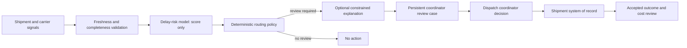

# Shipment-Risk Triage: an FDE End-to-End Walkthrough

This compact, fictional reference follows one workflow from field discovery to operated service ownership. It intentionally combines a versioned ML risk score, deterministic routing policy, an optional foundation-model explanation, and a human decision. It is not an agent: no model or score can authorize or change a shipment.

All people, metrics, volumes, and costs below are illustrative teaching data. The executable tests prove the stated routing and safety properties in a local fixture; they do not establish model accuracy, customer adoption, or realized value.

## The customer decision

Dispatch coordinators need to decide which in-transit shipments deserve intervention before a promised delivery date. The existing queue is sorted by arrival time and coordinator intuition, so high-value, high-risk shipments can be found late.

```text
Shipment event
  -> read current shipment and approved signals
  -> obtain a bounded delay-risk score
  -> apply deterministic routing policy
  -> create a persistent review case only when policy requires it
  -> show typed evidence and an optional explanation
  -> human dispatch coordinator decides the intervention
  -> measure accepted intervention, service, cost, and overrides
```

The accepted outcome is **a coordinator accepts or rejects a correctly routed review case with current evidence**. The system never claims that a risk score, explanation, or queue entry fixed a shipment.

## Follow the FDE journey

| Stage | What the team does | Evidence in this reference | Production decision |
| --- | --- | --- | --- |
| Discover | Observe dispatch triage, exceptions, data gaps, and workarounds | [Workflow charter](workflow-charter.json) records the observed job and discovery assumptions | Continue only if coordinators validate the workflow and signal availability |
| Value | Define eligible shipments, baseline, benefit, full cost, and guardrails | [Workflow charter](workflow-charter.json) and [design record](design-record.md) contain illustrative economics | Replace fixture values with measured baseline and a credible counterfactual |
| Select | Compare rules, optimization, ML, model explanation, and human review | [Intelligence-selection record](intelligence-selection.md) | Retain each component only if it improves the accepted outcome within its ceiling |
| Design | Own state, evidence, policy, trust boundaries, and effects | [Design record](design-record.md), [ontology](ontology.json), and [tool contracts](tools/) | Keep action authority with dispatch; use a review queue as the only system effect |
| Prove | Test routing, stale evidence, malformed scores, explanation failure, and budget limits | [Evaluation cases](evals/) and executable [tests](shipment-risk-triage.test.mjs) | Promote only the named segment and model/policy versions that pass representative checks |
| Adopt | Train coordinators, expose routing evidence, and collect overrides | The adoption plan below | Expand only after usage, override, and support evidence meet the charter |
| Operate | Review outcome, calibration, data freshness, service reliability, and full cost | The service review below | Constrain, roll back, or retire a route when a guardrail or value case fails |

## Architecture and authority



| Component | Versioned responsibility | May do | Must not do |
| --- | --- | --- | --- |
| Shipment context service | Current tenant-bound shipment, carrier, and value evidence | Return one scoped snapshot | Supply stale or cross-tenant data |
| Delay-risk model | Estimate probability of a late arrival from approved features | Return a score and model version | Change priority, create work, or authorize an action |
| Routing policy | Apply threshold, value, freshness, and budget rules | Select `review_required`, `no_action`, or `escalate` | Read free-form explanation text as policy |
| Explanation component | Turn structured evidence into a concise review aid | Produce typed, cited explanation text | Change the route or request additional authority |
| Review-case service | Create a non-binding, idempotent work item | Persist a coordinator review case | Intervene in shipment execution |
| Dispatch coordinator | Decide whether and how to intervene | Use the existing operational system | Delegate material judgment to the explanation |

The routing policy runs after the ML score and before any explanation. A failed or unsafe explanation falls back to a deterministic evidence summary; it cannot block an otherwise required review. Controls: `ARC-002`, `ARC-004`, `ARC-005`, `FDE-001`, `TOL-001`, `VAL-002`.

## Adoption and handoff

| Capability | Customer owner | Pilot evidence | Handoff condition |
| --- | --- | --- | --- |
| Review queue and evidence packet | Dispatch operations manager | Coordinators can inspect, correct, defer, or dismiss each case | Named service owner accepts operating cadence and support path |
| Routing threshold and segment | Logistics analytics owner | Calibration and false-positive review on the eligible segment | Change process has a policy owner and rollback procedure |
| Explanation style | Dispatch enablement lead | Coordinators report that it makes evidence easier to review, not harder | Prompt/template changes are evaluated separately from score/policy changes |
| Service operations | Logistics platform owner | Alert, incident, access, and cost review exercise completed | SLOs, escalation contacts, and retirement owner are recorded |

Start with a shadow queue. For two review cycles, coordinators compare system routing with their normal process, tag useful and incorrect cases, and record missing evidence. Only then decide whether the queue becomes part of the normal work surface. A weak adoption signal, unbounded review load, poor calibration, missing freshness, or cost above the charter ceiling pauses expansion. `FDE-003`, `ADP-001`, `ADP-002`.

## Service review

Review weekly during pilot and monthly after stable operation:

- **Value:** eligible volume, accepted intervention rate, avoided expedited-shipping or late-delivery loss, and comparison against the agreed counterfactual.
- **Quality:** model calibration, false-positive review rate, coordinator override rate, evidence freshness failures, and post-decision outcome lag.
- **Operations:** queue latency, model and tool availability, policy denials, incident count, recovery time, and data/model version drift.
- **Economics:** full cost per accepted coordinator decision, including data/ML inference, explanation, queue, coordinator review, support, and correction cost.
- **Lifecycle:** retain, adjust threshold, remove the explanation route, narrow the segment, roll back to manual triage, or retire the system.

The [production service review template](../../templates/production-service-review.md) is the operating record; the [field-learning register](../../templates/field-learning-register.md) captures discoveries without retaining unnecessary customer data.

## Reference artifacts

| Artifact | Purpose |
| --- | --- |
| [workflow-charter.json](workflow-charter.json) | Illustrative outcome, economics, readiness, owners, and stop conditions |
| [intelligence-selection.md](intelligence-selection.md) | Why ML, policy, optional explanation, and human review are each retained or rejected |
| [design-record.md](design-record.md) | System, state, trust, failure, rollout, and rollback decisions |
| [ontology.json](ontology.json) | Domain entities, evidence, actions, invariants, and source ownership |
| [tools/](tools/) | Typed contract for evidence reads and non-binding review-case creation |
| [threat-model.json](threat-model.json) | Threats and evaluation linkage |
| [evals/](evals/) | Representative success, failure, and adversarial routing worlds |
| [shipment-risk-triage.mjs](shipment-risk-triage.mjs) | Small executable reference implementation |
| [shipment-risk-triage.test.mjs](shipment-risk-triage.test.mjs) | Deterministic verification of route and safety invariants |

## Run it

```bash
npm test
```

The reference has no network access, credentials, vendor model call, or production data. It demonstrates the architecture boundary around a model; it is not an ML training package or shipment-management product.

The generic `stage_write` contract calls its receipt a proposal. In this reference, that proposal is a non-binding review-case record; the human coordinator's later disposition remains the business decision.
