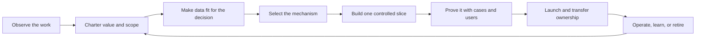
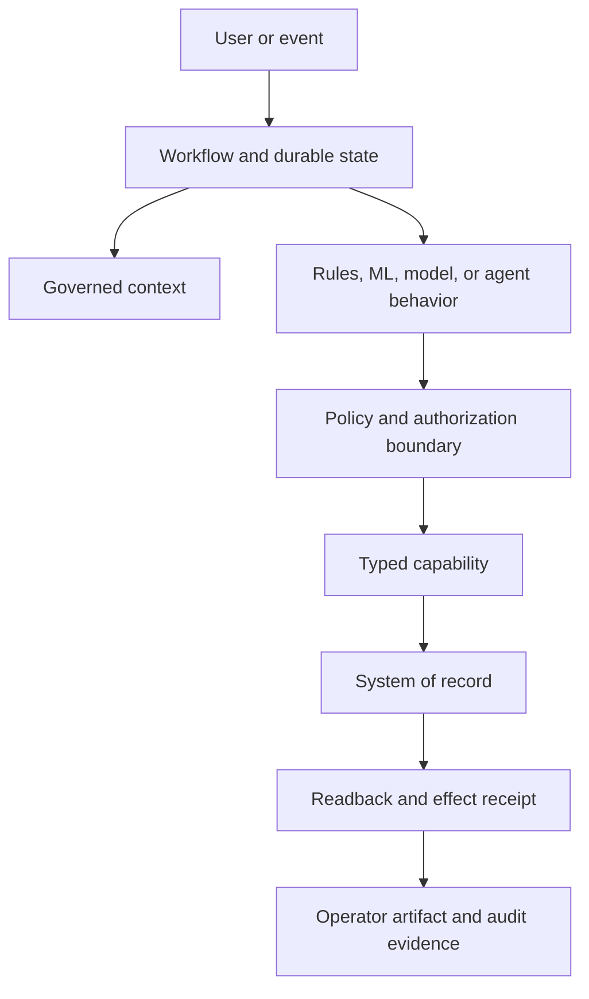

# The FDE Guide

> From a real workflow to measurable, operated value.

This is the concise human guide to forward-deployed engineering and internal applied-AI delivery. Read it linearly for the mental model, then use the repository's [Handbook](../playbooks/README.md) for the detailed method and the [Engineering Kit](../examples/invoice-exception/README.md) for contracts, code, tests, and worked systems.

**Reading time:** about 20 minutes. This guide is narrative orientation, not a production standard or a substitute for the target organization's policy, security, architecture, or risk review.

If you are learning the role, planning a development path, or assessing a team, use the companion [FDE and AI Engineer Capability Roadmap](capability-roadmap.md). It turns this method into role boundaries, capability evidence, four practice missions, a quick-start pack, and a glossary without creating a second methodology.

## 1. What an FDE is responsible for

A forward-deployed engineer turns an ambiguous operating problem into a supported software service that produces a measurable outcome. The work crosses four responsibilities:

- **Discovery:** understand where work, judgment, delay, risk, and value actually occur.
- **Product:** decide what should change for users and what should remain human, local, or manual.
- **Engineering:** build the smallest reliable system that can improve the workflow.
- **Operation:** prove the result, transfer ownership, support the service, and learn from production.

The same method applies inside a company. An internal applied-AI engineer may not carry the FDE title, but still has to connect business context, product judgment, software architecture, adoption, and production operation.

The output is not a demo, prompt, model call, agent, or dashboard. It is an **owned change to real work** with an accepted outcome, credible verifier, bounded authority, full-cost case, operating team, and retirement path.

> **Tokens are an input. Autonomy is a design choice. Accepted outcomes are the product.**

## 2. The operating loop

The guide uses one lifecycle throughout. Do not create a parallel method for each customer, model, or framework.



Each stage ends in a decision and evidence that another person can inspect:

| Stage | Decision | Minimum evidence |
| --- | --- | --- |
| Observe | Is this the real workflow and decision boundary? | Representative cases, exceptions, actors, systems, workarounds, and owner validation |
| Charter | Is the workflow worth changing? | Baseline, accepted outcome, verifier, eligible population, attribution, guardrails, value hypothesis, and risk ceiling |
| Prepare data | Are the sources fit for this decision? | Four data planes, source authority, quality thresholds, preparation lineage, output ownership, remediation economics, and failure behavior |
| Select | What is the smallest sufficient mechanism? | Comparison of software, optimization, ML, retrieval, model, agent, and human routes |
| Build | Can one vertical slice exercise the real boundaries? | Domain/state model, contracts, work surface, failure behavior, and adoption plan |
| Prove | Does it work safely and usefully on representative work? | Repeatable cases, user evidence, failure tests, cost and latency, limitations, and rollback criteria |
| Launch | Is the exact release supportable and reversible? | Compatible versions, bounded rollout, authority, runbooks, receiving owners, and exercised recovery |
| Operate | Should it continue, expand, change, or retire? | Accepted outcomes, attributable value, adoption, reliability, safety, cost, ownership, and field learning |

Stopping, narrowing, or redesigning weak work is a valid result. A strong model score, sponsor, renewal, launch, or usage number cannot average away a failed value, authority, safety, ownership, or production gate.

## 3. Observe the work before designing the system

Context extraction is not collecting every document. It is discovering the minimum operational truth needed to make a consequential design decision.

Observe real cases with the people who perform, receive, review, and support the work. Record:

1. the trigger and working interface;
2. the decision being made;
3. the inputs and their authoritative sources;
4. the permitted action and maximum tolerable effect;
5. normal paths, exceptions, workarounds, and recovery;
6. the person who owns the business result;
7. the person or system that can independently accept the outcome;
8. the team that will operate the changed workflow.

Interviews create hypotheses. Operator walkthroughs, source artifacts, system traces, and reconciled records create stronger evidence. If the workflow is only clear in a slide deck, discovery is not complete.

Do not automate a workaround before asking whether the workflow, policy, source system, or handoff should be repaired. AI can make a broken process move faster while making the underlying problem harder to see.

**Use in the repository:** [field-observation log](../templates/field-observation-log.md), [discovery pack](../templates/fde-discovery-pack.md), and [Discovery and Value](../playbooks/01-discovery-and-value.md).

## 4. Engineer the value contract

A use case becomes buildable when its outcome can be owned, measured, and challenged.

Define these fields before architecture:

- **Eligible population:** which work could validly use the system, with exclusions.
- **Baseline:** current performance, status, date, population, and confidence.
- **Accepted outcome:** the event that means the work was independently accepted—not merely generated or completed by the model.
- **Verifier:** the person, rule, reconciliation, or source-of-truth event that establishes acceptance.
- **Target and guardrails:** the desired change and what must not get worse.
- **Attribution:** how the team will distinguish system effect from other changes.
- **Full cost:** discovery, delivery, change, models, infrastructure, tools, human review, support, incidents, recovery, and maintenance.
- **Residual loss:** expected or realized harm not already included in another benefit or cost term.
- **Owner:** the role accountable for the metric and the decision it drives.

Useful operating units include:

```text
cost per accepted outcome =
  total operating and allocated lifecycle cost
  / independently accepted outcomes
```

```text
realized net value =
  attributable value from accepted outcomes
  + non-overlapping avoided loss
  - lifecycle cost
  - residual loss not already netted
```

Keep forecast, demonstrated pilot evidence, and realized production value separate. Do not annualize a narrow pilot without an explicit, owned extrapolation. Do not count the same benefit twice through time saved, unit value, avoided loss, or reduced headcount.

The [12 Factors of AI Value Engineering](../library/14-twelve-factors-ai-value-engineering.md) are the full framework. Four are hard gates: owned outcome, credible verifier, bounded authority and expected loss, and a plausible positive value case after full cost. The one-page [AI Value Engineering Scorecard](ai-value-engineering-scorecard.md) turns those factors into a portable assessment and decision record.

**Use in the repository:** [AI Value Engineering Scorecard](ai-value-engineering-scorecard.md), [workflow charter](../templates/workflow-charter.json), [value case](../templates/value-case.md), and [value and frugal architecture](../library/11-value-engineering-and-frugal-architecture.md).

## 5. Make data fit for the decision

Data readiness is not a generic platform score. It is evidence that the specific information required for the bounded decision is authoritative, accessible, timely, representative, lawful, economical, and operable.

Keep four uses explicit: operational state, knowledge and context, evaluation and training, and telemetry and feedback. Record where sources live; their owner, grain, keys, time semantics, schema, revision, freshness, access, retention, and correction behavior; the quality thresholds for decision-critical fields; every preparation transformation; label authority where used; and the ownership and lifecycle of generated output data.

Brownfield delivery must reconcile policy, contracts, code, database state, runbooks, and operator practice without treating any one as automatically authoritative. Greenfield delivery must establish identifiers, corrections, quality telemetry, and ownership before synthetic assumptions become accidental contracts.

If source repair exceeds the workflow value ceiling, constrain the population, add human collection or review, choose a smaller mechanism, or do not build.

**Use in the repository:** [data-readiness chapter](../library/16-data-readiness-and-context-contracts.md), [assessment](../templates/data-readiness-assessment.md), [data-context manifest](../templates/data-context-manifest.json), and [pipeline blueprint](../blueprints/data-preparation-and-context-pipeline.md).

## 6. Select the smallest sufficient mechanism

“Use AI” is not an architecture decision. Decompose the workflow into consequential decision steps and choose each mechanism separately.

| Mechanism | Good fit | Warning sign |
| --- | --- | --- |
| Deterministic software | Stable rules, transformations, validation, routing, authorization | Natural-language ambiguity is being hidden inside brittle branches |
| Optimization | Allocation, scheduling, ranking, or planning with explicit objectives and constraints | The objective or constraints cannot be owned or measured |
| Classical ML | Repeated prediction with labels, calibrated uncertainty, and drift monitoring | No representative outcomes or feedback path exists |
| Retrieval | Evidence must be found across governed sources | Retrieval output is allowed to become policy or authority |
| Foundation-model call | Bounded interpretation, extraction, classification, or drafting | A fluent output is being treated as verified truth |
| Bounded agent workflow | Multi-step judgment genuinely depends on changing evidence or tool use | The steps are known and ordinary workflow code would be simpler |
| Human review | Judgment is weakly verifiable, high stakes, or policy requires accountability | Review is used to disguise an unusable system or unbounded workload |

A production system may combine several mechanisms. Keep each route observable, testable, replaceable, and costed. A model route does not weaken identity, authorization, data, release, or ordinary software-engineering controls.

Add an agent only where bounded multi-step judgment is useful. Add multiple agents only when a real difference in permissions, tools, context, ownership, or latency justifies coordination cost.

**Use in the repository:** [intelligence-selection record](../templates/intelligence-selection-record.md), [software architecture guide](../library/12-software-architecture-and-intelligence-selection.md), and [hybrid system blueprint](../blueprints/hybrid-intelligence-system.md).

## 7. Design the whole decision system

The model is one component inside a larger software and operating boundary.



Design these layers explicitly:

- **Domain and state:** objects, identities, revisions, lifecycle states, invariants, and systems of record.
- **Context:** sources, permissions, provenance, freshness, sufficiency, trust, and invalidation.
- **Behavior:** code, rules, model routes, prompts, tools, guardrails, and compatibility.
- **Authority:** caller or workload identity, tenant, scope, policy, approval, and maximum effect.
- **Capabilities:** typed inputs and outputs, exact destinations, credential mode, failure contract, duplicate safety, and readback.
- **Runtime:** durable state, cancellation, timeout, resource budgets, retries, circuit breakers, and explicit terminal states.
- **Work surface:** persistent artifact, evidence, state, uncertainty, alternatives, and permitted human actions.
- **Operation:** traces, service objectives, alerts, runbooks, change path, rollback, ownership, and retirement.

The central action rule is simple:

> The model may propose. Trusted software authorizes and commits. A source-of-truth readback proves the result.

Keep secrets and credentials outside model-visible context. Recheck current identity, tenant, scope, policy, release admission, and approval at the boundary that performs a consequential effect. Derive duplicate safety from a stable business-operation identity. After an effect, verify the result in the authoritative system before reporting completion.

If a legacy browser, desktop client, or terminal emulator is the only viable integration, treat computer use as a separate controlled action boundary—not as an unrestricted tool. Bind the session and operation, treat visual content as untrusted, stop on interface drift, classify recordings, and verify the result independently. See the [computer-use action-boundary blueprint](../blueprints/computer-use-action-boundary.md).

**Use in the repository:** [blueprint selector](../blueprints/README.md), [operational ontology](../templates/operational-ontology.json), [tool contract](../templates/tool-contract.json), [capability manifest](../templates/capability-manifest.json), and [production controls](../controls/control-catalog.json).

## 8. Build one controlled vertical slice

The first slice should pass through the real interfaces and control boundaries without attempting the full product.

It should demonstrate:

- one representative trigger and user;
- authoritative context with real permission behavior;
- the selected decision route;
- the final operator work surface;
- a simulated, staged, reversible, or otherwise bounded effect;
- explicit failure and escalation states;
- telemetry, cost, and acceptance evidence;
- an owner-led recovery or rollback path.

Start adoption and handoff during the pilot. The receiving team should pair on evaluation, release, support, policy changes, incidents, rollback, and retirement before the delivery team exits.

Predeclare the pilot's maximum duration, evidence cutoff, and separate technical, operator, adoption, value, economics, and production-readiness graduation gates. A demo should not quietly become production because it impressed a sponsor.

**Use in the repository:** [Solution Design and Delivery](../playbooks/02-solution-and-delivery.md), [delivery and adoption plan](../templates/delivery-and-adoption-plan.md), and [customer handoff](../templates/customer-enablement-handoff.md).

## 9. Prove claims on representative work

An evaluation is a release claim under stated conditions—not a permanent score.

Use representative normal cases, difficult slices, known exceptions, adversarial inputs, dependency failures, policy changes, timeouts, retries, cancellation, recovery, and human-review capacity. Preserve the complete environment and behavior versions needed to replay the result.

Separate three questions:

1. **Capability:** can the mechanism perform the task?
2. **Behavior:** does the full system take the correct route and stop safely?
3. **Outcome:** does the workflow improve accepted results for the target population without violating guardrails?

Deterministic checks are strongest for closed invariants. Statistical measures need denominators and uncertainty. Model-based judges need calibrated rubrics and human comparison. Production feedback must not silently contaminate holdouts or give the candidate control over its evaluator.

Promote through bounded stages such as offline evaluation, shadow operation, canary, and a named production segment. Define rollback before rollout.

**Use in the repository:** [evaluation guide](../library/04-production-evaluation-and-governance.md), [evaluation-case template](../templates/evaluation-case.json), and [release gates](../operations/release-gates.md).

## 10. Operate the service and transfer ownership

Production is a recurring decision, not the last deployment step.

Monitor the complete system:

- accepted outcomes, value, adoption, and guardrails;
- sources, permissions, freshness, and reconciliation;
- route, model, prompt, tool, and policy versions;
- latency, cost, retries, steps, and terminal reasons;
- denied, prohibited, duplicate, effect-unknown, and readback-mismatch events;
- reviewer load, corrections, abandonment, training, and support;
- owner continuity, incident readiness, rollback, and retirement capability.

Review whether to continue, improve, expand, constrain, pause, or retire. An expansion into a new population, authority level, business action, model route, or customer environment is a new evidence and release decision.

Transfer is complete when the receiving team can operate, change, recover, support, and retire the service without delivery-team heroics. Documents alone do not prove operating capability; exercises do.

**Use in the repository:** [Operate and Scale](../playbooks/03-operate-and-scale.md), [production service review](../templates/production-service-review.md), [operations map](../operations/README.md), and [handoff template](../templates/customer-enablement-handoff.md).

## 11. Turn field learning into product capability

The compounding advantage of FDE work is not reusable customer data or a growing pile of custom code. It is the ability to separate local context from portable engineering knowledge.

Keep these customer- or business-unit-specific unless explicitly authorized and validated otherwise:

- policy, thresholds, identities, permissions, confidential data, source details, and operating decisions.

Candidates for reuse include:

- contract shapes, failure classes, evaluation methods, work-surface patterns, integration primitives, controls, runbooks, and platform gaps.

Productize only after recurrence is evidenced across independent contexts, the candidate is sanitized, a destination and owner exist, target-specific validation succeeds, and the normal release path is followed. Lower custom effort counts as improvement only when value, safety, adoption, supportability, and local-policy correctness remain healthy.

Classify field-built work before implementation: customer configuration, a target-owned extension, a shared product or platform capability, a time-bounded experiment, or prohibited/deferred work. The destination determines contribution rights, repository, release, support, and retirement. Do not leave a field-owned parallel service as a shadow product.

Transfer is proven when the receiving team can safely change, evaluate, release, recover, support, and retire the system—not when documents were delivered. Clear contract, intellectual-property, license, confidentiality, and reuse rights before customer-funded or jointly developed work becomes shared capability.

Do not manufacture dependence. Preserve negative and stopped evidence, transfer operating capability, and keep an exit path.

**Use in the repository:** [field-learning register](../templates/field-learning-register.md), [FDE and applied-AI synthesis](../library/10-fde-and-production-agent-synthesis.md), and optional [portfolio review](../templates/fde-portfolio-review.md).

## 12. See the method in executable systems

This repository includes two code-backed teaching systems.

### Controlled invoice resolution

The [invoice-exception reference](../examples/invoice-exception/README.md) proposes, stages, approves, commits, and verifies a reversible ledger effect. Read the [runtime](../examples/invoice-exception/reference-loop.mjs) and its [regression tests](../examples/invoice-exception/reference-loop.test.mjs) alongside the design. It includes:

- an executable runtime and policy;
- typed read, stage, commit, and readback tools;
- capability manifests and provenance records;
- a domain model, behavior bundle, threat model, evaluations, traces, and release manifest;
- regressions for authorization, tenant isolation, stale policy, duplicate retries, approval timing, release revocation, receipt validation, effect-unknown recovery, and source-of-truth readback.

### Hybrid shipment-risk triage

The [shipment-risk walkthrough](../examples/shipment-risk-triage/README.md) and its [executable decision system](../examples/shipment-risk-triage/shipment-risk-triage.mjs) combine a classical-ML score, deterministic policy, optional model explanation, and human review. It demonstrates that an AI-enabled system need not be agent-first.

Run the executable evidence:

```bash
npm ci --ignore-scripts
npm run test:reference
npm run test:evals
npm run test:hybrid
```

These are in-memory teaching implementations. Passing their tests proves only the declared local behavior; it does not certify a target deployment.

## 13. Start a real engagement

Before implementation, make sure you can answer:

1. What exact workflow and decision are changing?
2. Which representative cases and exceptions were observed?
3. Who owns the business outcome and the operating service?
4. What is the baseline, eligible population, target, and attribution method?
5. What event counts as an accepted outcome, and who or what verifies it?
6. What is the maximum tolerable effect and residual loss?
7. Which decision mechanism is smallest and sufficient?
8. Which systems, identities, permissions, and sources of truth are involved?
9. What will users inspect, correct, pause, reject, or escalate?
10. How will the pilot stop, graduate, roll back, transfer, and retire?

If a consequential answer is missing, stay in discovery. A model or framework choice will not resolve it.

## Continue into the repository

Choose the depth that matches the work:

- **Build capability:** use the [FDE and AI Engineer Capability Roadmap](capability-roadmap.md), complete one bounded mission, and keep the resulting limitations visible.
- **Run the method:** use the [FDE Handbook](../playbooks/README.md) and follow the current lifecycle stage.
- **Design a recurring solution:** start from the [business-flow portfolio](../solutions/README.md), then select only the relevant vertical profile and horizontal foundation.
- **Build or review a system:** use the [Engineering Kit](../templates/README.md), [controls](../controls/control-catalog.json), [schemas](../schemas/README.md), [blueprints](../blueprints/README.md), [examples](../examples/invoice-exception/README.md), and [tests](../tests/).
- **Work with a coding agent:** give it [AGENTS.md](../AGENTS.md) or install the optional [task skills](../.agents/skills/).

The Guide explains the mental model. The Handbook supports engineering judgment. The Engineering Kit makes claims, boundaries, and changes inspectable and testable. They are three depths of one method—not separate frameworks.
