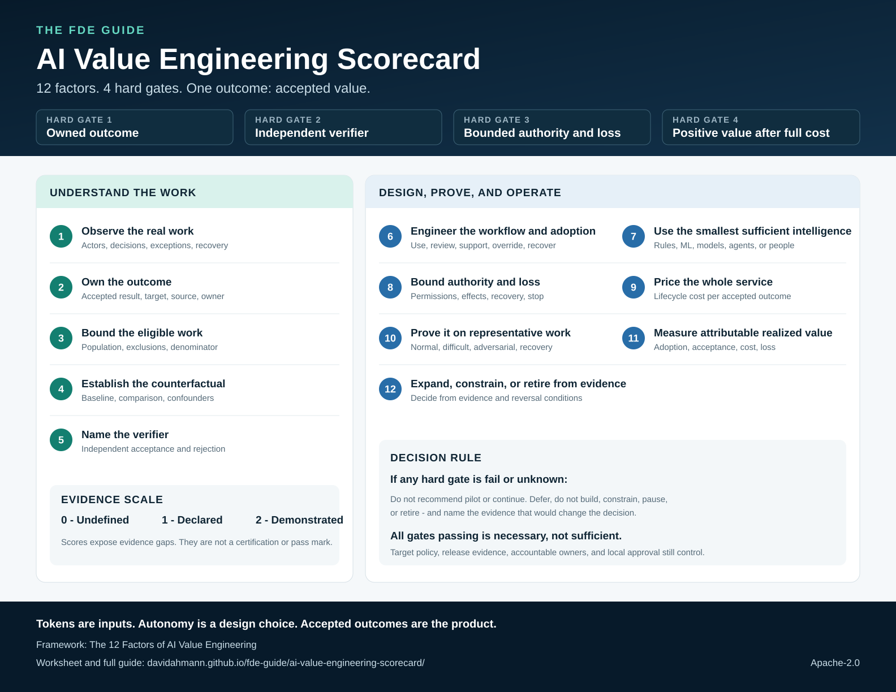

# AI Value Engineering Scorecard

> **12 factors. 4 hard gates. One outcome: accepted value.**

Use this scorecard to decide whether a bounded AI-enabled workflow is ready to pilot, continue, constrain, pause, or retire. It is the portable assessment surface for the [12 Factors of AI Value Engineering](../library/14-twelve-factors-ai-value-engineering.md), not a separate framework.

[Download the one-page PDF](../output/pdf/ai-value-engineering-scorecard.pdf) · [Open the SVG](../assets/ai-value-engineering-scorecard.svg) · [Open the PNG](../assets/ai-value-engineering-scorecard.png) · [Copy the machine-readable worksheet](../templates/ai-value-engineering-scorecard.json)



## Start with four hard gates

Mark each gate `pass`, `fail`, or `unknown`. A strong total cannot compensate for a missing gate.

| Hard gate | Question | Minimum evidence |
| --- | --- | --- |
| Owned outcome | Is there one measurable operational result with an accountable owner? | Outcome, population, owner, target, authoritative source |
| Independent verifier | Can something other than the producing system reject the result? | Acceptance and rejection rules, verifier identity, representative cases |
| Bounded authority and loss | Are reads, effects, approvals, expected loss, recovery, and stop conditions explicit? | Authority matrix, effect ceiling, loss ceiling, recovery and stop evidence |
| Positive value after full cost | Is positive net value plausible after adoption, lifecycle cost, and residual loss? | Base and downside economics with sources, owners, units, and assumptions |

If any gate is `fail` or `unknown`, do not recommend `pilot` or `continue`. Choose `defer`, `do_not_build`, `constrain`, `pause`, or `retire` as appropriate and name the evidence that would change the decision.

## Score the twelve factors

Score every factor using inspectable evidence for the named workflow, population, and environment:

- **0 — undefined:** no accountable definition or usable evidence;
- **1 — declared:** the definition and owner exist, but representative evidence does not;
- **2 — demonstrated:** representative, inspectable evidence exists for the claimed scope.

| Group | Factor | Assessment question |
| --- | --- | --- |
| Understand | 1. Observe the real work | Have operators, decisions, systems, exceptions, and recovery paths been observed? |
| Understand | 2. Own the outcome | Is the accepted operational result measurable and owned? |
| Understand | 3. Bound the eligible work | Is the eligible population and denominator explicit? |
| Understand | 4. Establish the counterfactual | Is the baseline credible, with confounders and comparison method stated? |
| Understand | 5. Name the verifier | Can an independent verifier reject the result? |
| Design | 6. Engineer the workflow and adoption | Can people use, review, support, override, and recover the changed workflow? |
| Design | 7. Use the smallest sufficient intelligence | Was each decision assigned the simplest mechanism that meets its requirements? |
| Design | 8. Bound authority and loss | Are permissions, effects, expected loss, approval, recovery, and stop paths bounded? |
| Prove | 9. Price the whole service | Are delivery, change, models, tools, infrastructure, review, support, and recovery included? |
| Prove | 10. Prove it on representative work | Do normal, difficult, adversarial, dependency, recovery, and human-capacity cases pass? |
| Operate | 11. Measure attributable realized value | Are accepted outcomes, adoption, attribution, actual cost, and realized loss measured? |
| Operate | 12. Expand, constrain, or retire from evidence | Is the next lifecycle decision tied to owned evidence and reversal conditions? |

Do not convert the twelve scores into a certification or universal pass mark. Use them to expose missing evidence and compare the current workflow with its own prior state. Local value, security, release, compliance, and operating decisions remain controlling.

## Record the decision

Complete the [JSON worksheet](../templates/ai-value-engineering-scorecard.json) or record the same fields in the target system:

1. workflow charter and assessment owner;
2. evidence stage: `forecast`, `demonstrated`, or `realized`;
3. status, owner, rationale, and evidence for each hard gate;
4. score, owner, evidence, and next evidence for each factor;
5. one bounded decision and the assumptions that would reverse it;
6. next review date.

A completed scorecard records whether the declared evidence supports the stated value decision. It does not certify production readiness, compliance, safety, or realized value. Use the repository's [release gates](../operations/release-gates.md) for a release decision.

## Use it with an agent

```text
Use $engineer-ai-value to assess this bounded workflow with
templates/ai-value-engineering-scorecard.json.

Workflow: [describe the workflow and eligible population]
Decision needed: [pilot, defer, do_not_build, continue, constrain, pause, or retire]

Keep assumptions separate from evidence. Mark every hard gate pass, fail, or unknown.
Do not total the factor scores or let strong factors average away a failed gate.
Return the completed scorecard, base and downside economics, blockers, and next evidence.
```

## Naming and tone

**The 12 Factors of AI Value Engineering** is the durable framework name. **AI Value Engineering Scorecard** is the portable assessment asset.

“Valuemaxxing” is optional informal shorthand for maximizing durable net value rather than AI activity. It is not a control, score, certification, or requirement to maximize automation.

Controls: `FDE-001`, `FDE-002`, `FDE-003`, `VAL-001`, `VAL-002`, `VAL-003`, `ARC-004`, `ARC-005`, `CST-001`, `CST-002`, `EVA-001`, `REL-003`, `IAM-003`, `SEC-004`, `ADP-001`, `ADP-002`, `OPS-004`, `OPS-006`, `OPS-007`.
