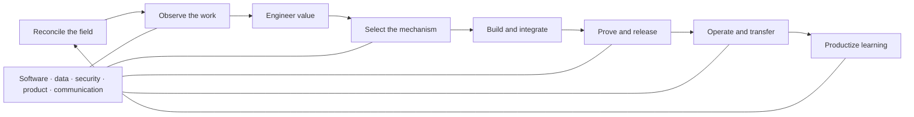

# Forward Deployed Engineer and AI Engineer Capability Roadmap

> Learn the responsibilities by completing evidence-backed missions, not by memorizing a preferred stack.

This roadmap is for people growing into forward-deployed engineering (FDE), applied-AI engineering, or adjacent delivery roles—and for leaders deciding what capability a team needs. It complements the [concise FDE Guide](README.md): the Guide explains the method; this page organizes the capabilities needed to apply it.

It is not a certification, hiring standard, fixed curriculum, or claim that one title owns every responsibility. Titles and team boundaries vary. Evaluate the work, authority, evidence, and operating responsibility instead.

## Choose the responsibility, not the title

These roles overlap. The useful distinction is what each person remains accountable for after a design meeting or customer workshop ends.

| Role | Primary accountability | Evidence of good work | Boundary to clarify |
| --- | --- | --- | --- |
| Forward-deployed engineer | Turn a target workflow into a measurable, supported capability in its real environment | Observed cases, bounded value contract, integrated system, accepted outcomes, adoption, and exercised handoff | Which work belongs in the shared product, the target environment, or a time-bounded experiment |
| Applied-AI or AI engineer | Build and improve production AI-enabled behavior inside a product, platform, or internal workflow | Mechanism choice, data and behavior versions, evaluations, software boundaries, telemetry, and regression evidence | Whether the role owns workflow discovery, product decisions, deployment, and ongoing service outcomes |
| Software or platform engineer | Build reliable product and platform capabilities that remain maintainable across users and environments | Code, contracts, tests, releases, service objectives, incident recovery, and operational ownership | Which target-specific context should become configuration, an extension, or no shared feature at all |
| Solutions engineer or architect | Translate requirements and constraints into a viable integration and adoption design | Architecture decisions, technical validation, integration plan, risk decisions, and stakeholder alignment | Who owns implementation, production effects, acceptance evidence, and support after launch |
| Implementation or professional-services engineer | Deliver a defined outcome within commercial, technical, and schedule boundaries | Scoped delivery, configuration, migration, enablement, acceptance, and transition evidence | Whether recurring field work has a normal path into product or platform ownership |

No role receives authority merely from its title. Production access, approvals, release decisions, customer commitments, and risk acceptance still belong to the target system and its accountable owners.

## The capability map

The work moves through one operating loop. Software, data, security, product judgment, and communication support every stage rather than forming separate tracks.

| Capability | You can do the work when you can… | Inspectable evidence |
| --- | --- | --- |
| Field leadership and accountable adaptation | Preserve an inherited brief, find the process knower, reconcile sponsor, operator, policy, and system evidence, and obtain a scoped disposition without rewriting history | [Field playbook](../playbooks/00-field-engagement-and-reframing.md), [engagement-reframe record](../templates/engagement-reframe.json), decision evidence |
| Workflow discovery | Reconstruct real cases, exceptions, workarounds, actors, sources, decisions, and recovery without treating interviews as proof | [Observation log](../templates/field-observation-log.md), [discovery pack](../templates/fde-discovery-pack.md), owner validation |
| Value and product judgment | Define the eligible population, baseline, accepted outcome, verifier, full cost, guardrails, adoption path, and stop decision | [Workflow charter](../templates/workflow-charter.json), [value case](../templates/value-case.md), [12 Factors](../library/14-twelve-factors-ai-value-engineering.md) |
| Software and data architecture | Establish domain state, four data planes, decision-fit quality, preparation lineage, source-of-truth boundaries, integration contracts, failure ownership, change paths, and supportability | [Data-readiness assessment](../templates/data-readiness-assessment.md), [data-context manifest](../templates/data-context-manifest.json), [operational ontology](../templates/operational-ontology.json), [architecture decision](../templates/architecture-decision-record.md), [blueprints](../blueprints/README.md) |
| Intelligence selection | Compare deterministic software, optimization, classical ML, retrieval, model calls, agents, and human review for each consequential decision | [Intelligence-selection record](../templates/intelligence-selection-record.md), [hybrid reference](../examples/shipment-risk-triage/README.md) |
| Secure integration and action | Bind identity, tenant, data, credential, egress, authorization, duplicate safety, and verification below model output | [Security guide](../library/15-production-ai-security-and-action-boundaries.md), [tool contract](../templates/tool-contract.json), [controlled-write reference](../examples/invoice-exception/README.md) |
| Evaluation and release | Turn a bounded claim into representative, adversarial, repeatable cases and release only the exact tested system | [Evaluation case](../templates/evaluation-case.json), [release gates](../operations/release-gates.md), applicable release evidence |
| Adoption and operation | Design the work surface, rollout, telemetry, support, incident response, cost control, ownership, and retirement path | [Delivery and adoption plan](../templates/delivery-and-adoption-plan.md), [operations](../operations/README.md), [service review](../templates/production-service-review.md) |
| Transfer and field learning | Prove the receiving team can change and recover the service, then separate local context from reusable capability | [Customer handoff](../templates/customer-enablement-handoff.md), [field-learning register](../templates/field-learning-register.md), [product boundaries](../library/10-fde-and-production-agent-synthesis.md) |

Breadth matters, but no one must be the deepest specialist in every domain. A strong practitioner recognizes missing expertise, assigns owners, exposes assumptions, and prevents an unowned gap from becoming hidden production risk.

## Five practice missions

Use these missions in order when learning the method. On real work, enter at the current lifecycle stage and preserve prior evidence. A repository exercise demonstrates reasoning and implementation technique; it does not substitute for production experience, user acceptance, or target-system approval.

### Mission 1: rescue an inherited brief

Choose a request whose sold or stated workflow can be tested against actual work.

1. Preserve the inherited claims and exact source passages.
2. Separately verify the sponsor, process knower, operator, disposition authority, and verifier.
3. Observe one representative case and a material exception.
4. Compare sold, stated, observed, system-enforced, and policy-authorized claims.
5. Propose a bounded reframe and safe fallback, then record `continue_discovery`, `bounded_kickoff`, `defer`, or `stop` from the scoped authority.
6. Preserve chronology and update only dependency-linked work.

**Finish with:** an [engagement-reframe record](../templates/engagement-reframe.json) another person can trace from inherited claim to field evidence, disposition, and next move.

### Mission 2: qualify a real workflow

Choose one bounded workflow you can observe. Do not begin with an agent idea.

1. Walk through at least three representative cases, including an exception or recovery path.
2. Record the trigger, decision, working interface, actors, sources, permitted action, current result, and owner.
3. Define an accepted outcome and credible verifier.
4. Estimate the eligible population, baseline, full cost, residual loss, and adoption constraints.
5. Decide `discover`, `defer`, or `do_not_build`; recommend `pilot` only after the value case is plausible.

**Finish with:** an [observation log](../templates/field-observation-log.md), [workflow charter](../templates/workflow-charter.json), and [value case](../templates/value-case.md) another person can challenge.

### Mission 3: design the smallest sufficient system

Use the [shipment-risk walkthrough](../examples/shipment-risk-triage/README.md) as a reference for separating mechanisms.

1. Decompose the workflow into consequential decision steps.
2. Compare rules, optimization, classical ML, retrieval, model calls, agents, and human review per step.
3. Draw the domain, state, source, identity, and failure boundaries.
4. Select one end-to-end slice that can be accepted or safely rejected.
5. Record what remains manual and why.

**Finish with:** an [intelligence-selection record](../templates/intelligence-selection-record.md), architecture decision, domain model, and a tested slice whose complexity is justified by the workflow.

### Mission 4: secure and verify a consequential action

Use the [invoice-exception reference](../examples/invoice-exception/README.md) to inspect a controlled write.

1. Define a narrow typed read or effect contract.
2. Enforce caller identity, tenant, scope, policy, credentials, destination, and data class at the trusted boundary.
3. Give the business operation a stable duplicate-safe identity.
4. Add approval only where required; bind it to the exact proposal and current policy.
5. Verify the source of truth after the effect and reconcile effect-unknown outcomes.
6. Test denial, revocation, retry, stale state, cross-tenant access, receipt tampering, timeout, and recovery.

**Finish with:** executable positive and adversarial tests, an explicit threat model, and a release claim no broader than the tested behavior.

### Mission 5: operate and transfer the service

Treat launch as the start of a recurring decision.

1. Define accepted-outcome, adoption, reliability, safety, cost, and reviewer-load measures with owners and denominators.
2. Exercise alerting, containment, rollback, recovery, and a material change.
3. Run a service review that can continue, constrain, pause, or retire the system.
4. Have the receiving team perform a change and recovery without delivery-team intervention.
5. Record recurring field learning without copying customer policy, data, identities, or confidential context.

**Finish with:** an exercised [service review](../templates/production-service-review.md), [customer handoff](../templates/customer-enablement-handoff.md), and owned improvement or retirement decision.

## The quick-start engagement pack

Do not copy every template before the workflow earns that complexity. Start with five linked decisions and expand only when the target system requires it.

| Decision | Start with | Add when needed |
| --- | --- | --- |
| Is the inherited brief still defensible? | [Engagement-reframe record](../templates/engagement-reframe.json) | Decision brief and selective change-impact record when field evidence conflicts |
| What work is changing? | [Observation log](../templates/field-observation-log.md) | Discovery pack for stakeholder, source, constraint, and readiness detail |
| Is it worth changing? | [Workflow charter](../templates/workflow-charter.json) and [value case](../templates/value-case.md) | Adoption evidence, attribution design, portfolio comparison |
| What should make each decision? | [Intelligence-selection record](../templates/intelligence-selection-record.md) | Architecture decisions, domain model, system map, applicable blueprint |
| Can one slice work safely? | [Delivery and adoption plan](../templates/delivery-and-adoption-plan.md) and realistic evaluation cases | Tool, capability, behavior, threat, telemetry, and release contracts |
| Can the owning team run it? | [Customer handoff](../templates/customer-enablement-handoff.md) and [service review](../templates/production-service-review.md) | Incident exercises, change evidence, portfolio and field-learning records |

This pack is an orientation subset, not a production-complete packet. Use the full [artifact sequence](../AGENTS.md#artifact-sequence-for-a-new-system) when designing or reviewing a real system.

## How to assess capability

Whether reviewing yourself, a candidate, or a delivery team, ask for decisions and evidence rather than tool-name recall.

- Can they reconstruct a workflow from cases and recognize when not to build?
- Can they find the real process knower, expose a sponsor/operator/policy conflict, and change direction without erasing history or inventing authority?
- Can they connect an accepted outcome to a verifier, value case, and accountable owner?
- Can they choose a smaller mechanism than an agent when it is sufficient?
- Can they explain source, identity, tenant, authority, failure, and recovery boundaries?
- Can they turn a claim into representative and adversarial tests?
- Can they operate within cost and reliability limits and respond to effect-unknown state?
- Can the receiving team change, recover, support, and retire the service without them?
- Can they convert recurring learning into a shared capability without leaking target-specific context?

A polished demo or diagram can start the conversation. It cannot prove production readiness, customer impact, security, or operating capability.

## Concise glossary

| Term | Meaning in this guide |
| --- | --- |
| Accepted outcome | A business or operating event independently recognized as a valid result—not merely a generated answer, completed agent run, or tool response |
| Eligible population | The work that could validly enter the workflow, including explicit exclusions and a denominator for measurement |
| Verifier | The person, deterministic rule, reconciliation, or source-of-truth event that can establish whether an outcome was accepted |
| Workflow boundary | The trigger, decision, actors, inputs, working interface, permitted action, result, exceptions, recovery, and owner included in scope |
| Smallest sufficient mechanism | The least complex combination of software, optimization, ML, retrieval, model behavior, agency, and human review that can meet the evidence and operating requirements |
| Operational ontology | A versioned domain and state model for relevant entities, actions, evidence, transitions, invariants, and policy references; it is not an authorization system by itself |
| Tool contract | A closed interface describing one bounded read, computation, stage, or effect, including data, identity, authorization, failure, and verification behavior |
| Capability manifest | Provenance and admitted-authority evidence for the exact executable capability behind a tool contract |
| Consequential effect | A change to an external system or obligation whose authority, duplicate safety, result, and recovery must be enforced below model output |
| Readback | A fresh source-of-truth verification of the postcondition after a consequential effect; a successful API response alone is not readback |
| Evaluation case | A versioned world, input, expected invariants, graders, budgets, and failure conditions used to test a bounded claim |
| Release evidence | The exact versions, digests, compatibility, evaluation, approval, rollout, rollback, and operating evidence for the system being admitted |
| Handoff | Demonstrated receiving-team capability to operate, change, evaluate, release, recover, support, and retire the service |
| Field learning | Sanitized, evidence-backed knowledge from delivery that may become a pattern, product capability, platform improvement, control, or configuration after recurrence and ownership are established |

## Continue into the method

- Read the [concise FDE Guide](README.md) for the complete mental model.
- Follow the [FDE lifecycle playbooks](../playbooks/README.md) for a live engagement.
- Start from [business-flow patterns](../solutions/README.md) only after qualification and value work.
- Inspect the [executable references](../examples/invoice-exception/README.md) and [Engineering Kit](../templates/README.md) when implementation evidence is needed.
- Give a coding agent [AGENTS.md](../AGENTS.md) or use one optional [task skill](../.agents/skills/) for a bounded job.

The goal is not to become indispensable to a deployment. It is to leave behind an owned capability that produces accepted value and can be changed, recovered, and retired without delivery-team heroics.
