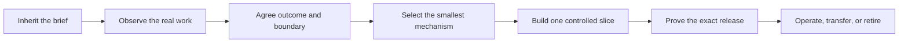

# The FDE Guide in Five Minutes

> Turn messy work into a measurable, accepted, and operated outcome.

This is the shortest useful orientation to the FDE Guide. Read it before the [concise Guide](README.md) when you need the mental model, not the complete operating manual. It is guidance—not production approval, customer authority, or a substitute for the target organization's policy, security, architecture, and risk review.

## The job

A forward-deployed engineer does more than translate requirements into software. The job is to discover how work actually happens, decide what is worth changing, build the smallest reliable intervention, and help an accountable team own the result.

That often begins with an inherited brief that is incomplete or wrong. A sponsor may describe one workflow while operators perform another. A commercial promise may conflict with policy, system behavior, or the people who carry the risk. Good field work does not hide those contradictions or silently rewrite history. It finds representative evidence, identifies who may decide, proposes a bounded reframe, and keeps delivery moving safely.

## Five rules that matter

### 1. Observe before you automate

Find the person who actually knows or performs the process. Watch a representative case, including exceptions, recovery, handoffs, and workarounds. Separate what was sold, stated, observed, enforced by the system, and authorized by policy. An interview is evidence that something was said; it is not proof that the workflow behaves that way.

### 2. Define acceptance before architecture

Name the workflow, eligible population, baseline, intended outcome, accountable owner, and independent verifier. State the adoption path, decision deadline, cost ceiling, guardrails, and conditions to continue, reshape, pause, or stop. If the outcome cannot be measured or accepted by someone with authority, stay in discovery.

### 3. Choose the smallest sufficient mechanism

For each consequential decision, compare deterministic software, optimization, classical machine learning, retrieval, a foundation-model call, a bounded agent workflow, and human review. Use the least complex option that meets the need. A model or agent is a component choice, not the starting point or the product.

### 4. Put authority in software boundaries

Model output may recommend; it does not authorize effects or prove completion. Trusted software must enforce identity, tenant, scope, policy, approvals, duplicate safety, and effect limits. Consequential actions also need source-of-truth readback. Keep rules, models, agents, and human review separately observable and testable.

### 5. Prove and operate the exact service

Evaluate realistic cases, failures, adversarial inputs, human review, cost, and latency against source-bound expectations. Bind the evidence to the exact data, prompt, model, tools, configuration, and software release. Before launch, name the operator, telemetry, support path, rollback, change process, and retirement conditions. Passing a model benchmark is not production readiness.

## When the brief is wrong

Use three field moves before inventing a larger process:

1. **Find or validate the process knower.** Identify who performs or owns the work and who can explain exceptions.
2. **Observe a representative case.** Capture the exact source, date, scope, owner, passage, limitations, and what it proves.
3. **Resolve a cited conflict.** Show both sides, preserve the inherited brief, propose a safe fallback and bounded reframe, and obtain a scoped human disposition from the right authority.

Accepted changes update only the dependent scope, design, evaluation, and delivery records. Rejected or deferred changes remain in the chronology without mutating the current boundary. The [field-engagement and accountable-reframing playbook](../playbooks/00-field-engagement-and-reframing.md) provides the full method.

## The minimum working packet

Do not complete every template by default. Create only the evidence needed for the next consequential decision.

| Need | Smallest useful artifact |
| --- | --- |
| Understand reality | [Field observation log](../templates/field-observation-log.md), plus an [engagement reframe](../templates/engagement-reframe.json) when evidence contradicts the brief |
| Bound value and acceptance | [Workflow charter](../templates/workflow-charter.json) and [value case](../templates/value-case.md) |
| Choose the intervention | [Intelligence-selection record](../templates/intelligence-selection-record.md) |
| Prove behavior | Representative [evaluation cases](../templates/evaluation-case.json) and target-system evidence |
| Launch and leave responsibly | [Production readiness](../templates/production-service-readiness.md), [release gates](../operations/release-gates.md), and [customer handoff](../templates/customer-enablement-handoff.md) |

## Choose the next route

| Your immediate job | Go here |
| --- | --- |
| The sold brief conflicts with field reality | [Field engagement and accountable reframing](../playbooks/00-field-engagement-and-reframing.md) |
| You need to qualify one workflow | [Discovery and Value](../playbooks/01-discovery-and-value.md) |
| You need outcome economics and hard gates | [12 Factors of AI Value Engineering](../library/14-twelve-factors-ai-value-engineering.md) and the [one-page scorecard](ai-value-engineering-scorecard.md) |
| You need to choose the mechanism or architecture | [Software Architecture and Intelligence Selection](../library/12-software-architecture-and-intelligence-selection.md) |
| You need evaluation or release evidence | [Production Evaluation and Governance](../library/04-production-evaluation-and-governance.md) and [release gates](../operations/release-gates.md) |
| You need to operate or transfer the service | [Operate and Scale](../playbooks/03-operate-and-scale.md) and the [customer handoff](../templates/customer-enablement-handoff.md) |

## Keep the boundary clear

The Guide is a design and verification kit, not a drop-in runtime, certification, or universal compliance standard. Templates and examples accelerate thinking; they are not customer evidence or proof that a target release is safe. Target-system policy, source authority, human decisions, and independently inspectable evidence remain controlling.

Continue with the [concise FDE Guide](README.md) for the full mental model, the [lifecycle playbooks](../playbooks/README.md) for the detailed method, or the [Engineering Kit](../examples/invoice-exception/README.md) for contracts, code, evaluations, and executable reference systems.
