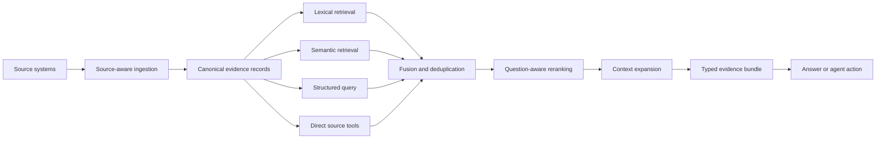

# Context and Knowledge Systems

## Context is a governed supply chain

Useful agent context is not “everything the company knows.” It is a task-specific projection of authorized, fresh, attributable evidence. The system must know where information came from, when it was updated, which user may see it, how strongly it matches the task, and what surrounding material is needed to interpret it.

The strongest pattern in the source set is to **meet data where it lives**. Documents, Slack threads, code, tickets, databases, and operational systems have different ergonomics. A knowledge layer should connect them without forcing everyone to create information in one universal tool. [S14]



Authorization and freshness checks apply across the pipeline, not only at the final answer.

## Ingest according to the source

A common query schema does not require identical ingestion.

### Conversations

Individual messages often lack meaning without their thread. A useful pipeline can:

- Re-fetch the complete thread when a reply arrives
- Preserve parent, replies, participants, channel, and last activity
- Keep raw content available for exact search
- Distill a searchable question, summary, resolution, and referenced systems
- Extract high-signal runs of messages separately when a thread summary would lose them

Cerebras calls the last technique **bursting**: consecutive messages by one author are embedded with the thread topic prepended. Their implementation filters bursts using rarity, length, and reaction signals. This is a useful recall technique, but its thresholds can discard short valuable evidence or favor popular content. [S14]

### Code

Code needs both exact and semantic access. Exact search is excellent for identifiers and errors; semantic indexing helps when the query and implementation use different language or when repositories are too large to navigate unaided.

Prefer syntax- or language-aware hierarchical chunks, incremental re-indexing of changed files, and repository-level allowlists and denylists. Preserve source location and commit identity so evidence can be inspected against the current code. [S14]

### Structured data

Agents need more than table access. A semantic layer should mark sources of truth, joins, metric definitions, grain, time semantics, and access rules. Replit attributes much of its self-service business analysis to such a layer. [S17]

For qualitative research, Listen uses a **virtual table**: one row per interview and generated columns for features, classifications, or sentiment. This turns an unstructured corpus into a map-reduce style analysis surface while keeping row-level evidence reviewable. [S03]

For domains with consequential business rules, an **ontology** can make semantics executable rather than merely descriptive. It defines entities, relationships, and constraints—for example, who may receive a payout or whether an order has already been refunded. Standards such as RDFS and OWL support machine-readable relationships and logical inference. This complements a warehouse semantic layer: the semantic layer explains how to query and interpret data, while the ontology can reject domain states or proposed actions that violate explicit invariants. [S20]

### Custom systems

Make connector contribution simple. Cerebras uses small source-specific modules that emit a shared evidence schema. The important boundary is the contract, which might include:

```text
source_id       stable identity and deep link
source_type     slack | code | document | database | ticket | other
scope           project, tenant, channel, repository, or matter
content         raw or normalized evidence
summary         optional distilled representation
metadata        author, timestamps, systems, code refs, record grain
freshness       fetched_at, valid_at, expires_at, source revision
permissions     principals, policies, sensitivity, allowed actions
retrieval       lexical fields, embeddings, structured keys
provenance      connector version and transformations applied
```

## Use a portfolio of retrieval methods

| Method | Best at | Common failure |
| --- | --- | --- |
| Exact/full-text search | Error strings, flags, IDs, names, quoted phrases | Misses paraphrases |
| Semantic search | Conceptual similarity and vocabulary mismatch | Can over-rank generic or short text |
| Rarity/IDF scoring | Surfacing distinctive technical terms | Can undervalue common-language explanations |
| Recency/age decay | Fast-changing operational knowledge | Can bury older evergreen truth |
| Structured query | Filters, joins, aggregation, precise records | Requires schema and metric knowledge |
| Filesystem/shell search | Flexible navigation and unexpected questions | Higher skill and safety burden |
| Source-specific API | Reliable common operations | Lower ceiling for unforeseen tasks |

No scorer should be trusted alone. Cerebras combines ranked lists with reciprocal rank fusion, deduplicates at the source level, limits domination by one file, reranks against the original question, and only then expands neighboring context. [S14]

The broader design principle from Elastic is a **low floor and high ceiling**: give the agent specialized, reliable tools for common retrieval, plus a sandboxed general-purpose surface for complex or unexpected work. [S04]

## Plan, fan out, normalize, synthesize

For multi-source questions, a lightweight planner can choose likely tools based on the active project and a compact catalog of available sources. Calls then run in parallel and normalize into one typed evidence bundle before final synthesis. [S14]

This pattern has three important controls:

1. The planner sees a short, accurate description of each tool and source.
2. Each tool returns raw evidence and metadata rather than hiding another opaque answer generator.
3. The synthesizer receives source identity, recency, scores, permissions, and caveats alongside content.

Planning is also a failure point. An agent may skip retrieval, select the wrong tool, or emit invalid parameters. Detailed tool descriptions, examples, explicit system guidance, and scoped tool bundles reduce these errors. [S04]

Uber's **derived tools** apply the same lesson at organizational scale: expose a narrowed tool selection or preconfigured parameter view for a use case instead of asking the model to navigate every underlying service and option. [S06]

## Keep tools narrow and orchestration visible

Retrieval tools should be stable, structured, fast, and as LLM-free as practical. Examples include `search_code`, `search_slack`, `recent_prs`, or `who_knows`. The calling agent decides sequence and synthesis; the retrieval primitive remains reusable across clients. [S14]

Agent Skills are useful when a tool needs documentation or a procedure that would otherwise occupy the context window permanently. Load the instructions when the task requires them, not on every turn. [S04]

At larger scale, an MCP gateway and registry can add:

- Discovery and ownership metadata
- Generated definitions from service schemas
- Central authorization
- PII redaction
- Tool-call analytics and audit
- Metadata scanning
- Reliability or SLA tiers
- Scoped, derived tool variants

Uber reports using this control plane to serve thousands of engineers across many internal services. Treat the scale figures in the source as company-reported. [S06]

## Manage the context budget deliberately

More context is not automatically better context. Long histories hide relevant facts, increase cost, and can introduce unauthorized or stale data.

Useful techniques include:

- Retrieve per task and active scope rather than globally
- Put the most decision-relevant evidence in salient positions
- Compact long histories into explicit state plus retained evidence links
- Summarize tool errors into actionable, bounded feedback
- Cache stable prompt and policy prefixes
- Batch independent retrieval calls programmatically
- Inject skill documentation only when invoked
- Prefetch only high-probability, authorized context
- Preserve raw evidence outside the prompt so summaries remain auditable

The Build Hour notes report substantial speed and cost gains from prompt caching, programmatic tool batching, and compaction; those specific customer figures were not independently verified here. [S11]

## Distinguish retrieval from truth

A knowledge system can retrieve what an organization said without establishing that it was correct. This matters when moving from answering questions to taking actions.

Add stronger controls for action-oriented use:

- Mark canonical policies and systems of record
- Record validity windows and superseded content
- Require citations or record IDs for consequential claims
- Detect disagreement across sources
- Route low-confidence or high-impact conflicts to owners
- Evaluate retrieval recall separately from answer correctness
- Audit authorization at query and result time
- Avoid encoding operational “scar tissue” as policy

High usage is evidence of adoption, not proof of accuracy or value. Cerebras reports more than 15,000 daily questions, but the supplied article does not provide a retrieval benchmark, error rate, or downstream outcome measure. [S14]

## Evaluation checklist

- Does exact evidence rank above semantic approximations when identifiers match?
- Can paraphrased questions retrieve the correct source?
- Are results current for fast-changing systems and durable for evergreen knowledge?
- Does project or matter scoping reduce irrelevant results without harming recall?
- Are permissions preserved through ingestion, indexing, caching, and synthesis?
- Can every answer link back to raw evidence?
- Does the planner select the correct tool and valid parameters?
- Does reranking improve task success, not only similarity scores?
- Are conflicting sources surfaced rather than silently averaged?
- Can production misses become replayable retrieval tests?

## 2026 update: progressive capabilities, tainted context, and sufficiency

### Treat the tool catalog as part of context engineering

Always-loaded tool definitions are not free. They consume context, make selection ambiguous, and expose unnecessary attack surface. The current practical pattern is:

```text
task classification -> compact capability search -> typed operation description
                    -> scoped execution -> evidence/result
```

Cloudflare's Code Mode implementation is one concrete example: it keeps a large API surface behind compact discovery and execution primitives instead of loading thousands of endpoints into the model context. [R26-02](../research/2026-02-07--2026-08-07-production-agent-source-ledger.md#r26-02)

### Mark external observations as untrusted

Web pages, tickets, monitoring alerts, telemetry, tool output, and retrieved documents can contain instructions crafted to redirect the agent. Preserve source identity and trust level; never give content authority merely because it came through a tool. Google documents why signature-only prompt-injection detection is noisy in real web content, while Agentjacking research shows that operational telemetry can become an indirect-injection path. [R26-09](../research/2026-02-07--2026-08-07-production-agent-source-ledger.md#r26-09) [R26-18](../research/2026-02-07--2026-08-07-production-agent-source-ledger.md#r26-18)

### Use adaptive retrieval only when it earns its cost

For a truly multi-hop question, let the system plan, fan out, inspect whether evidence is sufficient, and revise retrieval if coverage is weak. Do not apply this loop to simple, stable lookups: a deterministic query is often safer, faster, and easier to audit. [R26-16](../research/2026-02-07--2026-08-07-production-agent-source-ledger.md#r26-16)

### Test capability boundaries, not just one score

Vary query specificity, source availability, freshness, and ambiguity to find where the system stops being dependable. A capability curve makes retrieval limits visible; a fixed benchmark score usually does not. [R26-23](../research/2026-02-07--2026-08-07-production-agent-source-ledger.md#r26-23)

[S03]: 05-source-index.md#s03
[S04]: 05-source-index.md#s04
[S06]: 05-source-index.md#s06
[S11]: 05-source-index.md#s11
[S14]: 05-source-index.md#s14
[S17]: 05-source-index.md#s17
[S20]: 05-source-index.md#s20
