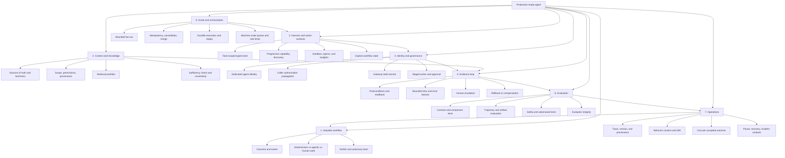

# Agent Systems Mind Map

Use this map to understand the dependency structure of a production agent. The central insight is that capability appears only when value, context, control, evidence, and operations work together.

## Navigation

| Mind-map branch | Practical resource |
| --- | --- |
| System delivery contract | [Agent-system Schema](../schemas/agent-system.schema.json) |
| Operational ontology | [Ontology Schema](../schemas/operational-ontology.schema.json) |
| Architecture topology | [Reference blueprints](../blueprints/README.md) |
| Mandatory controls | [Production control catalog](../controls/control-catalog.json) |
| Valuable workflow | [Product, Process, and Human Collaboration](01-product-process-and-ux.md) |
| Context and knowledge | [Context and Knowledge Systems](02-context-and-knowledge-systems.md) |
| Harness, state, tools, and orchestration | [Agent System Architecture](03-agent-system-architecture.md) |
| Evaluation, governance, safety, and economics | [Production, Evaluation, and Governance](04-production-evaluation-and-governance.md) |
| Design choices and failure modes | [Patterns and Anti-Patterns](06-patterns-and-anti-patterns.md) |
| Implementation sequence | [Production Implementation Playbook](07-production-implementation-playbook.md) |
| Release and rollback | [Production release gates](../operations/release-gates.md) |
| Dated primary evidence | [2026-02-07 to 2026-08-07 Source Ledger](../research/2026-02-07--2026-08-07-production-agent-source-ledger.md) |

## How to use the map in a design review

Start at the center and move clockwise. A branch with no concrete artifact is a design gap:

- No owner or verifier means the workflow is not ready for autonomy.
- No source-of-truth or provenance means context cannot support a consequential decision.
- No scoped identity or staged write means tool use is unsafe by default.
- No postcondition or rollback means the loop cannot prove success or recover.
- No replay suite means apparent performance cannot be trusted.
- No trace or runbook means the agent is not operable.
- No concurrency semantics means parallelism is an uncontrolled source of duplicated work and cost.
