# Production AI Systems Mind Map

Use this map to understand the dependency structure of a production AI-enabled system. The central insight is that capability appears only when value, architecture, intelligence selection, context, control, evidence, and operations work together.

```mermaid
flowchart TD
    A["Production-ready AI system"]

    A --> B["1. Customer workflow and value"]
    B --> B1["Observed work, baseline, outcome"]
    B --> B2["Decision, action, and owner"]
    B --> B3["Verifier and value hypothesis"]

    A --> C["2. Architecture and intelligence selection"]
    C --> C1["System and trust boundaries"]
    C --> C2["Rules, optimization, ML, model, agent, human"]
    C --> C3["State, APIs, events, and failure semantics"]
    C --> C4["Cost, quality, and fallback trade-offs"]

    A --> D["3. Context and knowledge"]
    D --> D1["Sources of truth and freshness"]
    D --> D2["Scope, permissions, provenance"]
    D --> D3["Retrieval portfolio"]
    D --> D4["Sufficiency check and uncertainty"]

    A --> E["4. Harness and action surfaces"]
    E --> E1["Task-scoped typed tools"]
    E --> E2["Progressive capability discovery"]
    E --> E3["Sandbox, egress, and budgets"]
    E --> E4["Explicit workflow state"]
    E --> E5["Capability provenance and lifecycle"]

    A --> F["5. Identity and governance"]
    F --> F1["Dedicated agent identity"]
    F --> F2["Caller authorization propagation"]
    F --> F3["Gateway-held secrets"]
    F --> F4["Staged writes and approval"]

    A --> G["6. Evidence loop"]
    G --> G1["Postconditions and readback"]
    G --> G2["Bounded retry and error classes"]
    G --> G3["Human escalation"]
    G --> G4["Rollback or compensation"]

    A --> H["7. Evaluation"]
    H --> H1["Contract and component tests"]
    H --> H2["Trajectory and artifact evaluation"]
    H --> H3["Safety and adversarial tests"]
    H --> H4["Evaluator integrity"]

    A --> I["8. Adoption and operations"]
    I --> I1["Trace, version, and provenance"]
    I --> I2["Adoption, override, and review load"]
    I --> I3["Behavior, value, and full cost"]
    I --> I4["Customer owner, recovery, retirement"]
    I --> I5["Governed field-learning loop"]

    A --> J["9. Scale and orchestration"]
    J --> J1["Bounded fan-out"]
    J --> J2["Idempotency, cancellation, merge"]
    J --> J3["Durable execution and replay"]
    J --> J4["Machine-scale quotas and rate limits"]
    J --> J5["Typed, expiring handoffs"]

    A --> K["10. Release and lifecycle"]
    K --> K1["Compatible solution manifest"]
    K --> K2["Shadow, canary, and approval gates"]
    K --> K3["Rollback and kill switches"]
    K --> K4["Improve, expand, or retire"]

    B --> C
    C --> D
    D --> G
    E --> F
    F --> G
    G --> H
    H --> I
    I --> B
    J --> E
    K --> I
```

## Navigation

| Mind-map branch | Practical resource |
| --- | --- |
| FDE lifecycle | [Discovery, delivery, and operation playbooks](../playbooks/README.md) |
| Workflow and value charter | [Workflow-charter Schema](../schemas/workflow-charter.schema.json) |
| System delivery contract | [Agent-system Schema](../schemas/agent-system.schema.json) |
| Operational ontology | [Ontology Schema](../schemas/operational-ontology.schema.json) |
| Architecture topology | [Reference blueprints](../blueprints/README.md) |
| Mandatory controls | [Production control catalog](../controls/control-catalog.json) |
| Customer workflow and value | [Discovery and Value](../playbooks/01-discovery-and-value.md) |
| Value engineering and cost | [Value Engineering and Frugal Architecture](11-value-engineering-and-frugal-architecture.md) |
| Architecture and intelligence selection | [Software Architecture and Intelligence Selection](12-software-architecture-and-intelligence-selection.md) and [hybrid intelligence blueprint](../blueprints/hybrid-intelligence-system.md) |
| Context and knowledge | [Context and Knowledge Systems](02-context-and-knowledge-systems.md) |
| Harness, state, tools, and orchestration | [Agent System Architecture](03-agent-system-architecture.md) |
| Capability admission and lifecycle | [Capability supply chain](../operations/capability-supply-chain.md) and [capability-manifest Schema](../schemas/capability-manifest.schema.json) |
| Typed delegation | [Handoff-envelope Schema](../schemas/handoff-envelope.schema.json) and [multi-agent coordinator](../blueprints/multi-agent-coordinator.md) |
| Evaluation, governance, safety, and economics | [Production, Evaluation, and Governance](04-production-evaluation-and-governance.md) |
| Design choices and failure modes | [Patterns and Anti-Patterns](06-patterns-and-anti-patterns.md) |
| Implementation sequence | [Production Implementation Playbook](07-production-implementation-playbook.md) |
| Compatible release and rollback | [Solution-release Schema](../schemas/solution-release.schema.json) and [production release gates](../operations/release-gates.md) |
| Adoption, customer ownership, and field learning | [Operate and Scale](../playbooks/03-operate-and-scale.md) and [field-learning register](../templates/field-learning-register.md) |
| Dated primary evidence | [2026-02-07 to 2026-08-07 Source Ledger](../research/2026-02-07--2026-08-07-production-agent-source-ledger.md) |

## How to use the map in a design review

Start at the center and move clockwise. A branch with no concrete artifact is a design gap:

- No observed workflow, baseline, owner, or verifier means the workflow is not ready for delivery.
- No explicit decision-mechanism choice means rules, optimization, ML, foundation-model, agent, and human responsibilities may drift into an unreviewable system.
- No source-of-truth or provenance means context cannot support a consequential decision.
- No scoped identity or staged write means tool use is unsafe by default.
- No postcondition or rollback means the loop cannot prove success or recover.
- No replay suite means apparent performance cannot be trusted.
- No trace or runbook means the agent is not operable.
- No adoption evidence or receiving service owner means the engagement is not ready for handoff.
- No concurrency semantics means parallelism is an uncontrolled source of duplicated work and cost.
- No capability provenance or lifecycle means the runtime cannot prove which admitted build held authority.
- No typed handoff means delegation can lose provenance, budgets, caller ceilings, and unresolved work.
- No compatible release manifest or rollback evidence means production change cannot be reviewed or reversed as one system.
- No governed field-learning record means production evidence cannot safely drive improvement or retirement.
