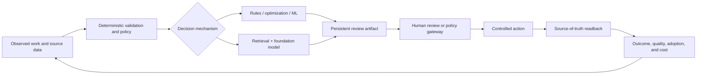

# Software Architecture and Intelligence Selection

Production AI is still production software. It needs explicit boundaries, owned state, data contracts, identity, delivery discipline, operations, and retirement. **Agents are components in operational software systems. They are not the system.**

Use this page when a workflow is ready to move from a value hypothesis to an architecture. Controls: `ARC-001`, `ARC-002`, `ARC-004`, `ARC-005`, `DEL-001`, `REL-002`, `OPS-001`.

## Select the mechanism per decision

Do not ask “where should we use an LLM?” Ask “what mechanism can make this decision safely, explainably, and economically?” A single workflow can combine several mechanisms.

| Decision shape | Default mechanism | Use it when | Required guardrail |
| --- | --- | --- | --- |
| Fixed policy, calculation, validation, or lifecycle rule | Deterministic code or rules engine | Inputs and branches are known | Tests and policy ownership |
| Scheduling, routing, allocation, or constrained planning | Optimization algorithm | Objective and constraints can be stated | Feasibility checks and fallback |
| Prediction, ranking, classification, anomaly, or fraud signal | Classical ML or statistics | Labeled evidence and measurable error trade-off exist | Drift monitoring and threshold review |
| Semantic lookup and evidence assembly | Search, embeddings, and retrieval | The answer depends on governed, changing content | Provenance, freshness, sufficiency, and citation |
| Language, document, image, audio, or ambiguous classification | Foundation model | Unstructured interpretation adds measurable value | Typed output, constrained context, evaluation, and human escalation |
| Open-ended but bounded multi-step coordination | Agent workflow | The path varies and feedback changes the next step | Tool ceilings, durable state, stop rules, verification |
| High-stakes, unclear, or weakly verifiable judgment | Human decision | The system cannot credibly bound or verify the decision | Review surface, evidence packet, and accountability |

Use a [selection record](../templates/intelligence-selection-record.md) for each consequential decision. The record must show the deterministic, optimization, classic-ML, foundation-model, and human alternatives considered when relevant; it is not a mandate to introduce every component. [R26-40] [R26-56]

## Draw the system before the agent loop

At minimum, create these four views in an [architecture decision record](../templates/architecture-decision-record.md):

1. **System context:** users, working surface, upstream sources, downstream systems, external parties, and outcome owner.
2. **Container/component view:** user surface, workflow runtime, domain/state service, context assembly, deterministic policy, model route, tool gateway, evaluation, and operations.
3. **Decision and state view:** decision inputs, state owner, invariants, allowed transitions, effects, postconditions, and recovery.
4. **Deployment and trust view:** identities, tenancy, credentials, network/egress, isolation, data classification, observability, release, and rollback.

The [operational ontology](../templates/operational-ontology.json) owns business objects, state, rules, actions, and evidence. The [agent-system](../templates/agent-system.json) owns workflow behavior and authority. Tool, capability, behavior, evaluation, and release contracts bind the pieces into a compatible deployable system.

## Use a cloud-native baseline

Kevin Hoffman's *Beyond the Twelve-Factor App* adds API-first design, telemetry, and authentication/authorization to the classic cloud-native workload disciplines. Treat those as the baseline for an FDE solution—not as an agent-specific framework. [R26-62]

| Workload concern | FDE application |
| --- | --- |
| API-first contracts | Typed source and tool contracts, versioned interfaces, compatibility tests |
| Configuration, credentials, and dependencies | Immutable builds, externalized configuration, brokered short-lived credentials, explicit provenance |
| Stateless processes and backing services | Durable workflow/domain state outside prompts and process memory; explicit source-of-truth dependencies |
| Concurrency and disposability | Idempotency, cancellation, leases, retry budgets, replay, and safe restart |
| Environment parity and release discipline | Versioned behavior bundles, evaluation worlds, compatible release manifests, canary and rollback |
| Telemetry | Traces for decision, policy, tool, effect, readback, outcome, adoption, and cost |
| Authentication and authorization | User or workload identity, tenant binding, least privilege, authorization at the effect boundary |

FDE adds outcome definition, workflow observation, customer adoption, service ownership, and value measurement around this software baseline.

## Design a hybrid system intentionally

The [hybrid intelligence-system blueprint](../blueprints/hybrid-intelligence-system.md) gives the exact component, state, trust-boundary, failure, telemetry, and release-test checklist. The default is serial and simple: add parallelism, additional models, or multiple agents only when measured constraints justify them.

## Architectural non-negotiables

- A model proposes; deterministic software validates, authorizes, executes, persists, and verifies consequential work. `ARC-002`
- Each component has a named purpose, version, owner, authority ceiling, evidence, cost allocation, monitor, fallback, and retirement path. `ARC-005`, `DEL-001`
- Source-of-truth state, identity, approvals, and completion proof live outside prompts and transient model context. `CTX-001`, `IAM-001`, `REL-003`
- The release unit binds data, domain, intelligence components, tools, policy, evaluation, user surface, and operations—not code alone. `DEL-001`
- A foundation model or agent is retained because it improves the accepted outcome under the required guardrails, not because it is novel or available. `ARC-004`, `VAL-002`

## Anti-patterns

- Calling a deterministic policy decision “agent reasoning.”
- Treating a model route as the architecture, while state, access, effects, and recovery remain implicit.
- Adding an LLM to a scheduling, allocation, validation, or classification problem without comparing the simpler mechanism.
- Training or routing an ML model without a stable label, error metric, drift monitor, or owner.
- Optimizing inference cost while ignoring tool, review, recovery, and customer-service cost.
- Treating an architecture diagram as complete when it has no state transitions, trust boundaries, failure behavior, or release tests.

[R26-40]: ../research/2026-02-07--2026-08-07-production-agent-source-ledger.md#r26-40
[R26-56]: ../research/2026-02-07--2026-08-07-production-agent-source-ledger.md#r26-56
[R26-62]: ../research/2026-02-07--2026-08-07-production-agent-source-ledger.md#r26-62
