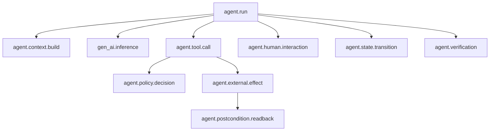

# Agent Telemetry Contract

Machine-readable reference contracts cover state transitions in [`trace-event.schema.json`](../schemas/trace-event.schema.json) and consequential effects in [`effect-receipt.schema.json`](../schemas/effect-receipt.schema.json). The broader topology below is the production telemetry profile: an implementation MUST encode its tool, policy, inference, human-interaction, and verification events in closed deployment-specific schemas before claiming full conformance. The repository validator does not imply that those additional event types are schema-validated here.

The shared state-transition `details` vocabulary is workflow-neutral: it carries only hashed source revisions, typed decision references, hashed artifact references, effect-and-receipt references, and closed error codes. Domain payloads and raw business identifiers stay out of telemetry. A deployment that needs another detail shape MUST publish a versioned closed schema or a separately versioned event type; it must not reopen the shared object with arbitrary properties.

Controls: `OPS-001`, `SEC-004`.

## Production telemetry topology



## Required state-transition run attributes

The runtime envelope also requires `schema_version`, event time, trace/span identity, release digest, closed component versions, actor mode, and retention class. State-specific `details` accept only the identifiers, hashes, revisions, and error codes declared in the schema.

| Attribute | Type | Cardinality | Classification |
| --- | --- | ---: | --- |
| `agent.run.id` | UUID | 1 | internal |
| `agent.operation.id` | stable SHA-256 business-operation ID | 1 | internal |
| `agent.release.digest` | SHA-256 release-manifest digest | 1 | internal |
| `agent.system.id` | string | 1 | public |
| `agent.system.version` | semver | 1 | public |
| `agent.workflow.id` | string | 1 | internal |
| `agent.workflow.state` | string | 1/span | internal |
| `agent.tenant.hash` | string | 1 | confidential |
| `agent.principal.id_hash` | string | 1 | confidential |
| `agent.caller.id_hash` | string | 0..1 | confidential |
| `agent.actor.mode` | interactive_delegated / unattended_workload / mixed | 1 | internal |
| `agent.autonomy.level` | enum | 1 | internal |
| `agent.stop.reason` | controlled identifier from the workflow's tested vocabulary | 1 | internal |
| `agent.steps.count` | integer | 1 | internal |
| `agent.cost.usd` | number | 1 | confidential |
| `agent.accepted_outcome` | boolean | 1 | internal |

`agent.accepted_outcome` MUST be true only after confirmation by the workflow charter's declared independent verifier, authoritative source, or accountable reviewer. A terminal workflow state or model assertion is insufficient. The deployment MUST retain verifier provenance and the evidence reference in a separate closed verification event or domain record correlated to the trace; the shared trace-event schema does not encode those fields. Controls: `FDE-001`, `VAL-002`, `OPS-001`, `OPS-006`.

## Required tool span attributes

These fields define the minimum deployment span. They are not accepted by the state-transition schema; emit them through a separate closed tool-span contract and correlate them by run, operation, release, trace, and parent span.

| Attribute | Type |
| --- | --- |
| `agent.tool.id` | string |
| `agent.tool.version` | semver |
| `agent.tool.kind` | query / compute / stage_write / commit_write / administrative |
| `agent.tool.effect_class` | none / staged / reversible / irreversible |
| `agent.tool.attempt` | integer |
| `agent.tool.idempotency_key_hash` | string |
| `agent.tool.status` | ok / error / denied / timeout |
| `agent.tool.error_class` | retryable / terminal / authorization / validation / escalation |
| `agent.tool.duration_ms` | integer |

## Required policy event

This example is a deployment event shape, not an alternative payload for `trace-event.schema.json`. A production implementation MUST define a closed schema, retention class, correlation fields, and redaction policy for it.

Controls: `OPS-001`, `SEC-004`.

```json
{
  "event_name": "agent.policy.decision",
  "policy_id": "commit-resolution",
  "policy_version": "3.2.1",
  "policy_digest": "sha256:...",
  "agent_principal_hash": "sha256:...",
  "caller_principal_hash": "sha256:...",
  "tenant_hash": "sha256:...",
  "action": "commit_resolution",
  "resource_hash": "sha256:...",
  "decision": "allow",
  "obligations": ["approval_digest_match", "postcondition_readback"],
  "reason_code": "AUTHORIZED_APPROVER"
}
```

## Required effect receipt

```json
{
  "schema_version": "1.2.0",
  "effect_id": "uuid",
  "run_id": "uuid",
  "operation_id": "sha256:...",
  "release_digest": "sha256:...",
  "tenant_hash": "sha256:...",
  "account_hash": "sha256:...",
  "agent_principal_hash": "sha256:...",
  "caller_principal_hash": "sha256:...",
  "action": "commit_resolution",
  "effect_class": "reversible",
  "resource_hash": "sha256:...",
  "source_revision": "ledger-revision-42",
  "proposal_digest": "sha256:...",
  "idempotency_key_hash": "sha256:...",
  "policy_decision_id": "uuid",
  "policy_revision": "policy-3.2.1",
  "approval_id": "uuid",
  "expected_postcondition_digest": "sha256:...",
  "service_receipt": {
    "algorithm": "Ed25519",
    "key_id": "ledger-signing-key-2026-08",
    "issuer": "system-of-record",
    "subject": {
      "receipt_id": "opaque-id",
      "effect_id": "uuid",
      "run_id": "uuid",
      "operation_id": "sha256:...",
      "release_digest": "sha256:...",
      "tenant_hash": "sha256:...",
      "account_hash": "sha256:...",
      "agent_principal_hash": "sha256:...",
      "caller_principal_hash": "sha256:...",
      "action": "commit_resolution",
      "effect_class": "reversible",
      "resource_hash": "sha256:...",
      "source_revision": "ledger-revision-42",
      "proposal_digest": "sha256:...",
      "idempotency_key_hash": "sha256:...",
      "policy_decision_id": "uuid",
      "policy_revision": "policy-3.2.1",
      "approval_id": "uuid",
      "expected_postcondition_digest": "sha256:...",
      "committed_at": "ISO-8601"
    },
    "subject_digest": "sha256:...",
    "signature": "base64url-ed25519-signature"
  },
  "committed_at": "ISO-8601",
  "readback": {
    "run_id": "uuid",
    "readback_request_id": "uuid",
    "requested_at": "ISO-8601",
    "status": "matched",
    "source": "system-of-record",
    "revision": "ledger-revision-43",
    "verified_at": "ISO-8601",
    "verifier": "postcondition-verifier",
    "expected_postcondition_digest": "sha256:...",
    "observed_postcondition_digest": "sha256:...",
    "attestation": {
      "algorithm": "Ed25519",
      "key_id": "ledger-signing-key-2026-08",
      "issuer": "system-of-record",
      "subject_digest": "sha256:...",
      "signature": "base64url-ed25519-signature"
    }
  },
  "compensation": {
    "status": "available",
    "reference": "compensate-resolution"
  }
}
```

The committing service, not the model or harness, signs the canonical `service_receipt.subject`. The top-level effect receipt preserves the originating signed `run_id`; a later retry has its own trace run but returns that original receipt rather than rewriting its audit identity. The readback service signs a separate canonical attestation over the requesting run and unique request ID, request time, effect, operation, resource, source revision, expected postcondition, observed postcondition, and verification time. The runtime MUST verify both signatures with trusted keys, compare every repeated binding, enforce timestamp order, and fail closed before treating the effect as complete. A timeout-recovery receipt is accepted only when the full business-operation tuple matches the attempted commit.

Controls: `IAM-001`, `IAM-002`, `REL-001`, `REL-003`, `OPS-001`.

## Stop reasons

The shared vocabulary is `completed`, `completed_after_timeout_recovery`, `tenant_mismatch`, `stale_source_revision`, `stale_policy`, `context_load_failed`, `validation_failed`, `policy_denied`, `policy_denied_at_commit`, `idempotency_conflict`, `approval_rejected`, `approval_expired`, `approval_time_invalid`, `approval_identity_invalid`, `approval_digest_mismatch`, `policy_denied_before_commit`, `release_not_admitted`, `service_receipt_invalid`, `readback_denied`, `readback_mismatch`, `budget_exhausted`, `timeout_exhausted`, `cancelled`, `circuit_breaker`, and `internal_error`.

`trace-event.schema.json` constrains a stop reason to an opaque identifier rather than a universal enum because domain workflows need narrower extensions. Each agent-system design MUST publish and test its allowed vocabulary. The invoice reference uses `stale_invoice_revision` as its domain-specific form of `stale_source_revision`.

Control: `OPS-001`.

## Core SLIs

```text
accepted_outcome_rate = verifier_confirmed_accepted_outcomes / eligible_runs
unauthorized_effect_rate = unauthorized_effects / external_effects
duplicate_effect_rate = duplicate_effects / external_effects
postcondition_failure_rate = mismatched_readbacks / external_effects
intervention_rate = human_interventions / eligible_runs
cost_per_accepted_outcome = total_system_cost / accepted_outcomes
trace_completeness = traces_with_required_fields / traces_sampled
```

## Telemetry controls

- Hash or tokenize tenant, principal, resource, and idempotency identifiers.
- Enforce the closed trace schema at ingestion and reject undeclared payload fields.
- Never record credentials, raw authorization tokens, hidden model reasoning, or unrestricted retrieved content.
- Record model, prompt, tool, policy, ontology, schema, evaluator, and runtime versions.
- Sample successful read-only runs; retain 100% of denied, failed, write, incident, and rollback runs subject to policy.
- Apply field-level retention by classification and incident/legal requirements.
