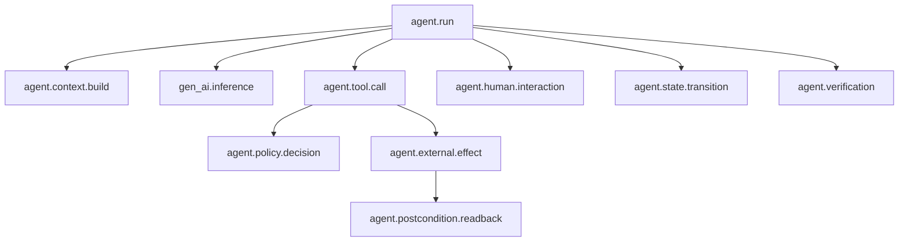

# Agent Telemetry Contract

Runtime schemas: [`trace-event.schema.json`](../schemas/trace-event.schema.json), [`effect-receipt.schema.json`](../schemas/effect-receipt.schema.json).

## Trace topology



## Required run attributes

| Attribute | Type | Cardinality | Classification |
| --- | --- | ---: | --- |
| `agent.run.id` | UUID | 1 | internal |
| `agent.operation.id` | stable SHA-256 business-operation ID | 1 | internal |
| `agent.system.id` | string | 1 | public |
| `agent.system.version` | semver | 1 | public |
| `agent.workflow.id` | string | 1 | internal |
| `agent.workflow.state` | string | 1/span | internal |
| `agent.tenant.hash` | string | 1 | confidential |
| `agent.principal.id_hash` | string | 1 | confidential |
| `agent.caller.id_hash` | string | 0..1 | confidential |
| `agent.autonomy.level` | enum | 1 | internal |
| `agent.stop.reason` | enum | 1 | internal |
| `agent.steps.count` | integer | 1 | internal |
| `agent.cost.usd` | number | 1 | confidential |
| `agent.accepted_outcome` | boolean | 1 | internal |

## Required tool span attributes

| Attribute | Type |
| --- | --- |
| `agent.tool.id` | string |
| `agent.tool.version` | semver |
| `agent.tool.kind` | query / compute / stage_write / commit_write / administrative |
| `agent.tool.effect_class` | none / staged / reversible / irreversible |
| `agent.tool.attempt` | integer |
| `agent.tool.idempotency_key_hash` | string |
| `agent.tool.status` | ok / error / denied / timeout |
| `agent.tool.error_class` | retryable / terminal / authorization / validation / escalation |
| `agent.tool.duration_ms` | integer |

## Required policy event

```json
{
  "event_name": "agent.policy.decision",
  "policy_id": "commit-resolution",
  "policy_version": "3.2.1",
  "policy_digest": "sha256:...",
  "agent_principal_hash": "sha256:...",
  "caller_principal_hash": "sha256:...",
  "tenant_hash": "sha256:...",
  "action": "commit_resolution",
  "resource_hash": "sha256:...",
  "decision": "allow",
  "obligations": ["approval_digest_match", "postcondition_readback"],
  "reason_code": "AUTHORIZED_APPROVER"
}
```

## Required effect receipt

```json
{
  "effect_id": "uuid",
  "run_id": "uuid",
  "action": "commit_resolution",
  "resource_hash": "sha256:...",
  "proposal_digest": "sha256:...",
  "idempotency_key_hash": "sha256:...",
  "policy_decision_id": "uuid",
  "approval_id": "uuid",
  "service_receipt": "opaque-id",
  "committed_at": "ISO-8601",
  "readback_status": "matched"
}
```

## Stop reasons

`completed`, `completed_after_timeout_recovery`, `tenant_mismatch`, `stale_invoice_revision`, `stale_policy`, `context_load_failed`, `validation_failed`, `policy_denied`, `policy_denied_at_commit`, `idempotency_conflict`, `approval_rejected`, `approval_expired`, `approval_digest_mismatch`, `policy_denied_before_commit`, `readback_mismatch`, `budget_exhausted`, `timeout_exhausted`, `cancelled`, `circuit_breaker`, `internal_error`.

## Core SLIs

```text
accepted_outcome_rate = accepted_outcomes / eligible_runs
unauthorized_effect_rate = unauthorized_effects / external_effects
duplicate_effect_rate = duplicate_effects / external_effects
postcondition_failure_rate = mismatched_readbacks / external_effects
intervention_rate = human_interventions / eligible_runs
cost_per_accepted_outcome = total_system_cost / accepted_outcomes
trace_completeness = traces_with_required_fields / traces_sampled
```

## Telemetry controls

- Hash or tokenize tenant, principal, resource, and idempotency identifiers.
- Never record credentials, raw authorization tokens, hidden model reasoning, or unrestricted retrieved content.
- Record model, prompt, tool, policy, ontology, schema, evaluator, and runtime versions.
- Sample successful read-only runs; retain 100% of denied, failed, write, incident, and rollback runs subject to policy.
- Apply field-level retention by classification and incident/legal requirements.
