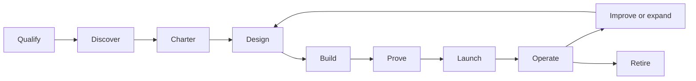

# FDE Playbooks

Use these playbooks to move one customer or internal workflow from an important problem to business-owned production operation. For an internal team, read “customer” as the business unit or operating team that owns the workflow after delivery.

## Lifecycle

| Stage | Primary question | Required output | Decision |
| --- | --- | --- | --- |
| Qualify | Is this problem important, owned, bounded, and verifiable? | Candidate brief and gate result | Discover, defer, or reject |
| Discover | How does the work actually happen, including exceptions and workarounds? | Observation log, current-state workflow, source map, exception set | Charter or stop |
| Charter | Which outcome, segment, verifier, value hypothesis, and risk ceiling define success? | [Workflow charter](../templates/workflow-charter.json) and [value case](../templates/value-case.md) | Pilot, defer, or do not build |
| Design | How do data, logic, actions, security, users, operations, and the selected intelligence mechanisms fit together? | Intelligence-selection record, domain model, system design, behavior bundle where needed, tool contracts, capability manifests, threat model, eval plan, and a system map only when dependency complexity warrants it | Build or redesign |
| Build | What is the smallest end-to-end slice that can prove the outcome? | Working vertical slice and delivery evidence | Continue or stop |
| Prove | Does it work on representative cases, with users, within risk and cost limits? | Replay, shadow, adoption, value evidence, and [evaluation report](../templates/evaluation-report.json) | Canary, revise, or stop |
| Launch | Can the compatible solution be contained, recovered, supported, and rolled back? | [Solution-release manifest](../templates/solution-release.json), runbooks, trained owners, cutover decision | Bounded production or hold |
| Operate | Is the workflow valuable, reliable, safe, adopted, and supportable? | Service reviews, incidents, regressions, value realization | Expand, constrain, pause, or retire |
| Improve or expand | Which field learning warrants a customer configuration, compatible product change, or bounded expansion? | [Field-learning register](../templates/field-learning-register.md) and validated disposition | Investigate, configure, fix, productize, standardize, defer, reject, or retire |
| Retire | When should the workflow stop, and how will authority, capabilities, state, evidence, support, and users be closed safely? | Owned [retirement sequence](03-operate-and-scale.md#10-run-the-improve-expand-or-retire-sequence) and verified [`solution-release.retirement_evidence`](../schemas/solution-release.schema.json) | Retire or remediate |

## Read in order

1. [Discovery and value](01-discovery-and-value.md)
2. [Solution design and delivery](02-solution-and-delivery.md)
3. [Operate and scale](03-operate-and-scale.md)

The [production implementation playbook](../library/07-production-implementation-playbook.md) remains the detailed technical release sequence. These FDE playbooks add customer discovery, value, adoption, ownership, and field-to-product learning around it.

## Minimum engagement packet

| Artifact | Purpose |
| --- | --- |
| [Field-observation log](../templates/field-observation-log.md) | Record actual work, evidence, exceptions, and workarounds |
| [FDE discovery pack](../templates/fde-discovery-pack.md) | Map workflow, sources, decisions, exceptions, and readiness |
| [Workflow charter](../templates/workflow-charter.json) | Bind problem, scope, outcome, value, readiness, owners, and decision |
| [Value case](../templates/value-case.md) | Separate estimated, measured, and realized value |
| [Intelligence selection record](../templates/intelligence-selection-record.md) | Choose the smallest sufficient combination of rules, optimization, ML, retrieval, models, agents, and human review |
| [System map and change impact](../templates/system-map-manifest.json) and [assessment](../templates/change-impact-assessment.json) | Optional derived navigation and material-change evidence for complex, changing systems; never a substitute for authority or release evidence |
| [Delivery and adoption plan](../templates/delivery-and-adoption-plan.md) | Coordinate the vertical slice, acceptance, rollout, and enablement |
| [Production handoff](../templates/customer-enablement-handoff.md) | Prove the customer can operate, change, support, and retire the service |
| [Production service review](../templates/production-service-review.md) | Review outcomes, SLOs, adoption, risk, cost, change, and ownership |
| [Field-learning register](../templates/field-learning-register.md) | Route validated field evidence into customer configuration, product change, shared pattern, or retirement |

Controls `FDE-001` through `FDE-004`, `VAL-001` through `VAL-003`, `ADP-001` through `ADP-002`, and `DEL-001` through `DEL-002` define the lifecycle baseline within this guide.
