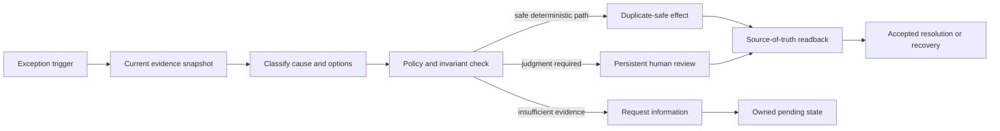

# Exception-to-Resolution Business Flow

**Maturity:** reusable business-flow pattern

Use this pattern when a transaction, request, order, claim, invoice, case, or record cannot continue through its normal deterministic path.

## Outcome and boundary

The outcome is not “the agent answered.” One eligible exception reaches a verified resolved state, an explicitly compensated state, or an owned escalation with current evidence and a next action. The business owner defines which terminal states are acceptable and which require human authority.

The pattern begins when the source system emits a stable exception identity and ends only after source-of-truth verification or a recorded unresolved disposition. `FDE-001`, `VAL-001`, `REL-003`.

## Business flow

## Decision model

| Decision | Default mechanism | Escalation condition |
| --- | --- | --- |
| Is the exception still current? | Deterministic source revision and state check | Source unavailable or state changed |
| Which evidence is required? | Versioned policy and typed retrieval | Missing, conflicting, stale, or unauthorized evidence |
| Which resolutions are permitted? | Deterministic rules and invariants | Novel exception or policy ambiguity |
| How should evidence be summarized? | Template, retrieval, or bounded model call | Unsupported claim or missing citation |
| May the state change? | Trusted policy enforcement and typed effect service | Missing authority, approval, or postcondition |

A foundation model MAY propose a classification or explanation. It MUST NOT authorize an effect, invent missing evidence, or prove completion. `ARC-004`, `ARC-005`, `IAM-003`.

## Smallest useful slice

- One high-volume exception class with a stable identity and current source revision.
- One authorized evidence path and one explicit policy revision.
- One deterministic resolution or staged proposal.
- One persistent reviewer surface for the ambiguous path.
- One duplicate-safe effect and source-of-truth readback, or a non-effecting escalation.
- One accepted-outcome event, cost measure, rollback path, and service owner.

The [invoice-exception reference](../../examples/invoice-exception/README.md) executes the controlled-write version of this slice.

## Acceptance contract

| Case | Required evidence |
| --- | --- |
| Stale exception | Processing stops before an effect and records the current source revision. |
| Missing or conflicting evidence | The case requests information or escalates; absence is not converted into certainty. |
| Unauthorized resolution | The effect boundary denies before state change. |
| Duplicate delivery | One stable business operation produces at most one effect. |
| Timeout after effect | The workflow enters effect-unknown recovery and reconciles before retry or completion. |
| Approved resolution | Approval is bound to the exact proposal when required; readback proves the declared postcondition. |

Controls: `SEC-004`, `REL-001`, `REL-003`, `REL-005`, `HUM-001`, `EVA-001`, `EVA-003`.

## Operating contract

Measure eligible exception volume, age by state, accepted resolution rate, reopen and compensation rate, reviewer wait and override, duplicate and prohibited effects, recovery success, and full cost per accepted resolution. Alert on unresolved-age breaches, evidence-source drift, policy denials, effect/readback mismatch, and abnormal changes in exception mix. `OPS-003`, `OPS-004`, `OPS-006`, `CST-001`.

## Reuse and variation

The stable pattern is exception identity, current evidence, permitted resolution, controlled effect, and verified terminal state. Customer-specific elements include exception taxonomy, evidence sources, policy, approval roles, compensations, system-of-record semantics, and value per resolution.

## What this does not prove

This pattern does not prove that a classifier is accurate, a proposed resolution is lawful or correct, an external effect is reversible, or a target system is ready. Those claims require local domain review, representative evaluation, target-environment authorization tests, and release evidence.

**Controls:** `FDE-001`, `VAL-001`, `ARC-004`, `ARC-005`, `IAM-003`, `SEC-004`, `REL-001`, `REL-003`, `REL-005`, `HUM-001`, `EVA-001`, `EVA-003`, `OPS-003`, `OPS-004`, `OPS-006`, `CST-001`.
