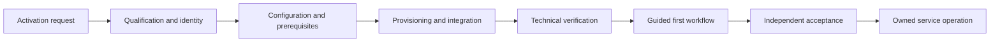

# Request-to-Activation Business Flow

**Maturity:** reusable business-flow pattern

Use this pattern when a customer, user, service, location, device, or resource must move from a request into safe, usable operation.

## Outcome and boundary

The accepted outcome is the requester completing the first valid business task under current identity, entitlement, configuration, and support ownership. An invitation, provisioned record, successful login, deployment, or checklist completion is not sufficient by itself.

The pattern begins with a stable request and accountable sponsor, and ends with independently accepted first use or a safe rejection with a reason and next step. `VAL-001`, `VAL-002`, `FDE-003`.

## Business flow

## Decision model

| Decision | Default mechanism | Failure behavior |
| --- | --- | --- |
| Is the request eligible and sponsored? | Deterministic business rule | Reject or request evidence |
| Who and what receives authority? | Identity and policy service | Fail closed on ambiguity or stale membership |
| Are prerequisites complete? | Versioned checklist and system verification | Block activation with owner and next action |
| Which configuration applies? | Typed profile and policy | Reject unsupported combination |
| Is the system technically ready? | Automated verification and readback | Roll back or remain staged |
| Has value begun? | Named user and outcome verifier | Remain onboarding; do not infer from login |

Models MAY explain requirements, draft mappings, or guide a user. They MUST NOT create identity, grant entitlement, waive a control, or declare activation complete. `ARC-005`, `IAM-001`, `IAM-003`.

## Smallest useful slice

- One requester type, sponsor, tenant or account, identity path, and entitlement.
- One supported configuration and one integration or resource.
- One staged provisioning path with duplicate safety and rollback.
- One guided first workflow ending in a named accepted outcome.
- One support path, service owner, operating measure, and shutdown exercise.

The [enterprise-foundation accelerator](../enterprise-foundation.md) provides the horizontal identity, tenancy, entitlement, usage, and lifecycle components for this flow.

## Acceptance contract

| Case | Required evidence |
| --- | --- |
| Missing sponsor or identity ambiguity | Activation stops before authority is granted. |
| Duplicate request | One stable activation identity produces one active resource. |
| Partial provisioning | State remains staged or rolls back; support sees the exact failed step. |
| Entitlement changes during activation | Current policy is rechecked before first use. |
| Technical verification passes but user cannot complete work | Activation remains incomplete and adoption debt has an owner. |
| Deactivation | Access, credentials, jobs, egress, data handling, and support state follow the declared shutdown contract. |

## Operating contract

Measure eligible requests, time to technically ready, time to first accepted outcome, blocked-step age, rework, support effort, activation and early-retention rate, deprovisioning latency, and full cost per accepted activation. Keep technical provisioning and realized adoption as separate metrics. `ADP-001`, `ADP-002`, `OPS-004`, `OPS-006`, `CST-001`.

## Reuse and variation

The reusable flow is request, qualification, identity, configuration, provisioning, verification, first use, and ownership. Customer-specific elements include entitlement policy, environment topology, integration set, migration, training, data residency, support model, and accepted first outcome.

## What this does not prove

This pattern does not prove enterprise identity interoperability, customer adoption, target-environment security, contractual entitlement, or operating readiness. Each target deployment requires owned configuration, integration, security, support, and outcome evidence.

**Controls:** `VAL-001`, `VAL-002`, `FDE-003`, `ARC-005`, `IAM-001`, `IAM-003`, `REL-001`, `ADP-001`, `ADP-002`, `OPS-004`, `OPS-006`, `CST-001`.
