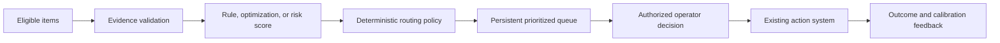

# Risk-to-Prioritized-Action Business Flow

**Maturity:** reusable business-flow pattern

Use this pattern when eligible work competes for limited human attention and the system must decide what should be reviewed first.

## Outcome and boundary

The accepted outcome is an authorized operator making a timely decision on a correctly routed item with current evidence. A score, rank, queue position, alert, or generated explanation is an intermediate result.

The pattern begins with an eligible population and versioned evidence, then ends with an accepted decision and observed downstream result. Items outside the measured population remain outside performance and value claims. `VAL-001`, `VAL-002`, `ARC-004`.

## Business flow

## Decision model

| Decision | Candidate mechanism | Required evidence |
| --- | --- | --- |
| Is the item eligible? | Deterministic rule | Denominator, exclusions, revision |
| How should scarce capacity be allocated? | Rule or optimization | Constraint feasibility and objective |
| What is the estimated risk? | Classical ML or statistics | Calibration, segment coverage, drift, fallback |
| Should the item enter review? | Deterministic policy | Threshold, evidence freshness, capacity, risk ceiling |
| How should evidence be explained? | Template or bounded model call | Explanation cannot change route or authority |
| What action should occur? | Authorized operator | Persistent evidence and target-system policy |

Controls: `ARC-004`, `ARC-005`, `HUM-001`, `EVA-001`, `EVA-002`.

## Smallest useful slice

- One eligible segment with a declared denominator and baseline queue.
- One transparent scoring or optimization route plus a deterministic baseline.
- One versioned routing policy with explicit no-action and escalation paths.
- One persistent review surface with evidence, uncertainty, and correction.
- One human-owned downstream decision and observed outcome source.
- One capacity, latency, quality, adoption, and cost ceiling.

The [shipment-risk triage walkthrough](../../examples/shipment-risk-triage/README.md) executes this pattern with a versioned ML score, deterministic routing, optional model explanation, and human action authority.

## Acceptance contract

| Case | Required evidence |
| --- | --- |
| Ineligible item | It is excluded before scoring and from the outcome denominator. |
| Missing or stale evidence | The item escalates or uses a declared safe fallback. |
| Score outside contract | The route fails closed; malformed or unversioned scores do not enter policy. |
| Explanation conflicts with policy | The deterministic route remains unchanged and the explanation is rejected or replaced. |
| Capacity exceeded | The system follows the declared degradation policy without hiding eligible demand. |
| Segment drift | Monitoring triggers review, constraint, rollback, or re-evaluation before expansion. |

## Operating contract

Track population coverage, calibration or objective quality by segment, queue age, accepted operator decisions, overrides, false-positive review burden, missed-priority sampling, downstream outcome, cost per accepted decision, and distribution drift. Review capacity and opportunity cost alongside model and workflow quality. `OPS-004`, `OPS-006`, `CST-001`, `CST-002`.

## Reuse and variation

The reusable pattern is eligibility, evidence, score or optimization, policy, queue, human decision, and feedback. Customer-specific elements include constraints, loss function, protected segments, review capacity, action authority, feedback delay, and value attribution.

## What this does not prove

This pattern does not prove that a score is causal, fair, calibrated in a target segment, or appropriate for a consequential decision. It also does not convert prioritization into authority. Target data, domain review, representative evaluation, and monitored outcomes remain required.

**Controls:** `VAL-001`, `VAL-002`, `ARC-004`, `ARC-005`, `HUM-001`, `EVA-001`, `EVA-002`, `EVA-003`, `OPS-004`, `OPS-006`, `CST-001`, `CST-002`.
