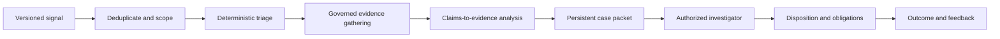

# Signal-to-Investigation Business Flow

**Maturity:** reusable business-flow pattern

Use this pattern when a rule, model, report, external notice, or person raises a signal that must become a traceable case disposition.

## Outcome and boundary

One eligible signal becomes a persistent case that an authorized investigator can dismiss, monitor, escalate, or resolve using attributable evidence. Signal volume, model confidence, or generated narrative is not the accepted outcome.

The boundary begins with a versioned signal and ends with a named disposition, evidence record, reviewer identity, and downstream obligation. Confidential case data remains scoped to its authorized purpose and audience. `FDE-001`, `VAL-001`, `CTX-001`, `IAM-002`.

## Business flow

## Decision model

| Decision | Default mechanism | Required boundary |
| --- | --- | --- |
| Is this signal new and in scope? | Deterministic deduplication and policy | Stable signal and subject identity |
| Which evidence may be accessed? | Purpose-, tenant-, role-, and case-bound retrieval | Fail closed before disclosure |
| What facts support each claim? | Structured query, retrieval, analytics, or bounded model synthesis | Source, revision, freshness, contradiction |
| What is the disposition? | Authorized human or governed deterministic rule for low-risk cases | Persistent evidence packet and reason |
| What action follows? | Typed service below model control | Current authority and policy recheck |

Multi-agent fan-out is optional. Use it only when evidence domains require distinct permissions, owners, or latency boundaries, and preserve one parent case state and an authority-attenuating handoff. `ARC-005`, `CTX-005`, `REL-004`.

## Smallest useful slice

- One signal source, subject type, tenant or account boundary, and deduplication rule.
- Two authoritative evidence sources with explicit freshness and contradiction behavior.
- One case packet containing claims, supporting and conflicting evidence, uncertainty, and missing work.
- One investigator disposition with edit, reject, escalate, and pause controls.
- No automatic external action; one typed downstream proposal if the pilot requires it.
- One sampled quality review, full-cost measure, and service owner.

## Acceptance contract

| Case | Required evidence |
| --- | --- |
| Duplicate signal | One case identity is retained and the later signal is linked without double counting. |
| Cross-tenant or wrong-purpose request | Evidence access is denied before disclosure and the denial is traceable without raw sensitive payloads. |
| Conflicting evidence | Both sources and revisions remain visible; the system does not silently choose one. |
| Unsupported generated claim | The claim is rejected, marked unresolved, or routed for review. |
| Reviewer disagreement | Original packet, edits, final disposition, and reason remain attributable. |
| Downstream proposal | It is non-binding until separately authorized under the target action policy. |

Controls: `CTX-002`, `TOL-005`, `SEC-004`, `HUM-001`, `HUM-002`, `EVA-001`, `EVA-003`.

## Operating contract

Measure eligible and deduplicated signals, conversion to cases, evidence sufficiency, unsupported-claim rate, investigator agreement and override, case age, downstream acceptance, prohibited disclosure, cost per accepted disposition, and post-disposition outcomes. Monitor source drift, unusual access patterns, signal-distribution shifts, and unresolved-case accumulation. `OPS-001`, `OPS-004`, `OPS-006`, `CST-001`.

## Reuse and variation

The reusable shape is signal, scoped case, evidence graph, disposition, obligation, and feedback. Customer-specific elements include signal thresholds, confidentiality, evidence systems, legal or policy obligations, reviewer roles, retention, and downstream authority.

## What this does not prove

This pattern does not prove that a signal is valid, an investigation is complete, a person or entity engaged in misconduct, or a regulatory action is required. Those determinations remain subject to the target organization's policy, authorized experts, and applicable law.

**Controls:** `FDE-001`, `VAL-001`, `ARC-005`, `CTX-001`, `CTX-002`, `CTX-005`, `IAM-002`, `TOL-005`, `SEC-004`, `REL-004`, `HUM-001`, `HUM-002`, `EVA-001`, `EVA-003`, `OPS-001`, `OPS-004`, `OPS-006`, `CST-001`.
