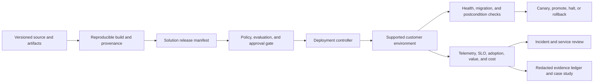

# Deployment and Operations Accelerator

**Maturity:** design accelerator

Use this accelerator when repeatable deployment, customer health, incident ownership, or credible proof of outcomes is the dominant delivery problem. “One click” means one controlled path with explicit policy, evidence, and rollback—not the absence of review.

## Outcome and boundary

A named service owner can deploy an exact release into a supported environment, verify health and customer value, contain and recover severe failures, and retire it safely. A redacted case study can trace claims to accepted outcomes and operating evidence without exposing customer data.

Choose one deployment mode first:

| Mode | Primary boundary |
| --- | --- |
| Vendor-managed SaaS | Tenant, region, shared platform, and customer data/control responsibilities |
| Customer-managed cloud | Customer account, workload identity, network, policy, upgrade, and support boundary |
| Hybrid | Explicit division of data, control, identity, telemetry, release, incident, and retirement ownership |

## Domain model

| Object | Identity and source of truth | Consequential states |
| --- | --- | --- |
| Deployment profile | Customer, mode, environment, profile revision | draft, admitted, retired |
| Solution release | Release ID, version, canonical digest | review, approved, deployed, rolled back, retired |
| Environment | Customer, account, region, environment ID | ready, degraded, quarantined, decommissioned |
| Rollout | Release, environment, cohort | pending, canary, bounded, promoted, halted |
| Service objective | Service, segment, measurement revision | healthy, at risk, breached |
| Incident | Service, severity, occurrence | detected, contained, recovering, resolved |
| Customer-health assessment | Customer, period, metric definitions | healthy, watch, intervention, unknown |
| Evidence claim | Claim, metric, source revision, reviewer | draft, verified, rejected, published |

## Architecture

The controller deploys an immutable release manifest into an admitted environment. It does not infer compatibility from a branch name or semantic version. Build, policy, data, behavior, capability, evaluation, user-surface, operations, migration, and rollback artifacts form one reviewable unit. `DEL-001`, `DEL-002`.

Customer health separates five dimensions: accepted value, adoption, reliability, safety, and cost. A single blended score MAY route attention but MUST preserve definitions, denominators, evidence, freshness, and owning teams underneath. `VAL-001`, `OPS-004`, `OPS-006`.

## Smallest useful slice

Build one supported deployment mode with:

- immutable environment and release profiles with provenance and compatibility checks;
- one canary cohort, promotion decision, rollback trigger, and rollback exercise;
- one schema or configuration migration with forward and reverse evidence;
- a customer-health view covering accepted outcome, adoption, SLO, safety, and full cost;
- one severe-incident game day with technical and customer-communication owners;
- one redacted case-study draft sourced from independently accepted results.

Do not begin with every cloud, region, tenancy model, dashboard, or deployment topology. A second profile is justified only when repeated customer evidence shows that configuration can replace a fork.

## Acceptance contract

| Case | Required evidence |
| --- | --- |
| Artifact or configuration drift | Admission rejects the release or environment before rollout; the expected and observed digests are visible. |
| Missing secret or workload identity | Deployment or workload fails closed without exposing secret material. |
| Failed migration | Rollout halts; forward recovery or rollback preserves declared data invariants. |
| Unhealthy canary | Promotion remains blocked and the operator can identify the owning signal, cohort, and rollback action. |
| Rollback | Prior compatible release is restored and verified against source-of-truth postconditions. |
| Alert route failure | Game day exposes the broken route and records owner, containment, repair, and regression. |
| Misleading health metric | Missing denominator, freshness, or accepted-outcome evidence produces unknown—not healthy. |
| Customer offboarding | New work, identities, credentials, egress, data, telemetry, and retained artifacts follow the verified retirement plan. |
| Public case-study claim | Claim resolves to a permitted, reviewed evidence source and states population, period, limitations, and attribution. |

Test provisioning failure, dependency outage, incompatible configuration, policy denial, canary regression, alert suppression, rollback failure, backup restoration, incident handoff, customer communication, telemetry loss, and retirement. `EVA-001`, `EVA-003`, `OPS-002`, `OPS-003`.

## Operating contract

Track deployment lead time, deployment success, change-failure rate, rollback time, accepted-outcome SLO, prohibited and duplicate effects, detection and recovery time, adoption by eligible population, support burden, infrastructure and model cost, and cost per accepted outcome.

Each service review decides whether to continue, improve, constrain, expand, transfer, or retire. Each severe incident produces a detection query, containment action, readback, recovery evidence, customer impact, owner, and regression. `OPS-003`, `OPS-004`, `OPS-006`, `OPS-007`.

## Case-study evidence packet

A publishable technical case SHOULD contain:

1. customer-safe problem, workflow, baseline, eligible population, and target;
2. architecture and mechanism decisions, including simpler alternatives rejected;
3. identity, tenant, data, integration, release, and operating boundaries;
4. representative failures, containment, recovery, and resulting changes;
5. independently accepted outcome, adoption, reliability, cost, and measurement window;
6. limitations, attribution method, unresolved risks, and what would not generalize;
7. explicit customer approval for every disclosed fact.

Generated-code volume, model tokens, connector count, and demo completion are not outcome proof.

## Starter packet

- [Workflow charter](../templates/workflow-charter.json), [value case](../templates/value-case.md), and [architecture decision record](../templates/architecture-decision-record.md)
- [Solution-release manifest](../templates/solution-release.json), [release gates](../operations/release-gates.md), and [change management](../operations/change-management.md)
- [Delivery and adoption plan](../templates/delivery-and-adoption-plan.md) and [customer handoff](../templates/customer-enablement-handoff.md)
- [Production service review](../templates/production-service-review.md), [SLO scorecard](../operations/slo-scorecard.md), and [behavior monitoring](../operations/behavior-monitoring.md)
- [Incident runbook](../operations/incident-runbook.md), [telemetry contract](../operations/telemetry-contract.md), and [field-learning register](../templates/field-learning-register.md)
- [Evaluation report](../templates/evaluation-report.json) and [production-readiness review skill](../.agents/skills/review-ai-production-readiness/SKILL.md)

Telemetry should use owned, versioned semantic conventions appropriate to the runtime. The current [OpenTelemetry semantic conventions](https://opentelemetry.io/docs/specs/semconv/) are an implementation anchor; the dated [standards note](../research/2026-08-09--reference-solution-standards.md) records the reviewed version and limits. Neither substitutes for the guide's workflow, policy, effect, and value evidence.

## What this does not prove

This accelerator does not make a solution portable across every customer environment, turn a deployment script into an operating model, or convert self-reported activity into realized value. Each deployment profile requires compatibility evidence, customer ownership, exercised recovery, and accepted outcomes.

**Controls:** `VAL-001`, `VAL-002`, `DEL-001`, `DEL-002`, `IAM-001`, `SEC-001`, `REL-002`, `REL-003`, `EVA-001`, `EVA-003`, `HUM-001`, `HUM-002`, `OPS-001`, `OPS-002`, `OPS-003`, `OPS-004`, `OPS-006`, `OPS-007`.
