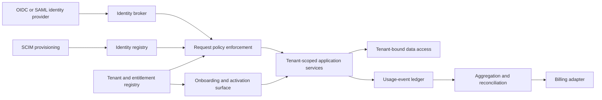

# Enterprise Foundation Accelerator

**Maturity:** design accelerator

Use this accelerator when enterprise identity, tenant isolation, entitlements, usage-based charging, or customer activation is the dominant delivery risk. Treat these as one lifecycle, not four unrelated features.

## Outcome and boundary

An authorized enterprise user can enter the correct tenant, exercise only current entitlements, create independently reconciled usage, and reach the first accepted workflow outcome. Deprovisioning and entitlement changes take effect without relying on a model or a cached UI decision.

The first value case SHOULD measure time-to-first-value, accepted active use, support effort, and full cost per active tenant. It MUST keep login count, invitation count, token volume, and raw API calls separate from accepted business outcomes. `VAL-001`, `VAL-002`.

## Domain model

| Object | Identity and source of truth | Consequential states |
| --- | --- | --- |
| Tenant | Stable internal tenant ID; tenant registry | provisioning, active, suspended, retiring |
| Principal | Issuer plus immutable subject; identity provider | invited, active, disabled |
| Membership | Tenant, principal, membership revision | pending, active, revoked |
| Role binding | Tenant, principal, role, policy revision | proposed, active, expired |
| Entitlement | Tenant, product, feature, contract revision | pending, active, suspended |
| Meter event | Tenant, meter, business operation ID | received, accepted, rejected, reconciled |
| Billing account | Tenant, external account reference | active, delinquent, closed |
| Onboarding milestone | Tenant, workflow, milestone revision | pending, verified, blocked, waived |

Tenant identity MUST bind request authorization, persistence, caches, background work, encryption context, usage events, and telemetry. An email domain, display name, or model inference is not a tenant key. `SEC-005`.

## Architecture

Authentication establishes identity. Provisioning changes the identity registry. Request-time authorization intersects the current principal, tenant, role, entitlement, resource, and policy revision. Database isolation is defense in depth; it does not replace service-layer authorization. `IAM-001`, `IAM-002`, `IAM-003`, `SEC-005`.

Usage metering is deterministic financial infrastructure. Meter events need a stable business-operation identity, explicit aggregation semantics, service-enforced duplicate safety, and reconciliation against both the source system and billing provider. A model MAY explain an anomaly; it MUST NOT authorize access, rate an invoice, or prove revenue accuracy. `ARC-005`, `REL-001`, `REL-003`.

## Smallest useful slice

Build one customer tenant with:

- one supported enterprise identity protocol and one provisioning path;
- two application roles and one protected resource type;
- one entitlement and one service-side policy decision;
- one append-only usage meter with duplicate rejection and reconciliation;
- one onboarding path ending in an independently accepted workflow outcome;
- one support owner, rollback path, and tenant shutdown exercise.

Add a second protocol, billing model, region, or tenant class only after the first slice proves its value and boundaries.

## Acceptance contract

| Case | Required evidence |
| --- | --- |
| Cross-tenant access | Request is denied before data return; cache, job, log, and database paths show no foreign-tenant disclosure. |
| User deprovisioning | Existing and new sessions lose authority within the declared objective; background work cannot reuse revoked identity. |
| Role or entitlement downgrade | The next consequential request uses current policy and fails closed on missing or stale context. |
| Duplicate usage event | Same business operation creates one accepted meter event and one billable unit under the declared aggregation rule. |
| Late or corrected event | Reconciliation exposes the adjustment, source revision, owner, and customer-impact path. |
| Tenant suspension | New work stops, credentials and egress are constrained, and the operating team can restore or retire safely. |
| Onboarding success | A named verifier accepts the first workflow outcome; completion is not inferred from checklist clicks. |

Test malformed assertions, wrong issuer or audience, replay, stale group membership, SCIM retry and out-of-order updates, cache-key collisions, row-filter bypass, background-job tenant loss, billing-provider timeout, and partial reconciliation. `EVA-001`, `EVA-003`, `SEC-004`.

## Operating contract

Track at minimum:

- time from signed handoff to first independently accepted outcome;
- eligible tenants activated and retained, with explicit denominators;
- authorization denials by reason without logging sensitive payloads;
- deprovisioning and entitlement-propagation latency;
- accepted, rejected, duplicated, late, corrected, and unreconciled meter events;
- billed units versus source-of-truth accepted units;
- support hours and full operating cost per active tenant.

Alert on cross-tenant evidence, unknown tenant context, material reconciliation drift, overdue deprovisioning, sustained onboarding blockage, and unsupported identity or billing dependencies. `OPS-001`, `OPS-003`, `OPS-004`, `OPS-006`.

## Starter packet

- [Workflow charter](../templates/workflow-charter.json) and [value case](../templates/value-case.md)
- [Intelligence-selection record](../templates/intelligence-selection-record.md) documenting why identity, tenancy, and metering remain deterministic
- [Operational domain model](../templates/operational-ontology.json)
- [Architecture decision record](../templates/architecture-decision-record.md) for isolation and deployment choices
- Narrow [tool contracts](../templates/tool-contract.json) and [capability manifests](../templates/capability-manifest.json) for any model-visible administration surface
- [Threat model](../templates/threat-model.json), [evaluation cases](../templates/evaluation-case.json), and [solution release](../templates/solution-release.json)
- [Delivery and adoption plan](../templates/delivery-and-adoption-plan.md), [handoff](../templates/customer-enablement-handoff.md), and [service review](../templates/production-service-review.md)

Implementation anchors: [OpenID Foundation specifications](https://openid.net/developers/specs/), [SCIM protocol RFC 7644](https://datatracker.ietf.org/doc/html/rfc7644), and the current [Stripe meter configuration](https://docs.stripe.com/billing/subscriptions/usage-based/meters/configure) documentation. The dated [standards note](../research/2026-08-09--reference-solution-standards.md) records their portable implications and limits. Select the exact protocol profile, provider behavior, and billing contract for the target deployment; a link is not conformance evidence.

## What this does not prove

This accelerator does not prove universal identity-provider interoperability, financial accuracy, tenant isolation in a chosen database, regulatory compliance, or customer adoption. Those claims require target-environment tests, finance reconciliation, security review, user evidence, and an owned release.

**Controls:** `ARC-004`, `ARC-005`, `VAL-001`, `VAL-002`, `IAM-001`, `IAM-002`, `IAM-003`, `SEC-005`, `REL-001`, `REL-003`, `EVA-001`, `EVA-003`, `OPS-001`, `OPS-003`, `OPS-004`, `OPS-006`.
