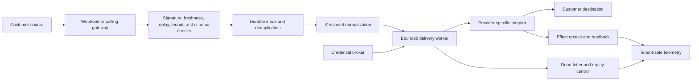

# Integration Runtime Accelerator

**Maturity:** design accelerator

Use this accelerator when a solution must receive events from customer systems or act through third-party APIs. Build one durable, tenant-scoped delivery substrate; keep connector-specific semantics visible rather than hiding them behind a universal interface.

## Outcome and boundary

An authorized tenant event is verified, durably accepted, normalized, delivered once at the business-operation level, and reconciled or made recoverable. Operators can distinguish rejection, retry, duplicate, partial downstream success, dead letter, replay, and completion without reading raw customer payloads.

Measure accepted deliveries, recovery effort, connector lead time, customer-visible delay, and full cost per accepted delivery. Do not count HTTP requests, retries, queue depth, or connector count as customer value. `VAL-001`, `VAL-002`.

## Domain model

| Object | Identity and source of truth | Consequential states |
| --- | --- | --- |
| Connection | Tenant, provider, external account, revision | pending, active, degraded, revoked |
| Credential reference | Broker, tenant, connection, credential revision | active, rotating, revoked |
| Connector build | Connector ID, version, artifact digest | candidate, admitted, disabled, retired |
| Subscription | Tenant, source, event type, revision | active, paused, deleted |
| Inbound event | Provider event ID plus tenant and source | rejected, accepted, duplicate |
| Delivery operation | Stable business-operation ID | queued, executing, effect-unknown, verified, failed |
| Attempt | Operation ID plus attempt number | started, retriable, terminal |
| Dead-letter item | Operation ID plus failure revision | open, replaying, resolved, retired |

## Architecture

The gateway MUST reject invalid signatures, stale events, unknown tenants, unsupported schemas, and oversized payloads before durable acceptance. A successful HTTP response proves receipt only when the source contract defines it that way; it never proves downstream completion.

Credentials stay behind a broker, egress is destination- and account-bound, and every connector build has verified provenance, declared authority, an owner, a disable path, and lifecycle state. `SEC-001`, `SEC-002`, `SEC-006`, `SEC-007`, `TOL-006`.

Prefer a provider API or target-owned adapter. If the approved workflow can only use a browser, desktop client, or terminal emulator, treat it as a separate [computer-use action boundary](../blueprints/computer-use-action-boundary.md): record the API gap and migration trigger, isolate the tenant-bound session, treat visual content as untrusted, separate observation from commit, classify recordings, detect interface drift, and verify the target state independently. Do not hide computer use behind the same reliability claim as a supported API connector.

Retries use the same stable business-operation ID. The destination service or trusted adapter enforces duplicate safety, and consequential changes receive source-of-truth readback. A model MAY propose field mappings for human review; it MUST NOT supply credentials, widen scopes, decide tenant identity, or declare delivery success. `REL-001`, `REL-003`.

## Smallest useful slice

Build one inbound event and one outbound action with:

- tenant-bound connection setup and brokered credentials;
- signature, timestamp, replay, size, and schema validation;
- durable inbox, stable operation identity, bounded retries, and dead-letter handling;
- one provider-specific adapter with rate-limit and partial-success behavior;
- effect receipt, source-of-truth readback, replay authorization, and operator view;
- versioned connector artifact and controlled disable procedure.

Do not begin with four branded connectors. Prove the shared runtime with one representative provider, then add adapters that preserve each provider's semantics.

## Acceptance contract

| Case | Required evidence |
| --- | --- |
| Bad signature or unknown tenant | Rejected before persistence or disclosure, with a typed reason and no secret-bearing log. |
| Replay or duplicate delivery | One business effect; repeated receipts identify the original operation. |
| Out-of-order event | Version or source precondition prevents stale state from overwriting current state. |
| Provider throttling | Retry honors bounded backoff and provider guidance without exceeding tenant or global budgets. |
| Timeout after effect | Operation enters effect-unknown, reads the destination, and resolves, compensates, or escalates. |
| Revoked credential | Broker denies use; queued work cannot reuse cached secret material. |
| Schema drift | Unsupported version is quarantined; an owner receives a sampled, minimized diagnostic. |
| Cross-tenant replay | Replay authority, connection, operation, credential, and destination remain bound to the original tenant. |
| Disabled connector | Exact artifact digest remains denied even if name or version is reused. |
| Browser or desktop fallback | Wrong account, prompt injection, layout drift, duplicate submit, misleading success, and session revocation stop safely; only independent target readback completes the operation. |

Run contract, provider-sandbox, replay-world, concurrency, and failure-injection tests. Include destination latency, rate limit, ambiguous response, partial batch, redirect, DNS rebinding, server-fetch, secret leakage, and dead-letter replay cases. `EVA-001`, `EVA-003`, `SEC-004`.

## Operating contract

Track accepted-delivery rate, end-to-end latency, duplicate effects, effect-unknown age, retry amplification, dead-letter age, replay success, credential failures, connector-version adoption, provider dependency health, and cost per accepted delivery. Segment by tenant and connector without exposing customer payloads.

Kill switches MUST stop new intake, a tenant connection, write paths, affected credentials, egress destinations, or an exact connector build independently. Every severe failure needs a detection query, containment step, readback, recovery owner, customer-communication path, and regression case. `OPS-002`, `OPS-003`, `OPS-005`, `OPS-006`.

## Starter packet

- [Workflow charter](../templates/workflow-charter.json), [value case](../templates/value-case.md), and [architecture decision record](../templates/architecture-decision-record.md)
- [Operational domain model](../templates/operational-ontology.json) for connection, event, operation, and replay states
- One [tool contract](../templates/tool-contract.json) and exact [capability manifest](../templates/capability-manifest.json) per admitted connector action
- [Capability supply-chain guide](../operations/capability-supply-chain.md) and [transactional-write blueprint](../blueprints/transactional-write-agent.md)
- [Threat model](../templates/threat-model.json) with destination, credential, replay, and tenant abuse cases
- [Evaluation cases](../templates/evaluation-case.json), [evaluation report](../templates/evaluation-report.json), and [solution release](../templates/solution-release.json)
- [SLO scorecard](../operations/slo-scorecard.md), [incident runbook](../operations/incident-runbook.md), and [change management](../operations/change-management.md)

## What this does not prove

This accelerator does not make every provider consistent, make arbitrary retries safe, eliminate provider limits, or prove that a connector works against a customer's configuration. Each adapter needs its own contract, exact build, sandbox and failure evidence, operating owner, and disable path.

**Controls:** `VAL-001`, `VAL-002`, `TOL-001`, `TOL-003`, `TOL-004`, `TOL-006`, `IAM-002`, `IAM-003`, `SEC-001`, `SEC-002`, `SEC-004`, `SEC-006`, `SEC-007`, `REL-001`, `REL-002`, `REL-003`, `EVA-001`, `EVA-003`, `OPS-002`, `OPS-003`, `OPS-005`, `OPS-006`.
