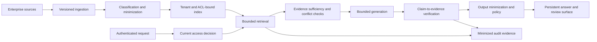

# Secure AI Workload Accelerator

**Maturity:** design accelerator

Use this accelerator for permission-aware retrieval and answer generation over sensitive enterprise content. Treat access, minimization, evidence, model behavior, and telemetry as one end-to-end path; a vector index is not the security boundary.

## Outcome and boundary

An authorized user receives an answer whose material claims resolve to current evidence the user could access at request time. When evidence is missing, stale, contradictory, or unauthorized, the system narrows the answer or escalates. Sensitive data is minimized before model context, output, telemetry, and retained artifacts.

The accepted-outcome verifier is task-specific: a user or domain reviewer accepts the answer for the declared decision, with its citations and limitations. Retrieval hit rate, generated tokens, and answer fluency are diagnostic measures, not value. `VAL-001`, `VAL-002`.

## Domain model

| Object | Identity and source of truth | Consequential states |
| --- | --- | --- |
| Content source | Tenant, source system, owner | active, degraded, disconnected |
| Document revision | Source ID, document ID, revision | current, superseded, deleted |
| Access grant | Principal or group, resource, policy revision | active, expired, revoked |
| Classified segment | Document revision, segment, classification | admitted, quarantined, tombstoned |
| Retrieval claim | Query, principal, policy, index revision | sufficient, insufficient, conflicting |
| Answer artifact | Request, evidence set, behavior bundle | proposed, accepted, rejected, escalated |
| Redaction event | Policy, detector revision, field reference | allowed, transformed, blocked, reviewed |

Every decision-bearing source declares owner, classification, source-of-truth status, revision, and freshness objective. Deleted or access-revoked content needs propagation and tombstone semantics across source, index, cache, memory, evaluation fixtures, and retained artifacts. `CTX-001`, `SEC-005`.

## Architecture

Current authorization is enforced before retrieval and again at any source fetch. Tenant, principal, resource, policy revision, index revision, and source revision remain observable. Retrieved text, document instructions, tool output, and prior answers stay untrusted data. `IAM-002`, `IAM-003`, `CTX-002`, `TOL-005`.

Classification and redaction use layered deterministic rules, structured metadata, approved detectors, and human review where error costs demand it. A foundation model MAY assist classification or answer generation after evaluation; it MUST NOT be the sole authorization, secret-detection, or completion verifier. `ARC-004`, `ARC-005`, `SEC-001`.

## Smallest useful slice

Build read-only question answering over one source with:

- two roles, one tenant, one content class, and current permission filtering;
- revision-aware ingestion, deletion propagation, and an ACL-bound index;
- bounded retrieval with explicit sufficiency and conflict outcomes;
- claim-level citations that resolve to authorized source revisions;
- deterministic redaction canaries across input, context, output, and telemetry;
- persistent human review, escalation, and feedback linked to the exact release.

Do not add write actions, memory, autonomous research, multiple stores, or open Internet retrieval until the read-only slice passes permission, evidence, and minimization tests.

## Acceptance contract

| Case | Required evidence |
| --- | --- |
| Cross-tenant or unauthorized document | No segment, metadata, citation, count, timing detail, cache entry, or answer discloses the resource. |
| Group removal or policy change | The next request uses current authority; stale access fails closed. |
| Deleted or superseded document | Tombstone propagates within the declared objective and citations cannot silently resolve to stale content. |
| Prompt injection in a document | Retrieved instructions do not change system authority, tools, destinations, or evaluation. |
| Unsupported answer | The system returns insufficient evidence or escalation instead of an uncited material claim. |
| Citation mismatch | Claim-to-source verifier rejects an irrelevant, inaccessible, or wrong-revision citation. |
| Sensitive-data canary | Prohibited value is blocked or transformed before model context and remains absent from output, traces, logs, caches, and artifacts. |
| Conflicting evidence | The answer exposes the conflict and source revisions rather than selecting a convenient claim. |

Evaluate tool selection, query formation, permission filtering, retrieval sufficiency, answer correctness, citation entailment, data exposure, abstention, latency, and cost as separate slices. Include no-tool, wrong-tool, bad-parameter, stale-index, malformed-document, indirect-injection, oversized-result, and evaluator-contamination cases. `EVA-001`, `EVA-002`, `EVA-003`, `EVA-006`.

## Operating contract

Track accepted-answer rate, evidence sufficiency, citation coverage and rejection, abstention and escalation, permission-denial results, source and index freshness, deletion propagation, sensitive-data blocks, user corrections, route-specific latency, and full cost per accepted answer.

Operators need kill switches for a source, tenant, index revision, model route, tool build, egress destination, and new work. A behavior or source change requires affected-route evaluation, canary or soak evidence, rollback triggers, and user-surface review. `OPS-002`, `OPS-006`, `OPS-007`.

## Starter packet

- [Workflow charter](../templates/workflow-charter.json), [value case](../templates/value-case.md), and [intelligence-selection record](../templates/intelligence-selection-record.md)
- [Bounded retrieval blueprint](../blueprints/bounded-retrieval-agent.md) and [operational domain model](../templates/operational-ontology.json)
- [Agent-system](../templates/agent-system.json) and [behavior-bundle](../templates/behavior-bundle.json) artifacts only when model behavior is selected
- Read and source-fetch [tool contracts](../templates/tool-contract.json) plus exact [capability manifests](../templates/capability-manifest.json)
- [Threat model](../templates/threat-model.json), [evaluation cases](../templates/evaluation-case.json), and [evaluation report](../templates/evaluation-report.json)
- [Delivery and adoption plan](../templates/delivery-and-adoption-plan.md), [solution release](../templates/solution-release.json), and [behavior monitoring](../operations/behavior-monitoring.md)

## What this does not prove

This accelerator does not prove that a detector finds all personal data, a retrieval metric predicts business value, a citation is legally sufficient, or a deployment complies with a regulation. Those claims require target-data evaluation, domain review, privacy and security assessment, operating evidence, and an owned release.

**Controls:** `ARC-004`, `ARC-005`, `VAL-001`, `VAL-002`, `CTX-001`, `CTX-002`, `TOL-001`, `TOL-005`, `IAM-002`, `IAM-003`, `SEC-001`, `SEC-004`, `SEC-005`, `EVA-001`, `EVA-002`, `EVA-003`, `EVA-006`, `OPS-002`, `OPS-006`, `OPS-007`.
