# Financial-Services Investigation Solution Profile

**Maturity:** worked vertical design profile

This profile covers evidence assembly and case workflow for authorized financial-operations or financial-crime investigators. It does not determine wrongdoing, file a regulatory report, freeze an account, contact a customer, or make a credit or eligibility decision.

## Vertical outcome

One eligible signal becomes an attributable case disposition with current supporting and conflicting evidence, a named investigator, and recorded downstream obligations. The accepted outcome is the authorized investigator's disposition under current institutional policy—not a risk score or generated narrative.

Measure investigation cycle time, evidence completeness, reopen rate, sampled disposition quality, downstream acceptance, investigator effort, prohibited disclosure, and full cost per accepted disposition. Maintain separate denominators for alerts, deduplicated subjects, cases, and reportable outcomes. `VAL-001`, `VAL-002`, `CST-001`.

## Operational context

```mermaid
flowchart LR
    S["Rule, model, or human signal"] --> D["Deduplicate and subject-bind"]
    D --> P["Purpose- and role-bound evidence"]
    P --> C["Claims, contradictions, and gaps"]
    C --> W["Persistent investigation case"]
    W --> H["Authorized investigator"]
    H --> X["Disposition and obligation"]
    X --> R["Restricted downstream system"]
    R --> O["Outcome, quality, and cost review"]
```

FinCEN guidance illustrates two important portable boundaries: supporting documentation must remain attributable to the determination, and suspicious-activity information can have strict confidentiality obligations. A target institution must interpret and enforce its actual obligations; this profile does not encode them. [VS26-07]

## Reusable flow composition

| Layer | Applied pattern | Financial-services specialization |
| --- | --- | --- |
| Case creation | [Signal to investigation](../business-flows/signal-to-investigation.md) | Stable alert, subject, account, institution, policy, and case identities; deduplicate without erasing recurrence. |
| Exception work | [Exception to resolution](../business-flows/exception-to-resolution.md) | Missing evidence, inconsistent identity, stale customer data, unsupported jurisdiction, or downstream failure become explicit states. |
| Evidence | [Secure AI workload](../secure-ai-workload.md) | Purpose-bound retrieval, field-level minimization, provenance, contradiction, confidentiality, and restricted telemetry. |
| Integration | [Integration runtime](../integration-runtime.md) | Brokered credentials, account-bound destinations, duplicate-safe submission, acknowledgment, and recovery. |

## Domain and action model

| Object | Source of truth | Example states | Authority boundary |
| --- | --- | --- | --- |
| Signal | Detection service plus rule/model version | new, duplicate, suppressed, escalated | Signal does not prove case outcome. |
| Subject and account | Authorized customer/account systems | active, restricted, closed, ambiguous | Cross-entity joins require current purpose and policy. |
| Evidence item | Transaction, identity, communication, or external source | current, superseded, conflicting, unavailable | Every claim retains source, revision, and access basis. |
| Investigation case | Case-management system | triage, investigating, review, disposed, reopened | Human investigator owns disposition. |
| Obligation | Institutional policy system | not-applicable, pending, approved, completed | Separate authorization governs filing, restriction, or outreach. |
| Review record | Quality or supervisory workflow | queued, accepted, corrected | Reviewer identity and rationale remain attributable. |

## Mechanism allocation

- Deterministic rules establish eligibility, deduplication, access, policy, deadlines, and required fields.
- Classical ML MAY estimate alert relevance under segment-specific evaluation and drift monitoring.
- Governed analytics and retrieval assemble current evidence.
- A bounded model MAY cluster facts, draft a chronology, or identify missing evidence; every claim requires attributable support.
- An authorized investigator makes the case disposition.
- Separate trusted services enforce any filing, account, customer, or funds action under current policy and approval.

No generated explanation or score can widen access, suppress a mandatory review, establish suspicion as fact, or authorize a consequential action. `ARC-005`, `IAM-003`, `TOL-003`, `HUM-003`.

## Smallest useful slice

Start with one signal type, one customer and account segment, two governed evidence sources, one case queue, and no automatic downstream effect. Demonstrate deduplication, purpose-bound access, claims-to-evidence review, investigator editing and disposition, quality sampling, and outcome/cost telemetry. Add a downstream proposal only after case quality and confidentiality controls pass.

## Acceptance and operating evidence

Test wrong institution, tenant, account, subject, role, purpose, or jurisdiction; revoked investigator access; stale policy; duplicate and linked signals; conflicting sources; prompt injection in narrative evidence; unsupported claims; confidential-data leakage through logs or model context; reviewer disagreement; and prohibited downstream action.

Operate on case age, evidence sufficiency, unsupported-claim rate, investigator correction, quality-review findings, reopen and downstream rejection, access denials, prohibited disclosure, dependency health, policy drift, and cost per accepted disposition. Keep signal-model performance separate from investigation and business outcomes. `SEC-004`, `OPS-001`, `OPS-004`, `OPS-006`.

## Customer-specific decisions

Define the institution, jurisdiction, products, signal policy, subject and account identity, confidentiality classes, evidence sources, purpose limitations, investigator and supervisory roles, retention, legal hold, disclosure restrictions, filing or action services, model-risk review, quality sampling, incident paths, and manual continuity process.

## What this does not prove

This profile does not determine whether activity is suspicious, satisfy a reporting obligation, validate a detection model, authorize account treatment, or establish compliance with financial regulation. Those decisions belong to the target institution's authorized legal, compliance, risk, security, operations, and supervisory owners.

**Controls:** `VAL-001`, `VAL-002`, `ARC-005`, `CTX-001`, `CTX-002`, `IAM-002`, `IAM-003`, `TOL-003`, `TOL-005`, `SEC-004`, `HUM-001`, `HUM-003`, `EVA-001`, `EVA-003`, `OPS-001`, `OPS-004`, `OPS-006`, `CST-001`.

[VS26-07]: ../../research/2026-08-09--business-flow-and-vertical-solutions.md#vs26-07
