# Industrial Operations-Response Solution Profile

**Maturity:** worked vertical design profile

This profile covers prioritization and coordination for maintenance, reliability, quality, asset, or supply disruptions. It keeps equipment control, safety decisions, work authorization, and production changes outside model authority.

## Vertical outcome

One eligible operational signal becomes a correctly scoped and prioritized work item that an authorized operator accepts, rejects, or escalates using current asset, process, inventory, and safety evidence. The accepted outcome is the operator's decision and verified downstream state—not an anomaly score, generated work instruction, dashboard alert, or digital-twin prediction.

Measure avoided delay or loss only against an owned counterfactual. Include false-positive labor, unnecessary shutdown or expedite cost, missed-event sampling, data integration, review, support, and recovery in full-cost accounting. `VAL-001`, `VAL-002`, `CST-001`.

## Operational context

```mermaid
flowchart LR
    S["Sensor, quality, asset, or supply signal"] --> A["Asset and process identity"]
    A --> E["Current operational evidence"]
    E --> R["Rule, optimization, or risk estimate"]
    R --> P["Safety- and policy-bounded routing"]
    P --> W["Persistent operator work item"]
    W --> H["Authorized operator"]
    H --> M["CMMS, ERP, MES, or control procedure"]
    M --> V["Verified state and outcome"]
```

NIST's OT guidance treats accurate asset visibility as foundational and emphasizes that operational constraints differ from ordinary IT environments. The portable lesson is to bind every signal and recommendation to an authoritative asset and operating context before prioritization or action. [VS26-08]

## Reusable flow composition

| Layer | Applied pattern | Industrial specialization |
| --- | --- | --- |
| Prioritization | [Risk to prioritized action](../business-flows/risk-to-prioritized-action.md) | Bind score or optimization to asset, location, process state, maintenance regime, constraints, and evidence time. |
| Exception work | [Exception to resolution](../business-flows/exception-to-resolution.md) | Represent missing telemetry, identity ambiguity, conflicting maintenance state, unavailable part, or work-order failure explicitly. |
| Integration | [Integration runtime](../integration-runtime.md) | Separate IT workflow APIs from OT networks and broker all credentials and permitted destinations. |
| Operation | [Deployment and operations](../deployment-and-operations.md) | Exercise fail-safe degradation, manual continuity, kill switches, rollback, and incident communication. |

## Domain and action model

| Object | Source of truth | Example states | Authority boundary |
| --- | --- | --- | --- |
| Asset and location | Asset registry or approved engineering system | active, isolated, maintenance, retired | Identity and topology are verified before evidence joins. |
| Operational signal | Historian, quality, supply, or monitoring service | new, acknowledged, superseded, invalid | Signal is evidence, not a control command. |
| Constraint and policy | Safety, production, maintenance, inventory, or service system | current, expired, unavailable | Missing critical policy fails to manual operation. |
| Response case | Work-management service | triage, planned, authorized, executing, verified, closed | Operator owns material disposition. |
| Work order or supply action | CMMS, ERP, MES, or approved service | staged, approved, issued, completed, failed | Separate service rechecks authority and preconditions. |
| Outcome | Authoritative production or service source | pending, observed, disputed | Value claims wait for the declared observation window. |

## Mechanism allocation

- Rules enforce safety, eligibility, equipment state, maintenance windows, and prohibited actions.
- Optimization MAY allocate constrained labor, inventory, capacity, or sequence under explicit objectives and feasibility checks.
- Classical ML MAY estimate failure or delay risk with asset- and regime-specific evaluation.
- Retrieval MAY assemble current manuals, work history, inventory, and approved procedures under access policy.
- A bounded model MAY summarize evidence or draft a work-item narrative; it does not generate authoritative operating instructions.
- Authorized personnel use approved control, maintenance, or business systems for material actions.

Controls: `ARC-004`, `ARC-005`, `SEC-002`, `SEC-003`, `REL-005`.

## Smallest useful slice

Choose one asset class or supply lane, one site or tenant, one signal, one authoritative asset source, one deterministic safety policy, and one review queue. Run in advisory or shadow mode. Demonstrate stale and missing evidence handling, score or optimization fallback, operator correction, duplicate-safe work-item creation, downstream readback, and manual continuity before expanding scope.

## Acceptance and operating evidence

Test wrong asset or site, stale topology, missing maintenance or safety policy, sensor replay and out-of-order data, impossible optimizer output, score drift, explanation-policy conflict, network loss, connector timeout, duplicate work item, unauthorized control request, and recovery after downstream uncertainty.

Operate on eligible signals, asset and evidence coverage, queue age, operator acceptance and override, false-positive labor, missed-event sampling, prohibited effects, downstream verification, dependency and network health, manual fallback success, cost per accepted response, and observed service or production outcome. `SEC-004`, `OPS-002`, `OPS-003`, `OPS-004`, `OPS-006`.

## Customer-specific decisions

Define asset taxonomy, topology and source authority, safety and regulatory obligations, operating regime, maintenance and production systems, OT/IT boundary, allowed network paths, manual procedure, operator and engineer roles, work authorization, shift handoff, outage and incident protocols, outcome lag, model regime changes, and shutdown or retirement conditions.

## What this does not prove

This profile does not establish functional safety, equipment suitability, control-system security, model validity, maintenance correctness, regulatory compliance, or improved production outcomes. Target engineers, operators, safety, security, reliability, quality, and service owners must validate the deployment in its actual environment.

**Controls:** `VAL-001`, `VAL-002`, `ARC-004`, `ARC-005`, `SEC-002`, `SEC-003`, `SEC-004`, `REL-001`, `REL-003`, `REL-005`, `HUM-001`, `OPS-002`, `OPS-003`, `OPS-004`, `OPS-006`, `CST-001`.

[VS26-08]: ../../research/2026-08-09--business-flow-and-vertical-solutions.md#vs26-08
